# Creating Groups and Users with AWS Identity and Access Management (IAM)

## Overview
This guide provides detailed instructions on creating user groups and users in AWS IAM, assigning appropriate permissions, and validating user access.

## Requirements

### Groups
1. **DevOps**: Full access to all AWS account resources
2. **Staff**: View-only access to AWS account resources

### Users
1. **John**: Member of DevOps group
2. **Paul**: Member of Staff group

Both users should have the initial password "Admin123" for AWS Management Console login.

## Implementation Steps

### 1. Create Groups

#### 1.1 DevOps Group
1. In the AWS Management Console, search for IAM and click on "User groups"
2. Click "Create group"
3. Enter "DevOps" as the User group name
4. In the Attach permissions policies section, search for and select "AdministratorAccess"
5. Click "Create user group"

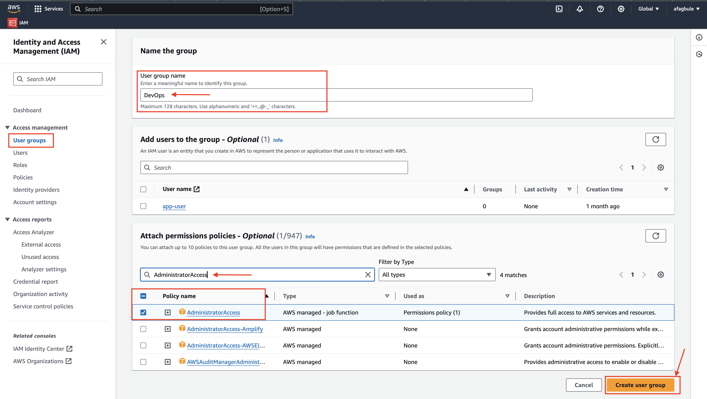

#### 1.2 Staff Group
1. In IAM, click on "User groups" again
2. Click "Create group"
3. Enter "Staff" as the User group name
4. In the Attach permissions policies section, search for and select "ReadOnlyAccess"
5. Click "Create user group"

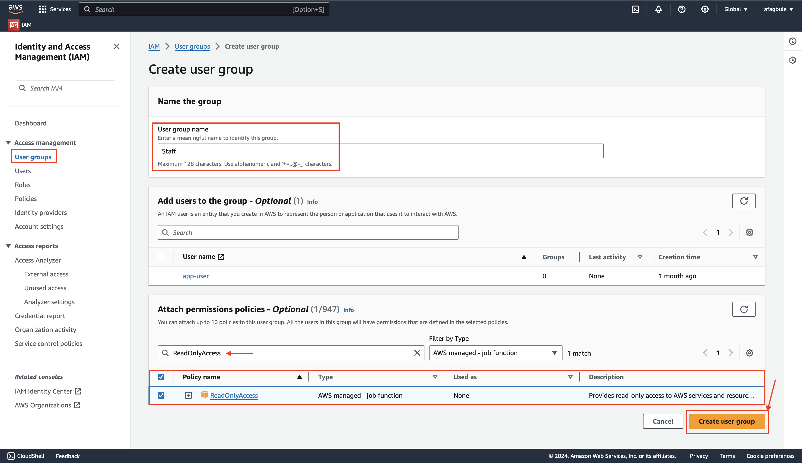

Verify that both groups appear in the User groups list.

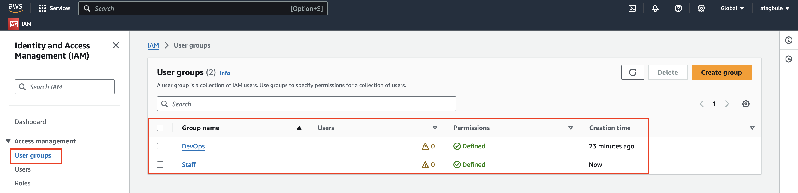

### 2. Create Users

#### 2.1 Create John (DevOps)
1. In IAM, click on "Users"
2. Click "Create user"
3. Enter "john" as the User name
4. Check "Provide user access to the AWS Management Console"
5. Select "I want to create an IAM user"
6. Choose "Custom password" and enter "Admin123"
7. Check "Users must create a new password at next sign-in"
8. Click "Next"

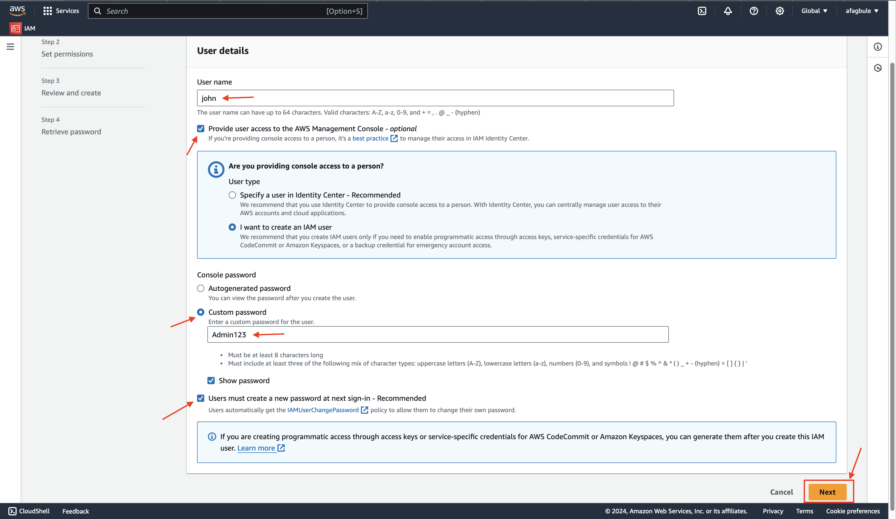

9. On the next page, select "Add user to group" and check "DevOps"
10. Click "Next"

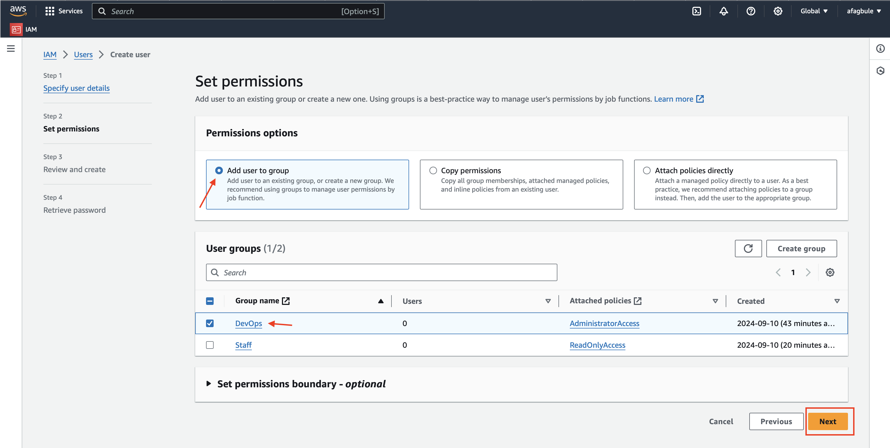

11. Review the information and click "Create user"

#### 2.2 Create Paul (Staff)
1. In IAM, click on "Users"
2. Click "Add users"
3. Enter "paul" as the User name
4. Follow steps 4-7 from John's creation process
5. On the permissions page, select "Add user to group" and check "Staff"
6. Click "Next"

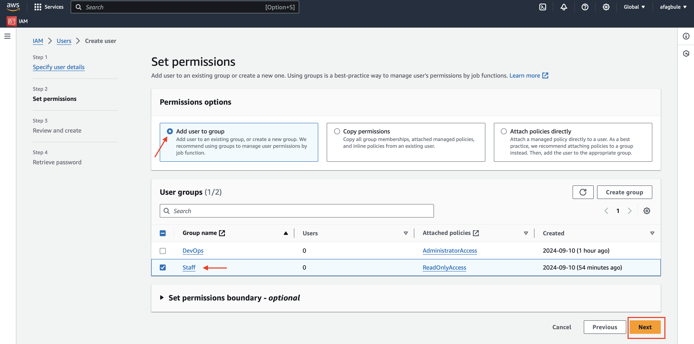

7. Review the information and click "Create user"

Verify that both users appear in the Users list.

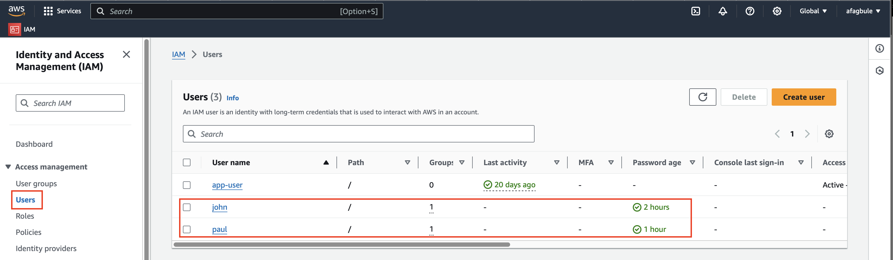

## Validation

### Test John's Access
1. Use the Console sign-in URL provided (e.g., https://account_id.signin.aws.amazon.com/console)
2. Sign in with username "john" and password "Admin123"

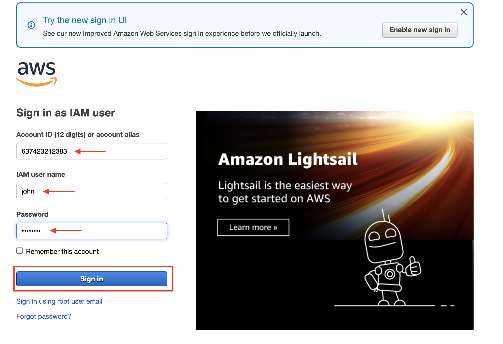

3. Change the password as prompted
4. Navigate to EC2 service
5. Attempt to view existing instances (should succeed)
6. Attempt to launch a new EC2 instance (should succeed)

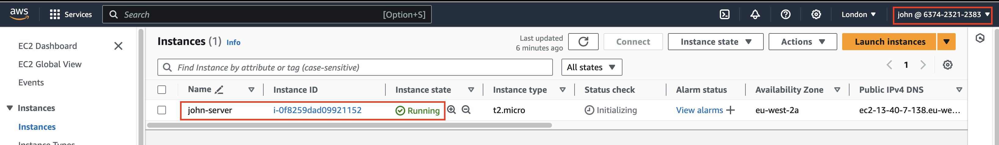

### Test Paul's Access
1. Use the same Console sign-in URL (e.g., https://account_id.signin.aws.amazon.com/console)
2. Sign in with username "paul" and password "Admin123"

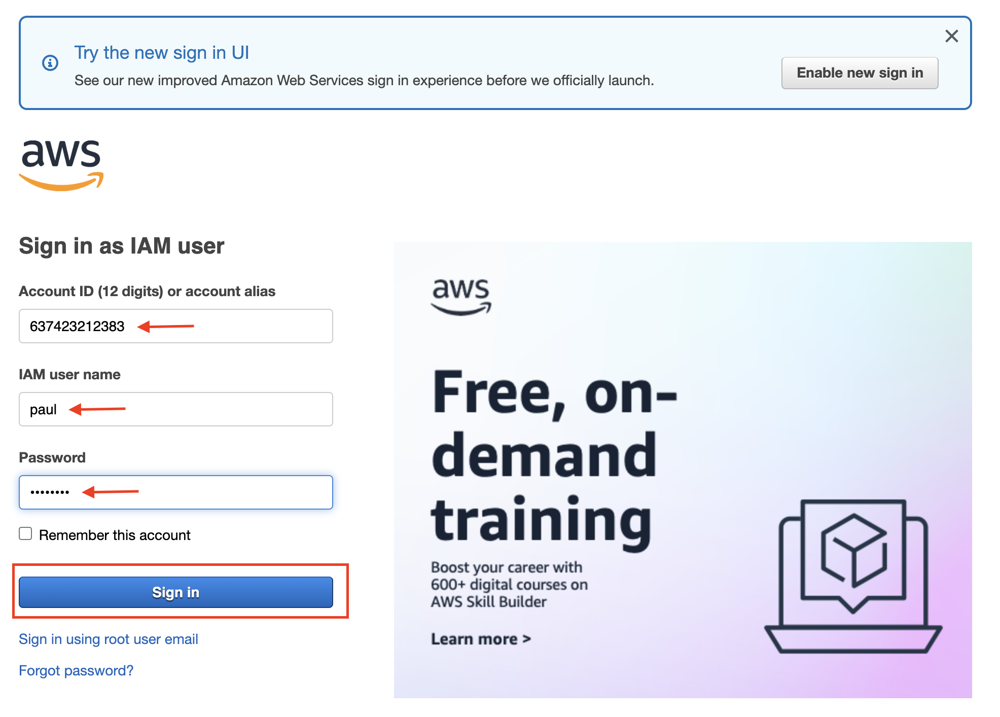

3. Change the password as prompted

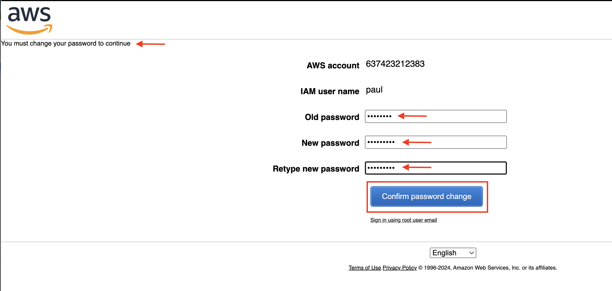

4. Navigate to EC2 service
5. Attempt to view existing instances (should succeed)

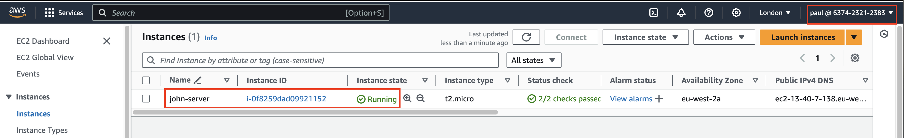

6. Attempt to launch a new EC2 instance (should fail with an "Instance launch failed" error)

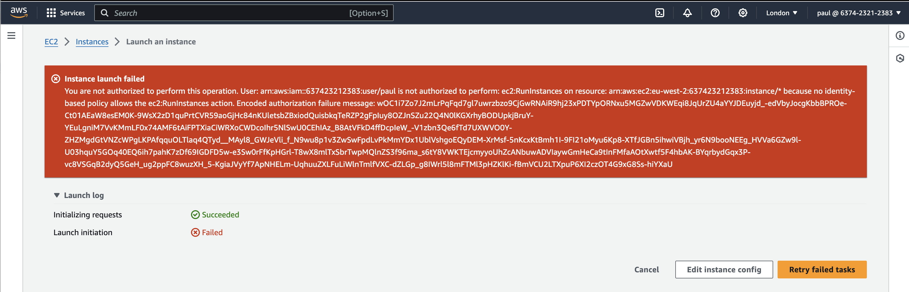

## Notes
- For detailed steps on creating EC2 instances, refer to the [AWS EC2 documentation](https://docs.aws.amazon.com/AWSEC2/latest/UserGuide/LaunchingAndUsingInstances.html)

## Conclusion
This setup ensures that John has full administrative access, while Paul has read-only access, as per the requirements. The detailed steps provide a clear guide for implementing and validating the IAM configuration. Always follow AWS best practices for IAM user and group management to maintain security.