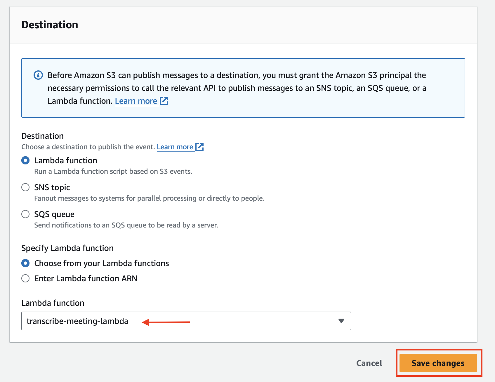
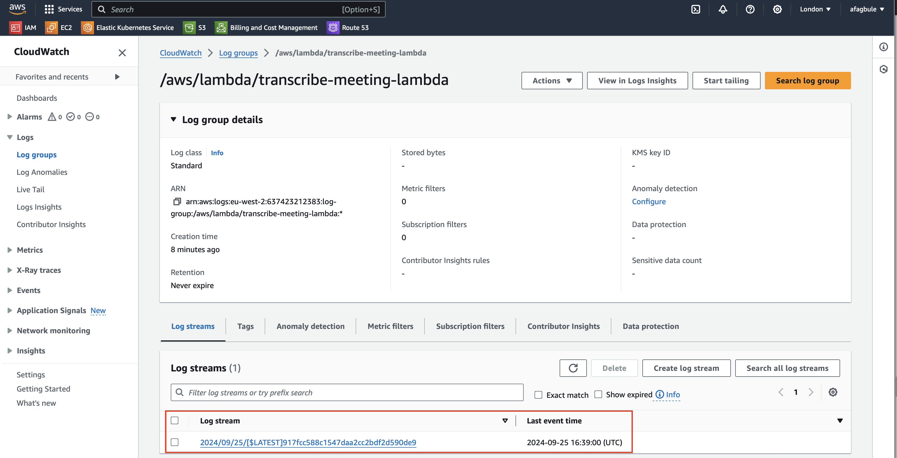
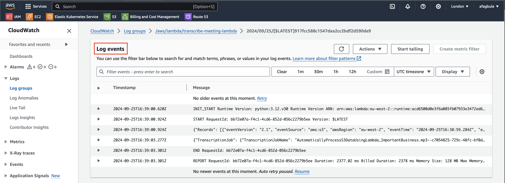
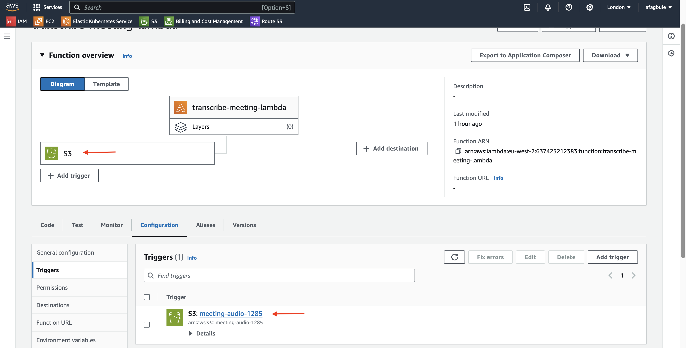
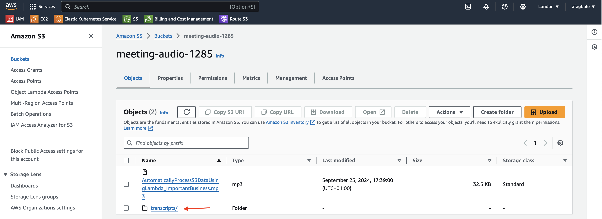
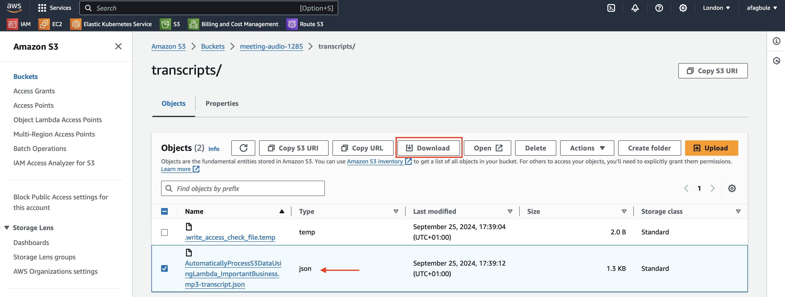

# Serverless Audio Transcription with AWS Lambda and AWS Transcribe

This project demonstrates how to create a serverless solution that automatically processes audio data uploaded to an S3 bucket using AWS Lambda and AWS Transcribe.

## Overview

Automating processes is a cornerstone of cloud computing. This solution automatically transcribes audio files into text whenever they are uploaded to an S3 bucket, saving time and effort for each new file.

## Prerequisites

- AWS Account
- Audio file for testing: `ImportantBusiness.mp3`
  - Download link: [ImportantBusiness.mp3](https://raw.githubusercontent.com/linuxacademy/content-aws-mls-c01/master/AutomaticallyProcessS3DataUsingLambda/ImportantBusiness.mp3)


## Setup Instructions

### 1. Create an IAM Role

1. Open the AWS Management Console
2. Search for "IAM" in the search bar
3. Click on the IAM service
4. Click on "Roles" and then click on "Create role"
5. Do the following:
   - Select "AWS Service"
   - Click the drop-down for "Service or use case" and select "Lambda"
   - Click "Next"
   - In the search bar, type "S3" and select "AmazonS3FullAccess"
   - In the search bar, type "Transcribe" and select "AmazonTranscribeFullAccess"
   - In the search bar, type "CloudWatchFullAccess" and select "CloudWatchFullAccess"
   - Click "Next"
   - Give the name "transcribe-meeting-role" to your role 
   - Add a tag to your role (e.g., Key: app, Value: meeting-transcriber)
   - Click "Create role"
6. The role should be created successfully and listed when "Roles" is clicked


### 2. Create and Deploy Lambda Function

1. Search for the Lambda service in the search bar
2. Click on "Create a function"
3. Do the following:
   - Choose "Author from scratch"
   - Give the name "transcribe-meeting-lambda" as your function name
   - Select "Python 3.12" from the Runtime drop-down (Note: choose the latest version available)
   - Leave the architecture as default x86_64
   - Expand "Change default execution role" by clicking the arrow beside it
   - Select "Use an existing role"
   - Choose your role from the drop-down (i.e., transcribe-meeting-role)
   - Click "Create function"


4. Scroll down to the code source section, delete the default code
5. Paste the code from the "lambda_function.py" script
6. Click on "Deploy"


### 3. Create and Configure S3 Bucket

1. Click on Services, select S3 located under Storage
2. Click on "Create bucket"
3. Give a unique name to your bucket (e.g., meeting-audio-1285)
4. Ensure "ACLs disabled" is selected (this is the default)
5. Leave "Block all public access" checked
6. Select "Disable versioning"
7. Add a tag to your bucket (e.g., Key: app, Value: meeting-transcriber)
8. For encryption, keep the defaults:
   - Server-side encryption with AWS S3 managed keys (SSE-S3)
   - Enable Bucket Key
9. Click "Create bucket"


10. Click on your newly created bucket
11. Go to the Properties section
12. Scroll to Event notification and click on "Create event notification"
13. Do the following:
    - Give a name (e.g., audio-upload-trigger) for Event name
    - Add a suffix (e.g., .mp3) to your event
    - For Event types, select "All object create events"
    - Scroll down to Destination, select your lambda function from the drop-down menu
    - Click "Save changes"



### 4. Test the Solution

1. Download the `ImportantBusiness.mp3` file from the link provided in the Prerequisites section.

2. Upload the `ImportantBusiness.mp3` file to your S3 bucket:
   - Click on "Objects"
   - Click on "Upload"
   - Click on "Add files"
   - Locate the `ImportantBusiness.mp3` audio file
   - Click on "Upload"


3. Monitor the Lambda function execution:
   - Search for CloudWatch in the search bar
   - Click on the drop-down for Logs and select "Log groups"
   - Click on the Log groups


   - In the Log group, you will see the Log stream of events



   - In the Log events, you will see the logs from the function



4. Check the transcription job:
   - Go to Amazon Transcribe
   - Click on "Transcription jobs" to view the job created


   - View the job details to see the Output data location


5. Verify the Lambda function trigger:
   - On the Function overview for transcribe-meeting-lambda, you will see the S3 bucket icon
   - Click this to display meeting-audio-1285 under Triggers



6. Access the transcription output:
   - Click the meeting-audio-1285 link to open it in a new window
   - You will see a new folder named "transcripts/" created by transcribe. 
   - Click on this folder



   - Inside the folder, select the json file and then click download



7. View the transcript:
   - Open up GitBash/Terminal on your device
   - Change directory to your downloads directory
   - Check if you have Python installed using either the `python --version` or `python3 --version` command
   - Run the following command to view your transcript:

     ```
     python3 -m json.tool AutomaticallyProcessS3DataUsingLambda_ImportantBusiness.mp3-transcript.json | head -10
     ```


You have successfully transcribed the mp3 audio to a json file.
