# AWS Auto Scaling Group Setup Guide

## What is an Auto Scaling Group?
An Auto Scaling Group (ASG) is an AWS service that automatically manages and scales a collection of EC2 instances based on defined conditions. It helps maintain application availability and allows you to scale your computing capacity up or down automatically according to demand.

### Key Benefits
- **Automatic Scaling**: Dynamically adjusts capacity based on real-time demand
- **High Availability**: Maintains desired number of instances across Availability Zones
- **Cost Optimization**: Scales down during low demand to reduce costs
- **Self-healing**: Automatically replaces unhealthy instances
- **Load Distribution**: Evenly distributes traffic across instances

## Prerequisites
- Active AWS Account
- Basic understanding of AWS EC2 service
- Understanding of basic networking concepts
- IAM permissions to create and manage EC2 resources

## Infrastructure Overview
This guide helps you set up an Auto Scaling Group with Apache web servers running on Red Hat Enterprise Linux instances. The setup includes:
- Custom VPC with public subnets
- Launch Template with Apache installation
- Auto Scaling Group with desired capacity
- Security group for web traffic

### Architecture Diagram
```
[Internet Gateway]
        ↓
    [Custom VPC]
        ↓
[Auto Scaling Group]
    ↙     ↓     ↘
[EC2-1] [EC2-2] [EC2-3]
```

## Step-by-Step Setup Guide

### 1. Instance Configuration
1. Navigate to EC2 Dashboard → Launch Instance
2. Configure base settings:
   - **AMI**: Red Hat Enterprise Linux
   - **Instance Type**: t2.micro (Free Tier eligible)
   - **Key Pair**: Create new or select existing
   
#### Network Settings
- **VPC**: Your custom VPC
- **Subnet**: Public subnet
- **Auto-assign Public IP**: Enable
- **Security Group**: Use existing frontend security group

#### User Data Script
```bash
#!/bin/bash
sudo yum install httpd -y
sudo systemctl start httpd
sudo chkconfig httpd on
echo "<html><h1>Olawale Slimboi Web Server</h1></html>" > /var/www/html/index.html
```

### 2. Creating an AMI
1. Once instance is running:
   1. Select **Action** → **Image and templates** → **Create image**
   2. Set image name (e.g., `apache-webserver-img`)
   3. Keep "Reboot instance" option enabled
   4. Leave "Tag image and snapshots together" as default
   5. Click **Create image**
2. View your AMI:
   - Navigate to left panel → **AMIs**

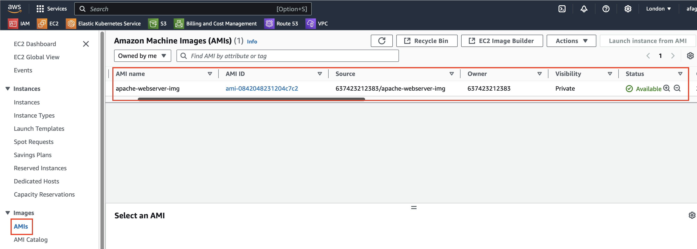

### 3. Launch Template Creation
1. Navigate to EC2 Dashboard → Launch Templates
2. Click **Create Launch Template**
3. Configure template:
   - Name: `apache-webserver-template`
   - AMI: Select your created AMI under "My AMIs"
   - Instance Type: t2.micro
   - Key Pair: Select existing or create new
   - Security Group: Create new or select existing
     - Name: `apache-asg`
     - Allow SSH and HTTP traffic
   - Advanced network configuration
     - Enable Auto-assign public IP
4. Review and click **Create launch template**

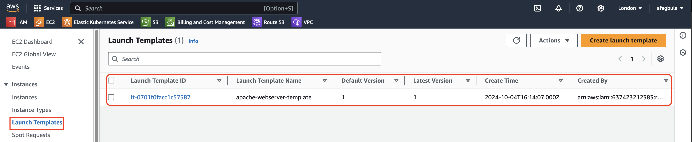

## Creating Auto Scaling Group
1. Navigate to EC2 Dashboard → Auto Scaling Groups → Create Auto Scaling Group
2. Configure:
   - **Name**: `apache-webserver-asg`
   - **Launch Template**: Select your template
   - **VPC and Subnets**: Select your VPC and multiple AZs
   - **Desired Capacity**: 2
   - **Minimum Capacity**: 1
   - **Maximum Capacity**: 2

### Scaling Policies
- **Target Tracking scaling Policy**:
  - Scaling policy name: Apache Target Tracking Policy
  - Metric: Average CPU Utilization
  - Target Value: 50%

3. Review and Create:
   - Click **Next**
   - Add tags: Name apache-asg-server
   - Click **Next**
   - Review settings
   - Click **Create auto-scaling group**

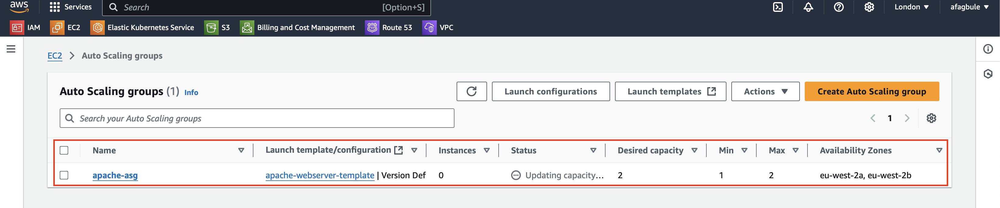

## Verifying Auto Scaling Group Setup

### 1. Check ASG Status
1. Click on the Auto Scaling Group
2. Navigate to the Activity tab
3. Scroll down to see the Status
   - This shows the scaling activities and instance launches


### 2. Verify Instance Provisioning
1. On the left panel, scroll up and click on Instances
2. You should see your new instances provisioned by the Auto Scaling Group
   - Verify that the number of instances matches your desired capacity

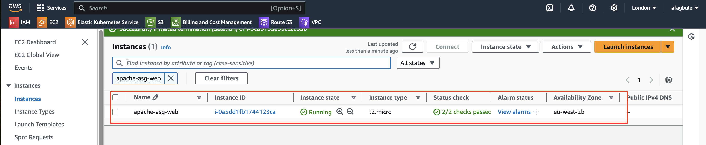

### 3. Test Apache Web Server
1. Copy the Public IP address of any provisioned instance
2. Paste the IP address into your browser
3. You should see the Apache webpage, confirming that:
   - Instances were successfully provisioned from the AMI
   - Apache web server is running correctly
   - Security groups are properly configured

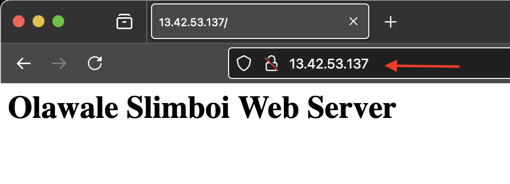

## Testing Auto Scaling Functionality

### Prerequisites for Testing
- SSH access to EC2 instances
- Key pair file (`.pem`)
- Instance public IP address

### 1. SSH Connection
1. Open Git Bash (Windows) or Terminal (MacOS)
2. Navigate to your key directory
3. Connect to the instance:
```bash
ssh -i ~/.ssh/devops.pem ec2-user@<PUBLIC-IP>
```
Replace `<PUBLIC-IP>` with your instance's public IP address

### 2. Monitor Initial CPU Usage
1. Run the `top` command to view all running processes
2. Note the initial CPU utilization (should be around 0.0%)

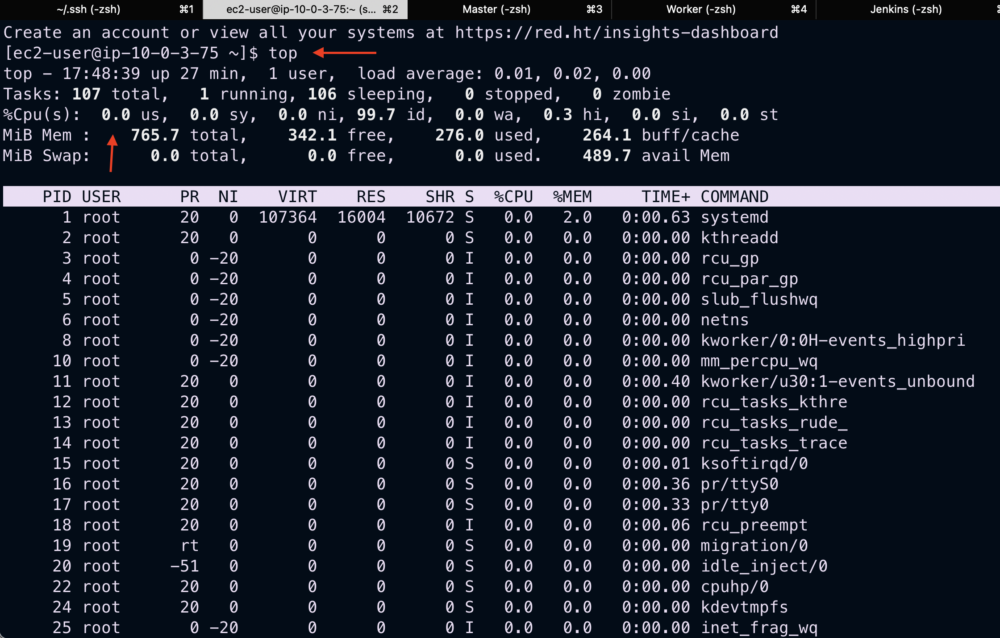

### 3. Simulate High CPU Load
1. Run the following command to spike CPU usage:
```bash
sha1sum /dev/zero &
```
2. Run `top` again to observe the effect:
   - Look for the sha1sum process (e.g., PID 1784)
   - CPU usage should increase to ~99.0%

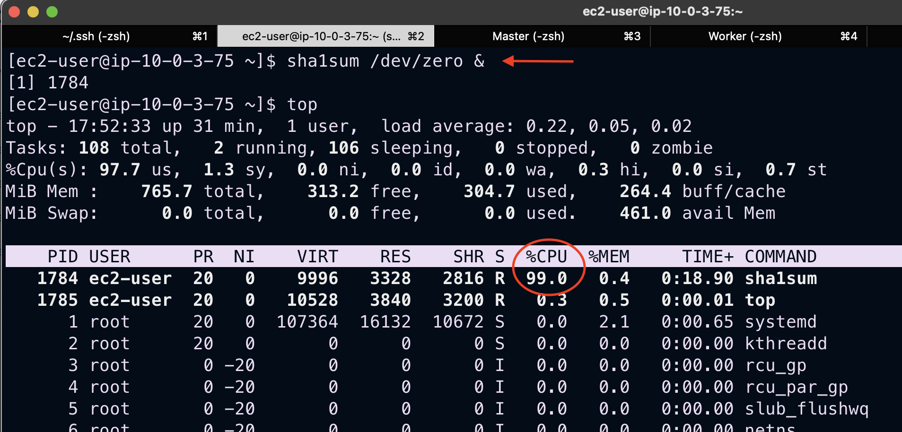

### 4. Observe Auto Scaling Response
1. Navigate to EC2 Dashboard
2. Watch for new instances being provisioned due to high CPU

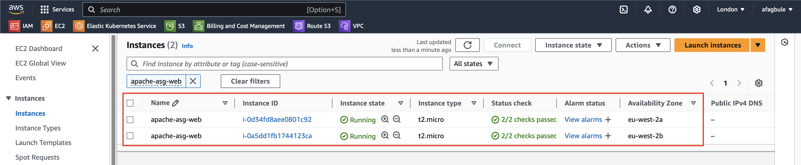

3. Check Auto Scaling Group Activity tab for scaling actions

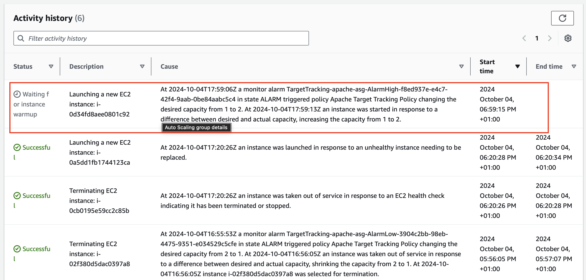

4. Wait approximately 5 minutes for the scaling action to complete successfully

### 5. Return to Normal State
1. Kill the sha1sum process:
```bash
kill <sha1sum-PID>
```
Replace `<sha1sum-PID>` with the actual process ID

2. Verify CPU returns to normal using `top` command

### 6. Observe Scale-In Behavior
1. Wait approximately 10 minutes
2. Check Auto Scaling Group activity:
   - Group should scale in
   - Excess instances will be terminated
   - System returns to desired state (1 instance)

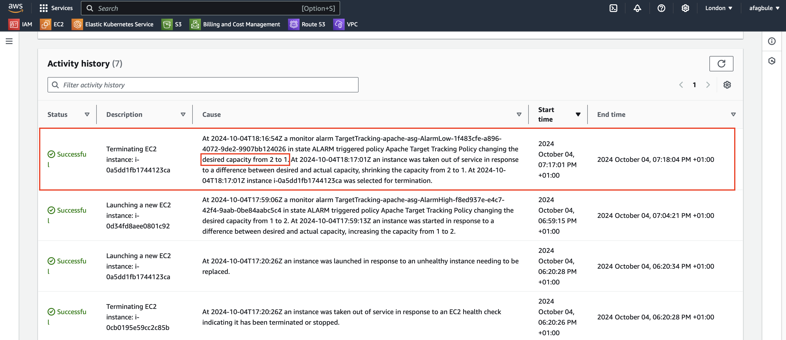

3. Verify final instance count in EC2 Dashboard

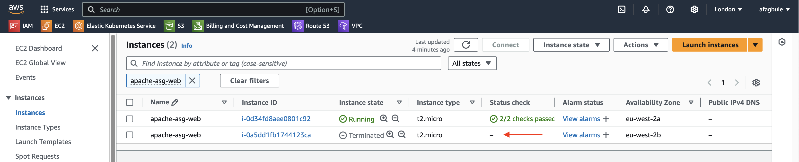

## Conclusion
Congratulations! You have successfully:
- Created an Auto Scaling Group
- Tested automatic scaling based on CPU utilization
- Verified scale-out and scale-in functionality
- Observed the self-healing nature of Auto Scaling Groups

## Next Steps
Consider exploring:
- Different scaling policies
- Custom metrics for scaling
- Integration with load balancers
- More complex scaling scenarios