# GitHub Pull Request Tutorial

This guide will walk you through the process of creating a pull request on GitHub, from creating a repository to merging changes.

## Prerequisites

- A GitHub account

## Steps

### 1. Create a GitHub Repository

1. Create a public GitHub repository via your browser. (See [How to Create and Use a GitHub Repository](https://github.com/slimboi/mot-labs/blob/main/Creating-a-Github-Repository/github.md) for guidance)
   - You can add a README.md file by checking the box while creating the repo.

### 2. Create a Feature Branch

1. On your repository page, click on "main"
2. Type in your feature branch name
3. Click "Create branch"

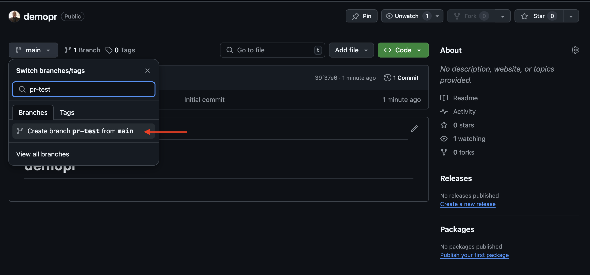

### 3. Clone the Repository

1. Open your terminal (Mac) or GitBash (Windows)
2. Clone the repository using:
   ```
   git clone git@github.com:yourusername/yourrepo.git
   ```
3. Verify the cloned repo with `ls`

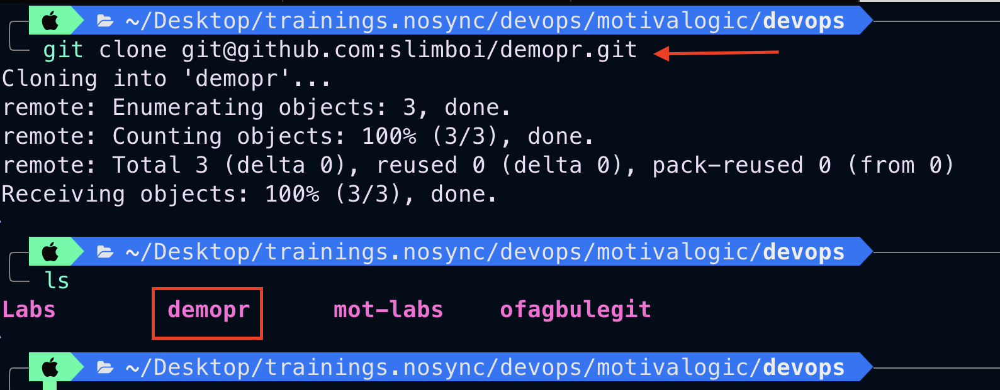

### 4. Navigate and Switch Branches

1. Change to the repo directory: `cd YOUR_DIRECTORY_NAME`
2. View all branches: `git branch -a`
3. Switch to your feature branch: `git checkout YOUR_FEATURE_BRANCH_NAME`

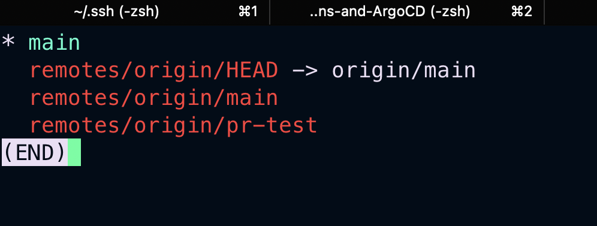

### 5. Make Changes

1. Create a new file: `echo "Testing" >> app.py`
2. Check file status: `git status`

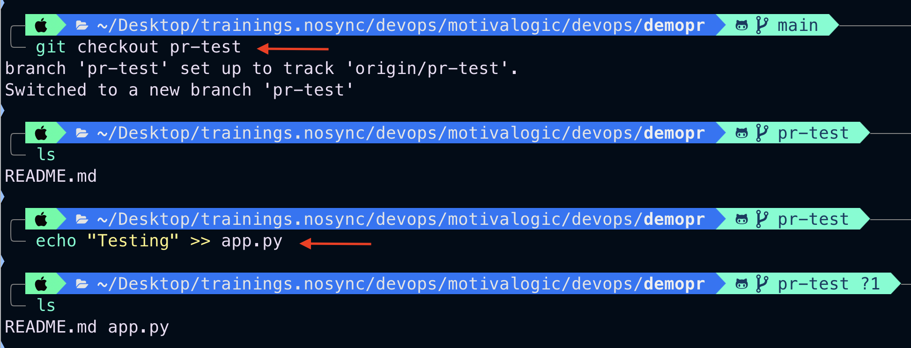

### 6. Stage and Commit Changes

1. Stage changes: `git add .`
2. Commit changes: `git commit -m "YOUR_MESSAGE"`
3. Verify status: `git status`

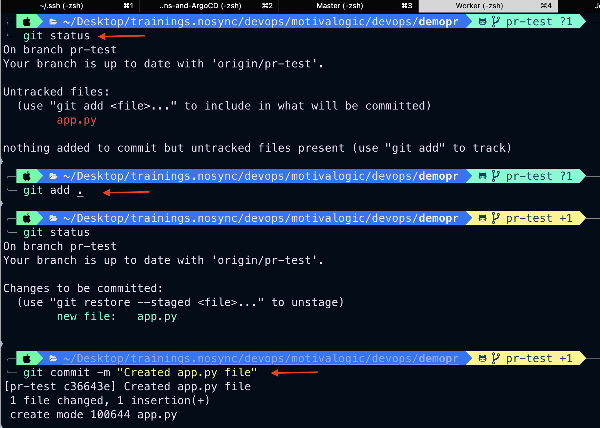

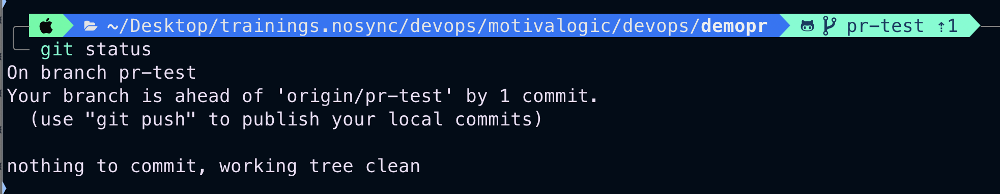

### 7. Push Changes

Push to your remote feature branch:
```
git push origin YOUR_FEATURE_BRANCH_NAME
```

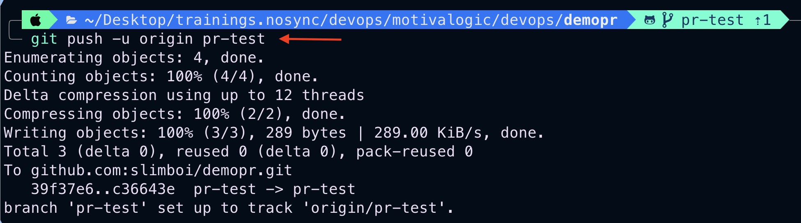

### 8. Create a Pull Request

1. On GitHub, click "Compare & pull request"
2. Add a title and description
3. Click "Create pull request"

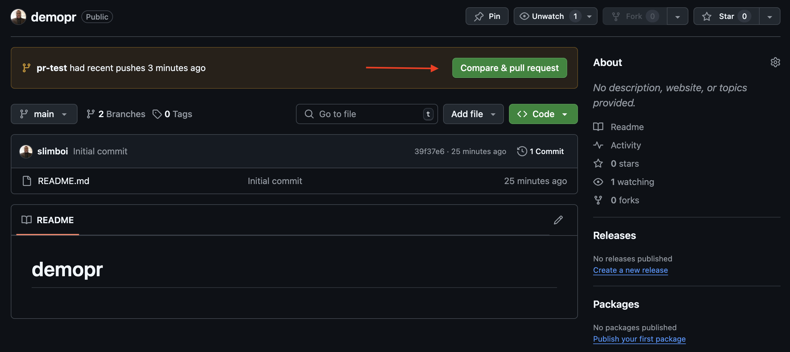

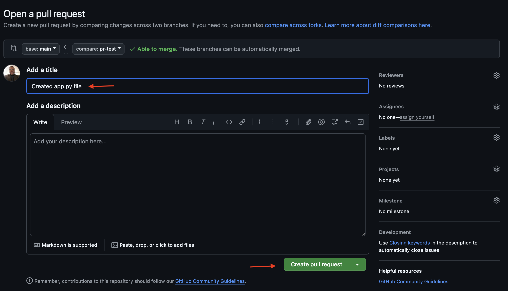

### 9. Merge the Pull Request

1. Click "Merge pull request"
2. Confirm the merge

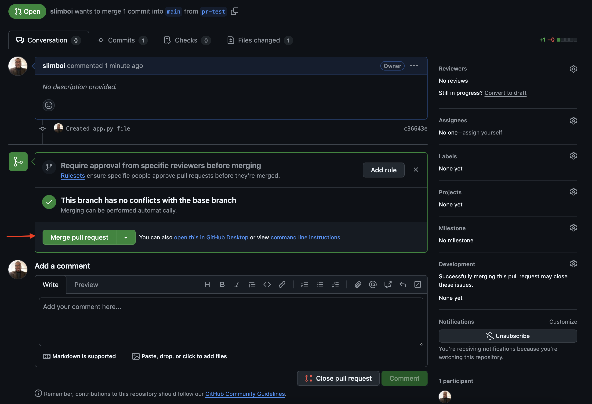

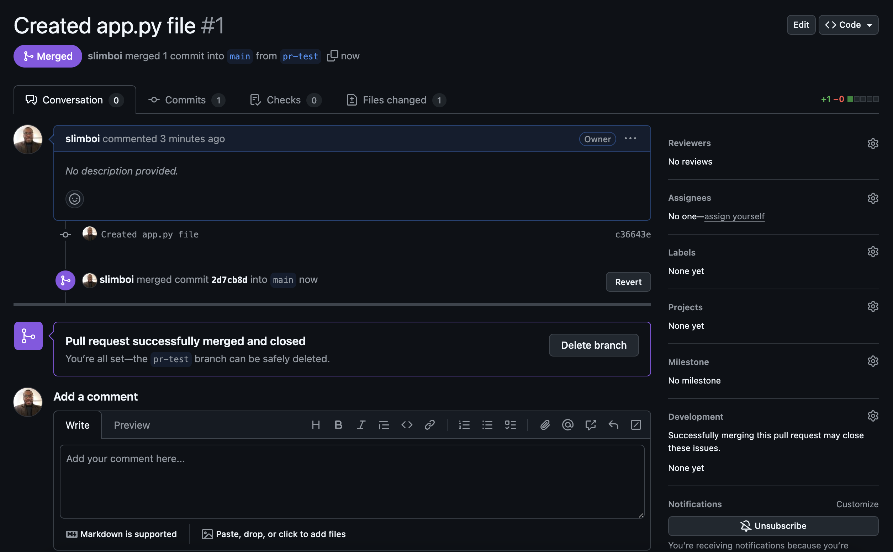

Congratulations! You've successfully created and merged a pull request.