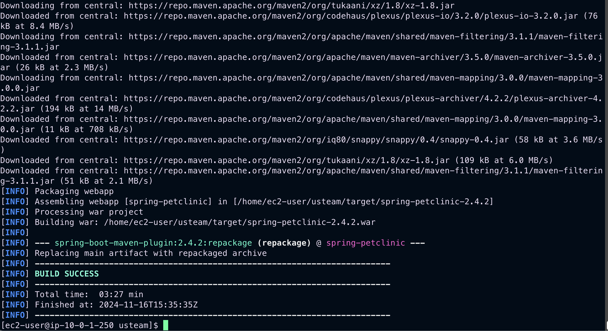
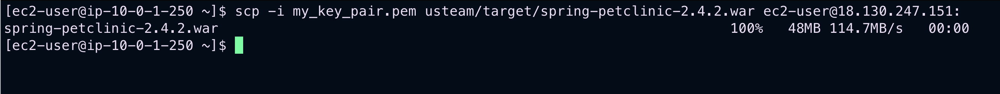
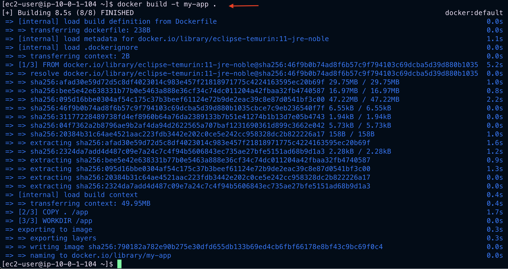
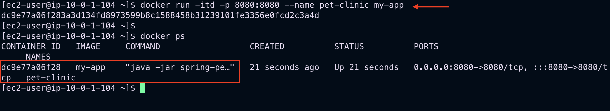
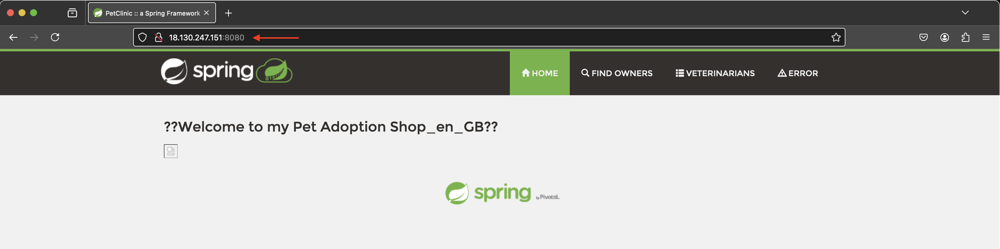

# 📦 Containerized Java Application Deployment with Terraform

This project demonstrates the deployment of a containerized Java application using **Terraform** on AWS infrastructure. The setup automates provisioning, configuration, and application deployment, enabling a streamlined development process.

---

## 🎯 **Project Overview**

This infrastructure setup includes:
- **Two EC2 Instances** in a custom AWS VPC:
  - **Docker Instance**: Hosts the containerized application.
  - **Maven Instance**: Builds the Java application.
- **Automated Software Installation** using user-data scripts.
- **Secure Artifact Transfer** between instances.
- **Deployment of a Containerized Application** using Docker.

---

## 🔧 **Prerequisites**

Ensure the following tools and configurations are in place:

- **AWS Account**: With appropriate IAM permissions.
- **Terraform**: Installed and configured.
- **AWS CLI**: Installed and authenticated.
- **Git**: For repository management.
- **Basic Knowledge**: Familiarity with Maven, AWS, and Docker concepts.

---

## 🏗️ **Infrastructure Components**

### 🛠️ **AWS Resources Created**
- **2 EC2 Instances**: `t2.medium` type.
- **Custom VPC**: With subnets and security groups.
- **Security Groups**: Fine-tuned for Maven and Docker instances.
- **SSH Key Pair**: For secure connections.

### 🔒 **Security Group Configurations**

#### Docker Instance
- Port 22: SSH
- Port 80: HTTP
- Port 8080: Application

#### Maven Instance
- Port 22: SSH
- Port 8080: Application

---

## 🚀 **Setup Instructions**

### **Step 1: Configure AWS Resources with Terraform**

1. **Review Resources** on the [Terraform Registry](https://registry.terraform.io/):
   - Key modules: `aws_vpc`, `aws_subnet`, `aws_security_group`, `aws_key_pair`, `aws_instance`.

2. **Create Terraform Files** in your project directory:
   - `main.tf`: Defines AWS resources.
   - `variables.tf`: Stores input variables.
   - `outputs.tf`: Manages deployment outputs.

3. **Update Variables** in `variables.tf` to suit your AWS environment.

---

### **Step 2: Deploy Resources with Terraform**

Run the following commands:
```bash
terraform init
terraform validate
terraform fmt
terraform plan
terraform apply
```

---

### **Step 3: Set Up Maven Server**

1. **Access Maven Instance**:
   ```bash
   ssh -i my_key_pair.pem ec2-user@<maven-server-ip>
   ```

2. **Monitor Installations**:
   ```bash
   tail -f /var/log/cloud-init-output.log
   ```

3. **Verify Installations**:
   ```bash
   git --version
   mvn --version
   java --version
   ```

4. **Build Application**:
   ```bash
   git clone https://github.com/CloudHight/usteam.git
   cd usteam
   mvn clean package
   ```
   
   *Successful Maven build process.*

---

### **Step 4: Deploy Artifact to Docker Server**

1. **Set Up SSH Key on Maven Server**:
   ```bash
   vi my_key_pair.pem  # Paste private key
   chmod 400 my_key_pair.pem
   ssh -i my_key_pair.pem ec2-user@<docker-server-ip>
   ```

2. **Transfer Artifact**:
   ```bash
   scp -i my_key_pair.pem usteam/target/spring-petclinic-2.4.2.war ec2-user@<docker-server-ip>:
   ```
   
   *Artifact successfully transferred.*

3. **Verify Artifact**:
   ```bash
   ssh -i my_key_pair.pem ec2-user@<docker-server-ip>
   ls -al
   ```

---

### **Step 5: Create and Run Docker Container**

1. **Create a Dockerfile**:
   ```bash
   vi Dockerfile
   ```

2. **Build the Docker Image**:
   ```bash
   docker build -t my-app .
   ```
   

3. **Run the Container**:
   ```bash
   docker run -itd -p 8080:8080 --name pet-clinic my-app
   docker ps  # Verify container is running
   ```
   

4. **Access Application in Browser**:
   Visit `http://<docker-server-ip>:8080`.

   
   *Application successfully running in the browser.*

---

### **Step 6: Cleanup Resources**

Destroy all resources after testing:
```bash
# Stop and remove container
docker stop pet-clinic
docker rm pet-clinic

# Remove infrastructure
terraform destroy -auto-approve
```

---

## 📂 **Project Structure**
```
.
├── main.tf            # Terraform configurations
├── variables.tf       # Input variables
├── outputs.tf         # Outputs post-deployment
├── Dockerfile         # Container instructions
├── README.md          # Project documentation
└── /imgs              # Images for README
```

---

## 🌟 **Key Features**
- Automates provisioning of AWS resources.
- Facilitates secure artifact transfer between instances.
- Simplifies application deployment using containerization.

Enjoy seamless deployments with Terraform and Docker!