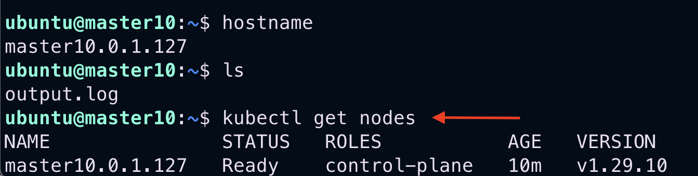
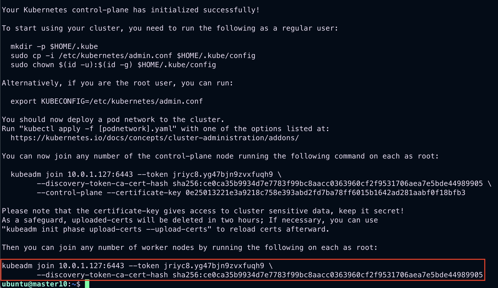
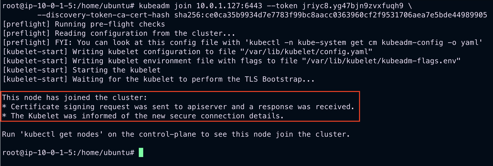
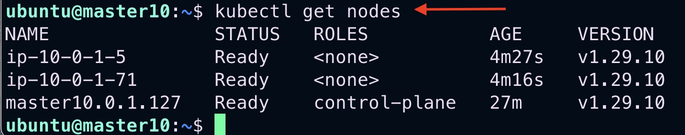
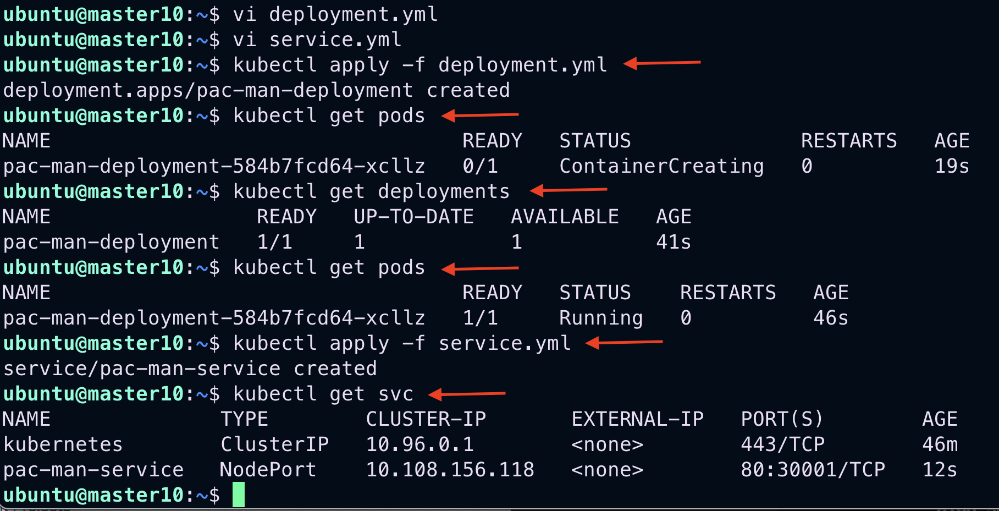
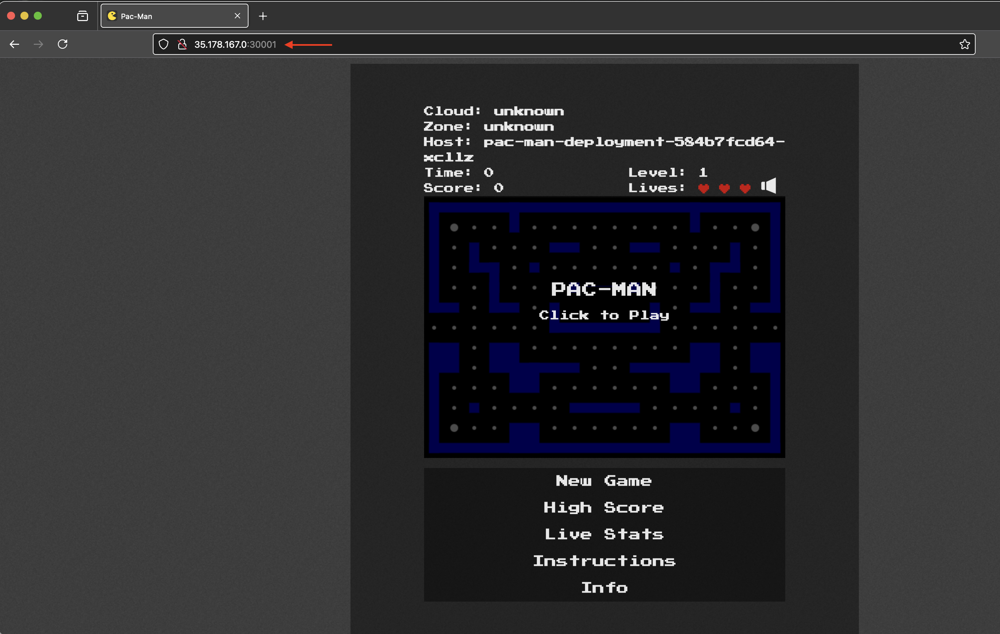

# **Creating a Kubernetes Cluster and Deploying an Application**

This project automates the deployment of a Kubernetes cluster on AWS EC2 instances using Terraform. The setup includes a master node and worker nodes in a custom VPC, with a sample application deployment. 

By following this guide, you'll learn to:

1. Use Terraform to create three EC2 instances in a custom AWS VPC.
2. Install Kubernetes on the EC2 instances using user-data scripts.
3. Initialize the master node to form a Kubernetes cluster.
4. Add worker nodes to the cluster.
5. Deploy an application using a `deployment.yml` file.
6. Expose the application using a `service.yml` file.

---

## 🔧 **Prerequisites**

Before starting, ensure the following:

- **AWS Account**: With IAM permissions to manage VPC, EC2, and related resources.
- **Terraform**: Installed and configured on your machine.
- **AWS CLI**: Installed and authenticated with access to your AWS account.
- **Knowledge Requirements**: Familiarity with AWS and Kubernetes concepts is recommended.

---

## 🚀 **Setup Instructions**

### **Step 1: Configure AWS Resources with Terraform**

1. **Review Key Modules**:
   Use Terraform modules from the [Terraform Registry](https://registry.terraform.io/), including:
   - `aws_vpc`
   - `aws_subnet`
   - `aws_security_group`
   - `aws_key_pair`
   - `aws_instance`

2. **Create Terraform Configuration Files**:
   - `main.tf`: Defines the AWS resources to be created.
   - `variables.tf`: Stores configurable variables like instance types, VPC CIDRs, etc.
   - `outputs.tf`: Manages and displays output values from the deployment.

3. **Customize Variables**:
   Edit `variables.tf` to suit your AWS environment (e.g., key pair name, region).

---

### **Step 2: Deploy Resources with Terraform**

Run the following commands to initialize and apply the Terraform configuration:

```bash
terraform init
terraform validate
terraform fmt
terraform plan
terraform apply
```

---

### **Step 3: Initialize the Kubernetes Master Node**

1. **SSH into the Master Node**:
   ```bash
   ssh -i my_key_pair.pem ubuntu@<master-node-ip>
   ```

2. **Verify Master Node Readiness**:
   ```bash
   kubectl get nodes
   ```

   

3. **Retrieve the Cluster Token**:
   Check the `output.log` file for the `kubeadm join` token:
   ```bash
   cat output.log
   ```

   

---

### **Step 4: Add Worker Nodes to the Cluster**

1. **SSH into Each Worker Node**:
   ```bash
   ssh -i my_key_pair.pem ubuntu@<worker-node-ip>
   sudo su
   ```

2. **Join Worker Nodes**:
   Run the `kubeadm join` command from the `output.log` on each worker node.

   

3. **Verify Cluster Nodes**:
   Check that the worker nodes have successfully joined the cluster:
   ```bash
   kubectl get nodes
   ```

   

---

### **Step 5: Deploy the Application**

1. **Create Deployment and Service Files**:
   Define your application deployment in `deployment.yml` and expose it with `service.yml`.

2. **Apply the Configurations**:
   ```bash
   kubectl apply -f deployment.yml
   kubectl apply -f service.yml
   ```

3. **Verify Application Deployment**:
   ```bash
   kubectl get pods
   kubectl get services
   ```



4. **Access the Application**:
   Copy any of your worker node's IP address, paste it into your browser with port `30001` (e.g., `YOUR_WORKER_IP_ADDRESS:30001`), and press Enter.



### **Step 6: Cleanup Resources**

After completing your testing or deployment, it's important to clean up the resources to avoid unnecessary costs. Run the following command to destroy all the resources:
```bash
# Remove infrastructure
terraform destroy -auto-approve
```

---

## 📜 **Project Summary**

This lab demonstrated how to:

- Provision infrastructure with Terraform.
- Set up a Kubernetes cluster on AWS EC2 instances.
- Deploy and expose an application in the Kubernetes cluster.

For further details, refer to the respective Terraform and Kubernetes documentation.