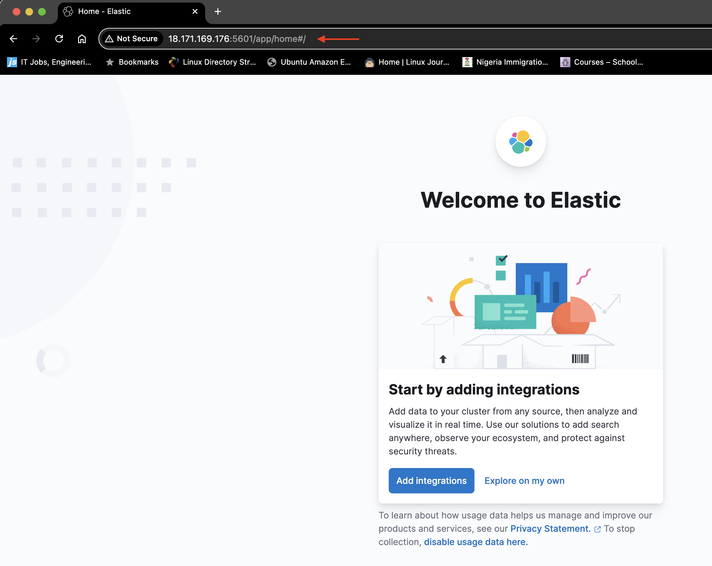
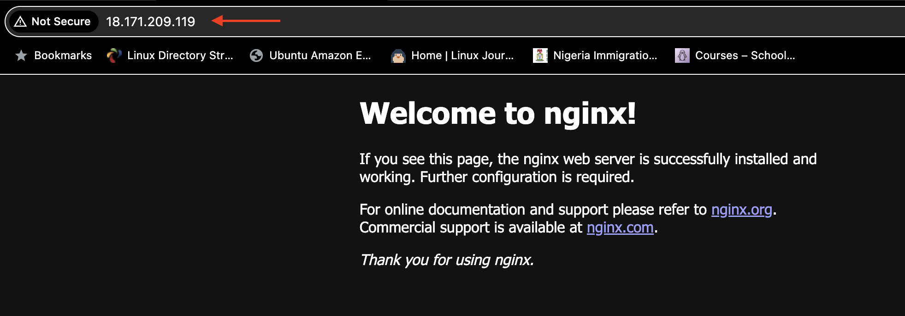
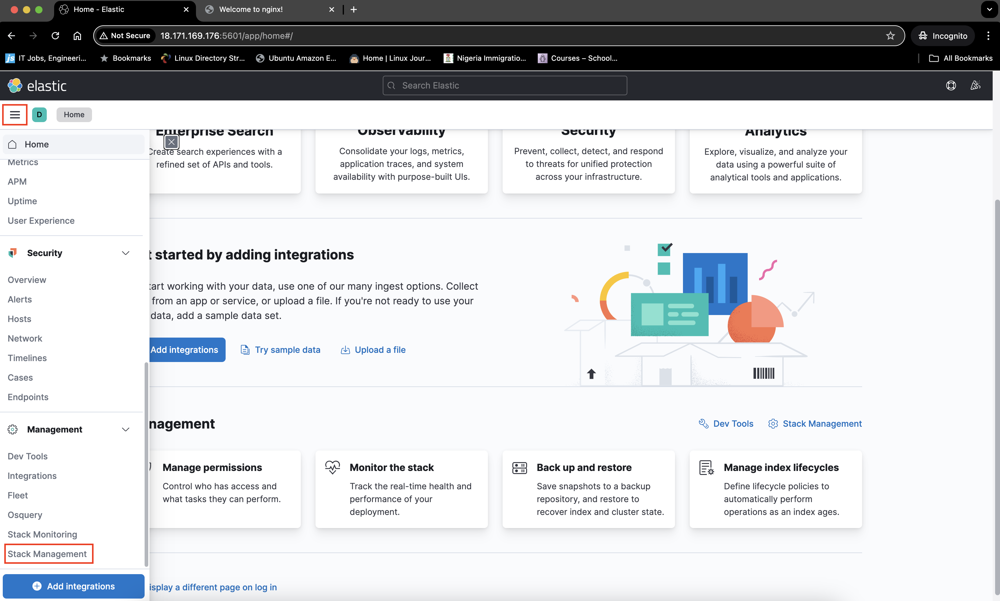
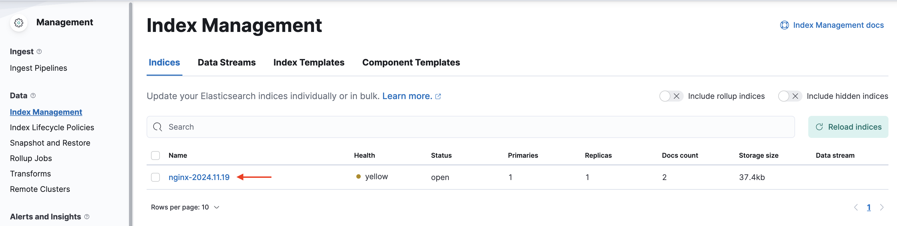
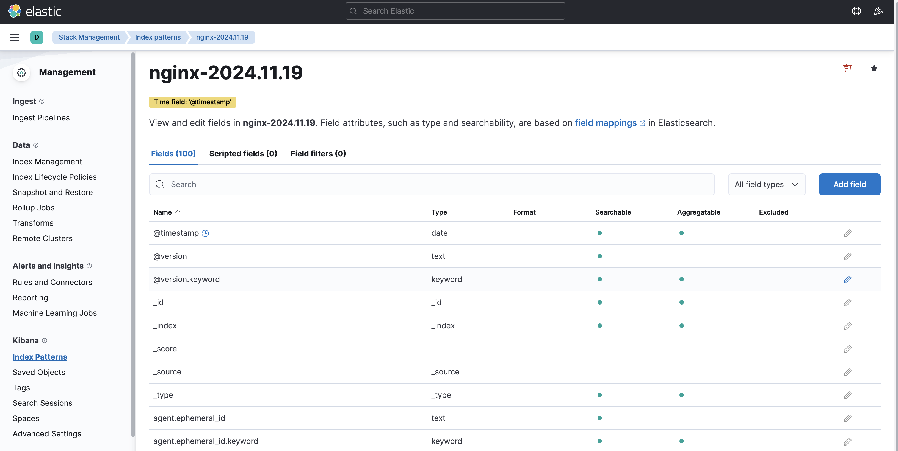
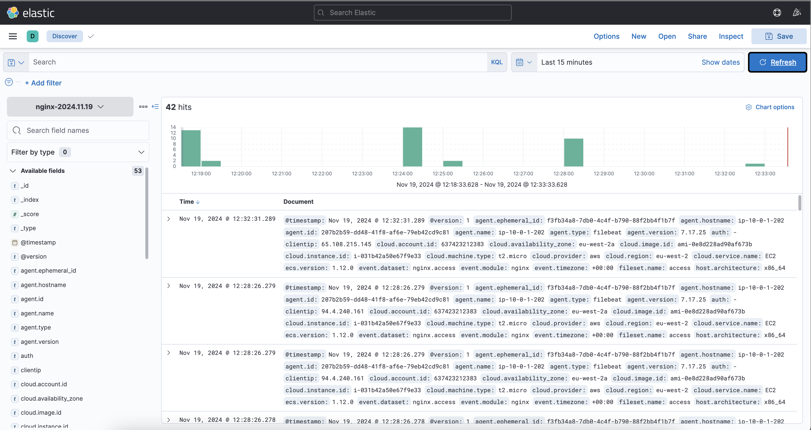

# **Elastic Stack Deployment on AWS EC2: Analyzing Nginx Logs**

This guide demonstrates how to use **Terraform** to create an AWS custom VPC and provision two EC2 instances. One instance hosts **Elasticsearch**, **Logstash**, and **Kibana** (ELK stack), while the other hosts **Nginx** and **Filebeat** for log forwarding.

---

## **🔧 Prerequisites**

Ensure you have the following before starting:

1. **AWS Account**: IAM permissions for managing VPCs, EC2 instances, and related resources.
2. **Terraform**: Installed and configured. [Download Terraform](https://www.terraform.io/downloads.html)
3. **AWS CLI**: Installed and authenticated. [Install AWS CLI](https://docs.aws.amazon.com/cli/latest/userguide/getting-started-install.html)
4. **Basic Knowledge**: Familiarity with AWS services and Terraform fundamentals.

---

## **🚀 Setup Instructions**

### **Step 1: Provision AWS Resources with Terraform**

1. **Terraform Key Resources**:
   - `aws_vpc`: Creates the custom VPC.
   - `aws_subnet`: Allocates subnets.
   - `aws_security_group`: Manages traffic permissions.
   - `aws_key_pair`: Sets up SSH access.
   - `aws_instance`: Provisions EC2 instances.

2. **Terraform File Organization**:
   - `main.tf`: Core AWS resource definitions.
   - `variables.tf`: Configurable parameters (e.g., instance types, regions, key pairs).
   - `outputs.tf`: Displays instance details like IP addresses.

3. **Customize Variables**:
   Update `variables.tf` to suit your setup:
   - Instance Types:
     - ELK Stack: `t2.large` (for heavy workloads).
     - Nginx: `t2.micro`.
   - Specify AWS key pair and region.

### **Step 2: Deploy Infrastructure**

Run the following commands in your Terraform project directory:

```bash
terraform init       # Initialize Terraform
terraform validate   # Validate configuration
terraform fmt        # Format code for readability
terraform plan       # Preview infrastructure changes
terraform apply      # Apply the configuration
```

---

### **Step 3: Validate and Access Services

### **Kibana Dashboard**

1. **Wait for Setup**:
   Allow 3 minutes for the EC2 instances to complete initialization.

2. **Access Kibana**:
   - Copy the public IP of the Elastic Stack server.
   - Navigate to:  
     `http://<YOUR_ELASTIC_IP>:5601`.

   

---

### **Nginx Server**

1. **Generate Logs**:
   - Copy the public IP of the Nginx server.
   - Navigate to:  
     `http://<YOUR_NGINX_IP>`.
   - Refresh the page multiple times to create logs.

   

---

## **🔍 Kibana: Exploring Nginx Logs**

1. **Navigate to Stack Management**:
   - Open the Kibana Dashboard:  
     `http://<YOUR_ELASTIC_IP>:5601`.
   - Click on Explore on my own
   - Go to **Stack Management**.

   

2. **Check Index Management**:
   - Click **Index Management**.
   - If no indices are visible, click **Reload Indices**.
   - Verify the availability of the Nginx index.

   

3. **Create an Index Pattern**:
   - Navigate to **Index Patterns** in Kibana.
   - Click **Create Index Pattern**.
   - Enter a name for your index (e.g., `nginx-2024.11.19`).
   - Select `@timestamp` as the timestamp field.
   - Click **Create Index Pattern**.

   

4. **Discover Nginx Logs**:
   - Go to **Discover** in Kibana.
   - View and analyze the Nginx logs.

   

---

### **Step 4: Cleanup Resources**

To avoid unnecessary costs, clean up resources after completing your testing or deployment. Run the following command to destroy all resources:
```bash
# Remove infrastructure
terraform destroy -auto-approve
```
This will remove all provisioned infrastructure, including EC2 instances, security groups, and the VPC.

---

## **🛠 Troubleshooting Tips**

- Ensure the security group allows HTTP (`80`), and Kibana (`5601`) ports.
- Verify that your Terraform AWS credentials are correctly configured.
- Use SSH to connect to the EC2 instances for debugging:
  ```bash
  ssh -i <YOUR_KEY.pem> ubuntu@<INSTANCE_PUBLIC_IP>
  ```

