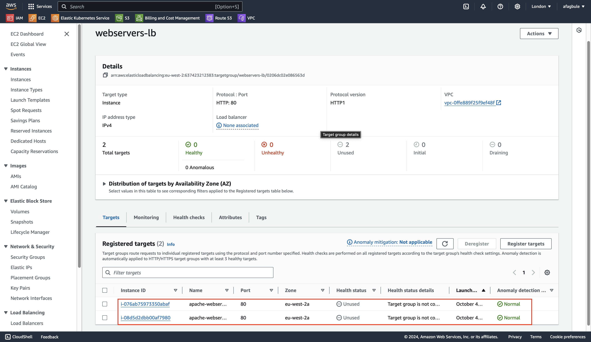
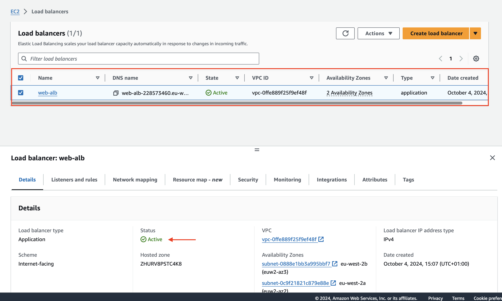
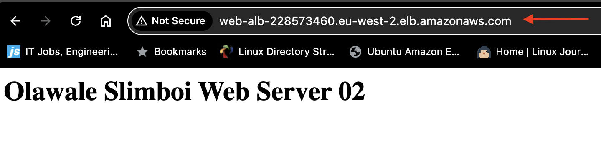

# AWS Application Load Balancer Setup Guide

## What is an Application Load Balancer?
An Application Load Balancer (ALB) is a sophisticated Layer 7 load balancing service provided by AWS. It functions by:
- Distributing incoming application traffic across multiple targets (EC2 instances, containers, IP addresses) in multiple Availability Zones
- Supporting content-based routing, where requests are routed based on the content of the request (URL path, host headers, HTTP headers)
- Offering advanced features like:
  - SSL/TLS termination
  - WebSocket support
  - HTTP/2 support
  - Protection against DDoS attacks when used with AWS Shield
  - Integration with AWS WAF for enhanced security

### Key Benefits
1. **High Availability**: Automatically distributes traffic across multiple AZs
2. **Automatic Scaling**: Works seamlessly with Auto Scaling groups
3. **Health Monitoring**: Continuously checks target health and routes traffic only to healthy targets
4. **Security**: Provides enhanced security with built-in SSL/TLS termination
5. **Cost Efficiency**: Pay only for what you use, with no upfront fees

## Prerequisites
- Active AWS Account
- Basic understanding of AWS EC2 service
- Understanding of basic networking concepts

## Infrastructure Overview
This guide walks through setting up an Application Load Balancer (ALB) with two EC2 instances running Apache web servers. The ALB will distribute traffic between these instances, providing high availability and fault tolerance.

### Architecture Diagram
```
                                   ┌──────────────────┐
                                   │                  │
                              ┌────►  Web Server 01   │
                              │    │                  │
┌──────────────┐    ┌─────────┴──┐ └──────────────────┘
│              │    │             │
│    Client    ├────►     ALB     │
│              │    │             │
└──────────────┘    └─────────┬──┘ ┌──────────────────┐
                              │    │                  │
                              └────►  Web Server 02   │
                                   │                  │
                                   └──────────────────┘
```

## EC2 Instance Setup

### Common Configuration for Both Instances
1. Navigate to EC2 Dashboard → Launch Instance
2. Configure base settings:
   - AMI: Red Hat Enterprise Linux
   - Instance Type: t2.micro (Free Tier eligible)
   - Key Pair: Create new or select existing

### Network Settings
- VPC: Your custom VPC
- Subnet: Public subnet
- Auto-assign Public IP: Enable
- Security Group: Use existing frontend security group (`ofagbule-frontend-sg`)

### Instance 1: Web Server 01
1. Name: `apache-webserver-01`
2. Under Advanced Details, add the following User Data script:
```bash
#!/bin/bash
#sudo yum update -y
sudo yum install httpd -y
sudo systemctl start httpd
sudo chkconfig httpd on
echo "<html><h1>Olawale Slimboi Web Server 01</h1></html>" > /var/www/html/index.html
```

### Instance 2: Web Server 02
1. Name: `apache-webserver-02`
2. Use identical configuration as Instance 1, but with this User Data script:
```bash
#!/bin/bash
#sudo yum update -y
sudo yum install httpd -y
sudo systemctl start httpd
sudo chkconfig httpd on
echo "<html><h1>Olawale Slimboi Web Server 02</h1></html>" > /var/www/html/index.html
```

## Verification
1. Wait for both instances to launch and pass status checks
2. Copy the public IP address of each instance
3. Paste each IP address into a web browser
4. Verify that you see the corresponding web server message for each instance


## Load Balancer Configuration

### 1. Create Target Group
1. Navigate to EC2 Dashboard → Target Groups (left panel)
2. Click "Create target group"
3. Configure basic settings:
   - Target type: `Instances`
   - Target group name: `webservers-lb`
   - Protocol: `HTTP`
   - Port: `80`
   - IP address type: `IPv4`
   - VPC: Select your custom VPC
   - Protocol version: `HTTP1`

4. Configure health checks:
   - Health check path: `/index.html`
   - Advanced health check settings (recommended defaults):
     - Port: `traffic-port`
     - Healthy threshold: `2`
     - Unhealthy threshold: `2`
     - Timeout: `5 seconds`
     - Interval: `30 seconds`
     - Success codes: `200`

5. Register targets:
   - Select both EC2 instances created earlier
   - Click "Include as pending below"
   - Verify port is set to `80`
   - Click "Create target group"



### 2. Create Application Load Balancer
1. Navigate to Load Balancers in EC2 Dashboard
2. Click "Create Load Balancer"
3. Select "Application Load Balancer" by clicking create
4. Configure basic settings:
   - Name: `web-alb`
   - Scheme: `internet-facing`
   - IP address type: `IPv4`

5. Network configuration:
   - VPC: Select your custom VPC
   - Mappings: Select at least two Availability Zones
   - Security Groups: Create or select existing

6. Listeners and routing:
   - Protocol: `HTTP`
   - Port: `80`
   - Default action: Forward to target group `webservers-lb`

7. Review and create:
   - Verify all settings
   - Click "Create load balancer"

### 3. Verify Load Balancer Configuration
1. Wait for ALB to become active (may take a few minutes)



2. Copy the ALB's DNS name from the details panel
3. Paste the DNS name into a web browser
4. Refresh several times to verify traffic distribution between both web servers




[Previous sections remain the same up to "Verify Load Balancer Configuration"]

## Testing High Availability

### Testing Failover Scenario
We'll simulate a failure in one web server to demonstrate the ALB's high availability features.

1. Connect to apache-webserver-01:
```bash
# SSH into the instance
ssh -i your-key.pem ec2-user@apache-webserver-01-ip

# Navigate to web root directory
cd /var/www/html

# Remove index.html file
sudo rm index.html

# Restart Apache service
sudo systemctl restart httpd
```

2. Expected Behavior:
   - The ALB will detect the missing index.html file during health checks
   - `apache-webserver-01` will be marked as unhealthy
   - All traffic will be automatically routed to `apache-webserver-02`
   - Users will continue to see the web page from server 02 with no service interruption

### Monitoring the Failover
1. **Browser Testing**:
   - Open your ALB's DNS name in a browser
   - Refresh several times
   - You should consistently see "Olawale Slimboi Web Server 02"
   - Notice there is no service interruption

2. **Health Check Status**:
   - Navigate to EC2 Dashboard → Target Groups
   - Select your target group
   - View the Targets tab
   - You should see:
     - `apache-webserver-01`: Status "unhealthy"
     - `apache-webserver-02`: Status "healthy"

### Recovery Process
To restore the failed instance:

1. Reconnect to apache-webserver-01
2. Recreate the index.html file:
```bash
sudo bash -c 'echo "<html><h1>Olawale Slimboi Web Server 01</h1></html>" > /var/www/html/index.html'
```
3. Restart Apache:
```bash
sudo systemctl restart httpd
```
4. Monitor the Target Group:
   - Wait for health checks to pass (usually 30-60 seconds)
   - `apache-webserver-01` should return to "healthy" status
   - Traffic will resume distribution between both instances

## Key Learning Points
- ALB automatically detects failed instances through health checks
- Traffic is automatically redistributed to healthy instances
- No manual intervention required for failover
- Recovery is automatic once the instance returns to healthy status

## Best Practices for Production
1. **Health Check Configuration**:
   - Set appropriate check intervals based on your application
   - Choose meaningful health check paths
   - Configure proper thresholds for your use case

2. **Monitoring**:
   - Set up CloudWatch alarms for unhealthy host counts
   - Monitor failed health check rates
   - Configure notifications for health status changes

3. **Documentation**:
   - Maintain recovery procedures
   - Document expected behavior during failures
   - Keep configuration details updated
