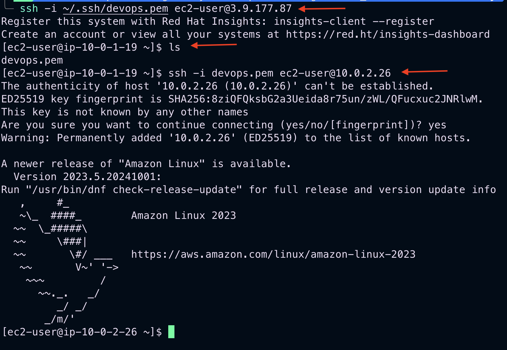
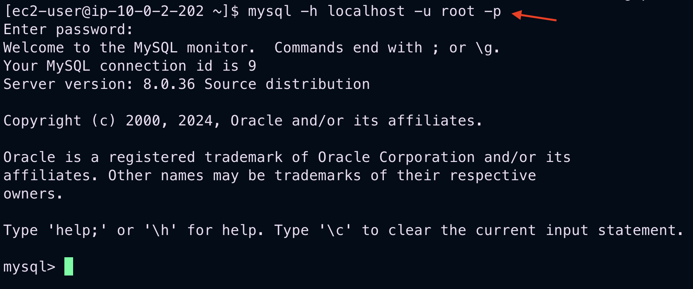
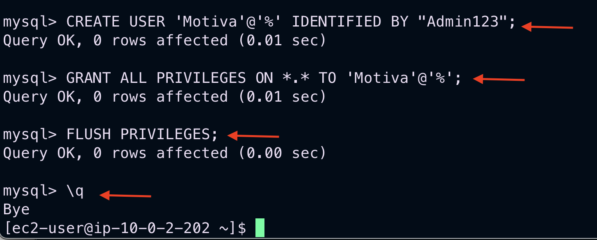
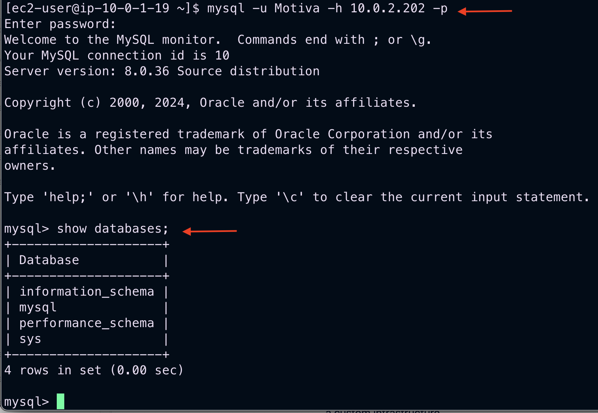
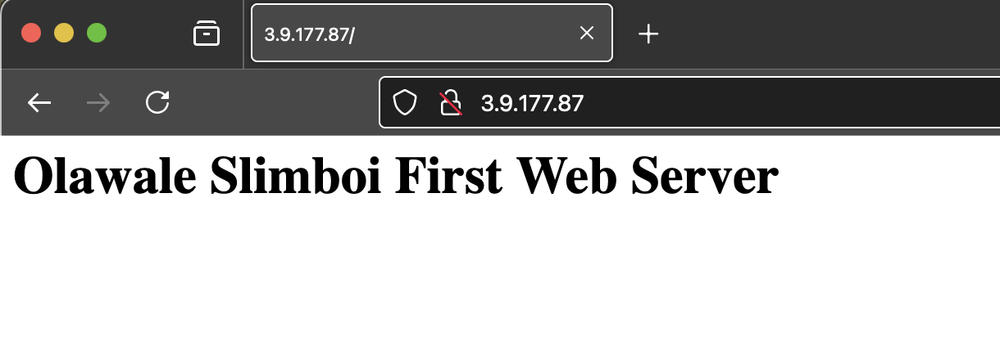

# Creating a Custom VPC in AWS

## Overview

Amazon Virtual Private Cloud (VPC) is a foundational AWS service that provides isolated cloud resources in a defined virtual network. This guide walks you through creating a custom VPC and deploying resources within it.

## Prerequisites

- Active AWS Account
- IAM user with appropriate permissions
- Basic understanding of networking concepts
- SSH client (GitBash or Mac terminal)

## Features

- Custom IP address range (CIDR block)
- Public and private subnets
- Internet Gateway configuration
- Route tables and security groups
- NAT Gateway
- Apache web server
- MySQL database

## Step-by-Step Guide

### 1. VPC Creation

1. Navigate to VPC Dashboard in AWS Console
2. Select your desired Region (e.g., London - eu-west-2)
3. Click "Create VPC"
4. Configure the following settings:
   - Name tag: `ofagbule-vpc` (or your preferred name)
   - IPv4 CIDR block: `10.0.0.0/16`
   - Tenancy: Default
5. Click "Create VPC"


### 2. Subnet Configuration

1. In the left navigation panel, click "Subnets"
2. Click "Create subnet"
3. Select your VPC from the dropdown menu
4. Create public subnet:
   - Subnet name: `ofagbule-pub-01`
   - Availability Zone: eu-west-2a
   - IPv4 CIDR block: `10.0.1.0/24`
5. Click "Add new subnet"
6. Create private subnet:
   - Subnet name: `ofagbule-prv-01`
   - Availability Zone: eu-west-2a
   - IPv4 CIDR block: `10.0.2.0/24`
7. Click "Create subnet"

### 3. Networking Configuration

#### 3.1 Internet Gateway Setup
1. Navigate to Internet Gateways in the left panel
2. Click "Create Internet Gateway"
3. Configure settings:
   - Name tag: `ofagbule-igw`
4. Click "Create Internet Gateway"
5. Attach to VPC:
   - Click "Attach to VPC"
   - Select your VPC from dropdown
   - Click "Attach Internet Gateway"

#### 3.2 Route Table Configuration

##### Public Route Table
1. Select "Route Tables" from left panel
2. Click "Create Route Table"
3. Configure settings:
   - Name tag: `ofagbule-public-rt`
   - Select your VPC
4. Click "Create Route Table"
5. Configure routes:
   - Select Routes tab
   - Click "Edit Routes"
   - Click "Add Route"
   - Destination: `0.0.0.0/0`
   - Target: Select your Internet Gateway
   - Click "Save Changes"
6. Associate subnet:
   - Select Subnet Associations tab
   - Click "Edit Subnet Associations"
   - Select your public subnet
   - Click "Save Associations"

##### Private Route Table
1. Click "Create Route Table"
2. Configure settings:
   - Name tag: `ofagbule-private-rt`
   - Select your VPC
3. Click "Create Route Table"
4. Configure routes:
   - Select Routes tab
   - Click "Edit Routes"
   - Click "Add Route"
   - Destination: `0.0.0.0/0`
   - Target: Select your NAT Gateway
   - Click "Save Changes"
5. Associate subnet:
   - Select Subnet Associations tab
   - Click "Edit Subnet Associations"
   - Select your private subnet
   - Click "Save Associations"

#### 3.3 NAT Gateway Setup
1. Navigate to NAT Gateways in left panel
2. Click "Create NAT Gateway"
3. Configure settings:
   - Name tag: `ofagbule-nat`
   - Subnet: Select your public subnet
   - Connectivity: Select "Public"
   - Click "Allocate Elastic IP"
4. Click "Create NAT Gateway"

#### 3.4 Security Group Configuration

##### Frontend Security Group (Web Server)
1. Navigate to Security Groups in left panel
2. Click "Create Security Group"
3. Configure basic settings:
   - Name: `ofagbule-frontend-sg`
   - Description: "Security group for web servers"
   - VPC: Select your VPC
4. Configure Inbound Rules:
   | Type  | Protocol | Port Range | Source    | Description        |
   |-------|----------|------------|-----------|-------------------|
   | SSH   | TCP      | 22         | 0.0.0.0/0 | SSH access        |
   | HTTP  | TCP      | 80         | 0.0.0.0/0 | HTTP web traffic  |
5. Add tags:
   - Name: `ofagbule-frontend-sg`
6. Click "Create Security Group"

##### Backend Security Group (Database)
1. Click "Create Security Group"
2. Configure basic settings:
   - Name: `ofagbule-backend-sg`
   - Description: "Security group for database servers"
   - VPC: Select your VPC
3. Configure Inbound Rules:
   | Type          | Protocol | Port Range | Source              | Description        |
   |---------------|----------|------------|---------------------|-------------------|
   | SSH           | TCP      | 22         | frontend-sg         | SSH access        |
   | MYSQL/AURORA  | TCP      | 3306       | frontend-sg         | Database access   |
4. Add tags:
   - Name: `ofagbule-backend-sg`
5. Click "Create Security Group"

### Important Notes:
- Ensure all resources are properly tagged for better management
- The NAT Gateway will incur costs as long as it's running
- Security group rules follow the principle of least privilege
- Frontend security group allows inbound HTTP traffic from anywhere
- Backend security group only allows traffic from frontend security group

## EC2 Instance Configuration

### 1. Apache Web Server Instance

#### Instance Setup
1. Navigate to EC2 dashboard
2. Click "Launch Instance"
3. Configure basic settings:
   - Name: `apache-webserver`
   - AMI: Red Hat Enterprise Linux
   - Instance Type: t2.micro
   - Key Pair: Select existing or create new

#### Network Configuration
1. Click "Edit" under Network Settings
2. Configure the following:
   - VPC: Select your created VPC
   - Subnet: Select your **public** subnet
   - Auto-assign Public IP: Enable
   - Security Group: Select existing frontend security group (`ofagbule-frontend-sg`)

#### User Data Configuration
1. Expand "Advanced details"
2. Scroll to User Data section
3. Input the following script:
```bash
#!/bin/bash
#sudo yum update -y
sudo yum install httpd -y
sudo service httpd start
sudo chkconfig httpd on
cd /var/www/html
echo "<html><h1>Olawale Slimboi First Web Server</h1></html>" > index.html
sudo yum install mysql -y
```

4. Click "Launch Instance"

### 2. MySQL Database Instance

#### Instance Setup
1. Click "Launch Instance"
2. Configure basic settings:
   - Name: `mysql-database`
   - AMI: Red Hat Enterprise Linux
   - Instance Type: t2.micro
   - Key Pair: Select existing or create new

#### Network Configuration
1. Click "Edit" under Network Settings
2. Configure the following:
   - VPC: Select your created VPC
   - Subnet: Select your **private** subnet
   - Auto-assign Public IP: Disable
   - Security Group: Select existing backend security group (`ofagbule-backend-sg`)

#### User Data Configuration
1. Expand "Advanced details"
2. Scroll to User Data section
3. Input the following script:
```bash
#!/bin/bash
#sudo yum update -y
sudo yum install mysql-server -y
sudo yum install mysql -y
sudo systemctl start mysqld
sudo systemctl enable mysqld
```

4. Click "Launch Instance"

## Database Configuration and Connection

### 1. Transfer SSH Key to Web Server

1. Open your SSH client
2. Navigate to your keypair directory
3. Transfer the key to the web server:
```bash
scp -i devops.pem devops.pem ec2-user@10.0.2.202:/home/ec2-user
```

**Command Structure:**
- `scp -i [keypair for login] [file name] [username@targethost]:[target path]`

> **Note:** Ensure you're in the directory containing the keypair when executing this command.

### 2. Connect to MySQL Database Instance

1. From the web server, SSH into the MySQL instance using its private IP:
```bash
ssh -i devops.pem ec2-user@<private-ip>
```



2. Log into MySQL as root:
```bash
mysql -h localhost -u root -p
```
> **Note:** Initially, there's no password set. Just press Enter when prompted.



### 3. Configure MySQL Remote Access

1. Create a remote user:
```sql
CREATE USER 'Motiva'@'%' IDENTIFIED BY "Admin123";
```

2. Grant privileges and update permissions:
```sql
GRANT ALL PRIVILEGES ON *.* TO 'Motiva'@'%';
FLUSH PRIVILEGES;
```



3. Exit MySQL:
```sql
\q
```

### 4. Test Remote Connection

1. From the web server, connect to MySQL remotely:
```bash
mysql -u Motiva -h 10.0.2.202 -p
```

2. Verify access by listing databases:
```sql
show databases;
```



## Verification

If all steps are completed successfully, you should:
1. Have a running Apache web server accessible via public IP



2. Be able to connect to MySQL database from the web server
3. See the list of available databases when connected remotely

## Security Considerations

1. Keep your keypair secure and never share it
2. Use strong passwords for database users

## Troubleshooting

Common issues and solutions:
- **SSH Connection Failed:**
  - Verify security group rules
  - Check keypair permissions
  - Confirm instance is running
- **MySQL Connection Failed:**
  - Verify user credentials
  - Check security group allows port 3306
  - Confirm MySQL service is running
- **Web Server Not Accessible:**
  - Check Apache service status
  - Verify security group rules
  - Confirm public IP is accessible

## Cleanup

To avoid unnecessary charges, remember to:
1. Terminate EC2 instances
2. Delete NAT Gateway
3. Release Elastic IPs
4. Delete custom VPC and associated resources