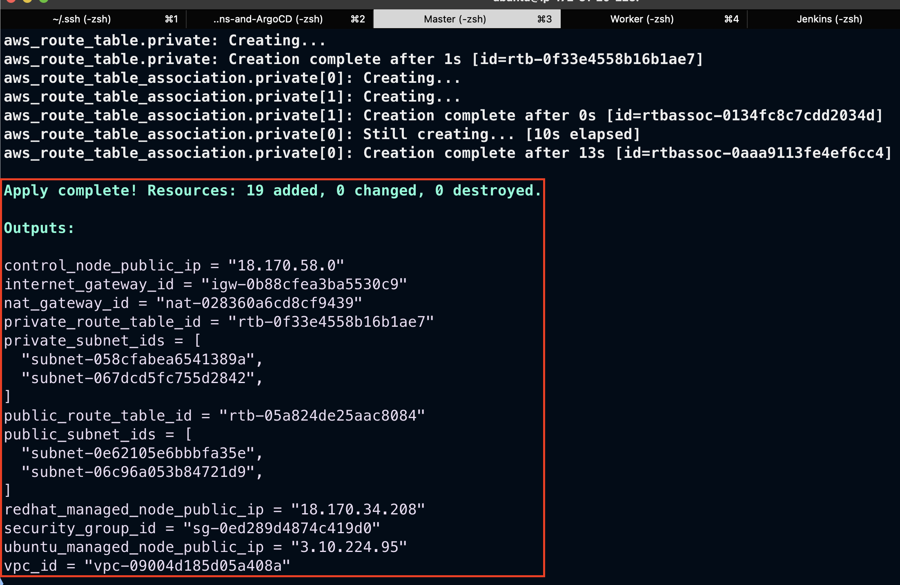
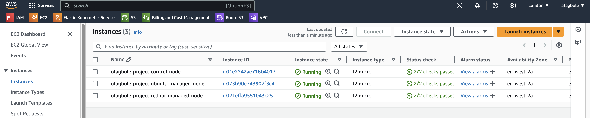
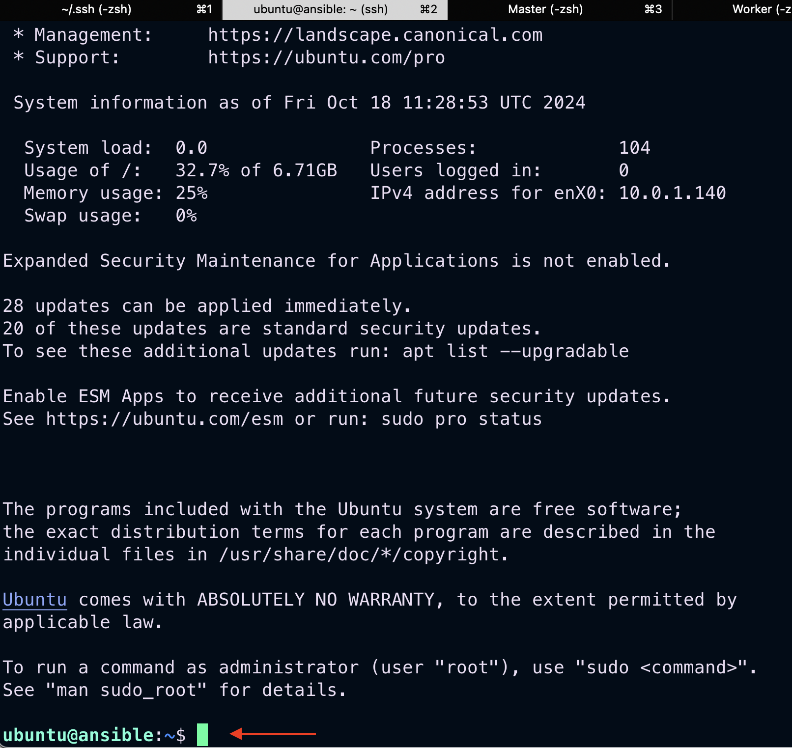
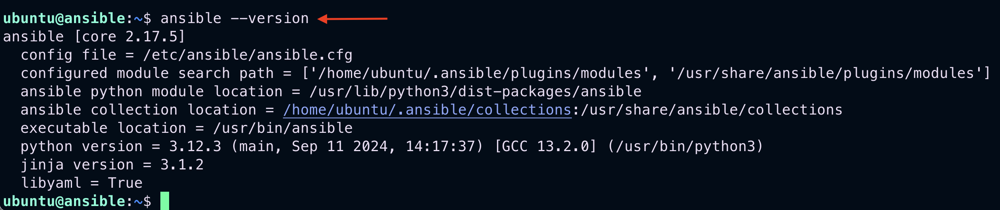
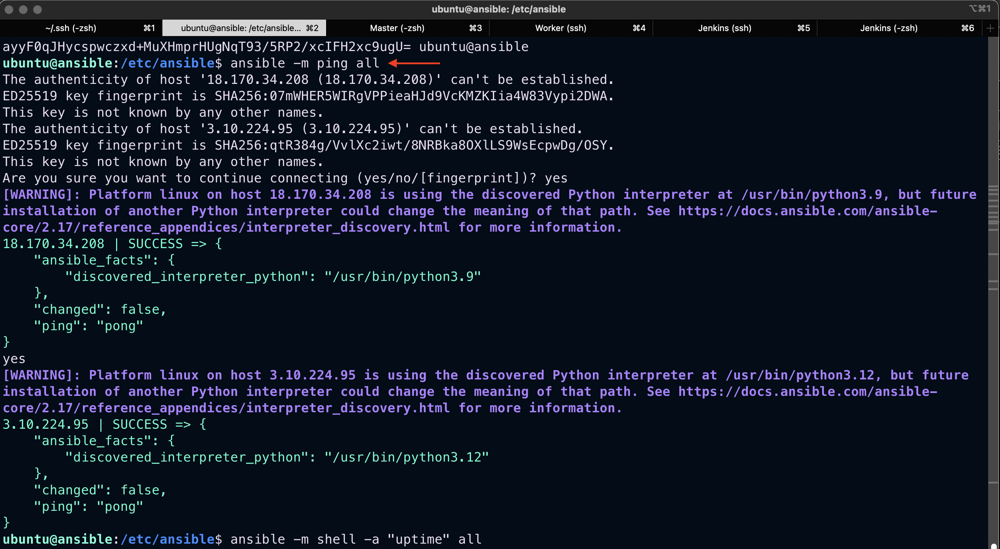
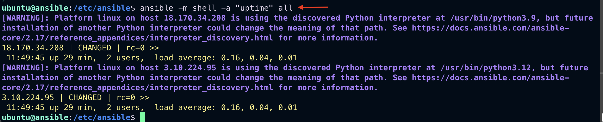
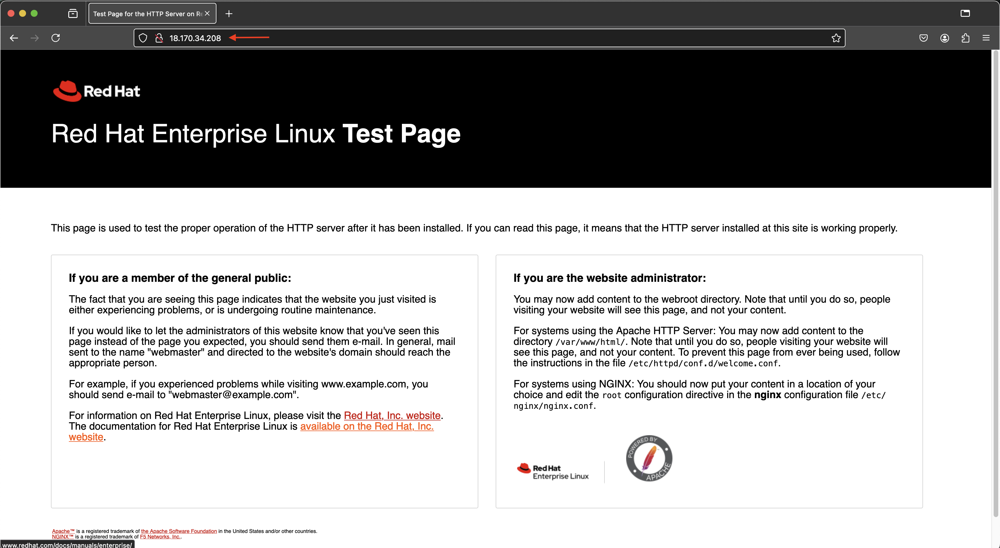
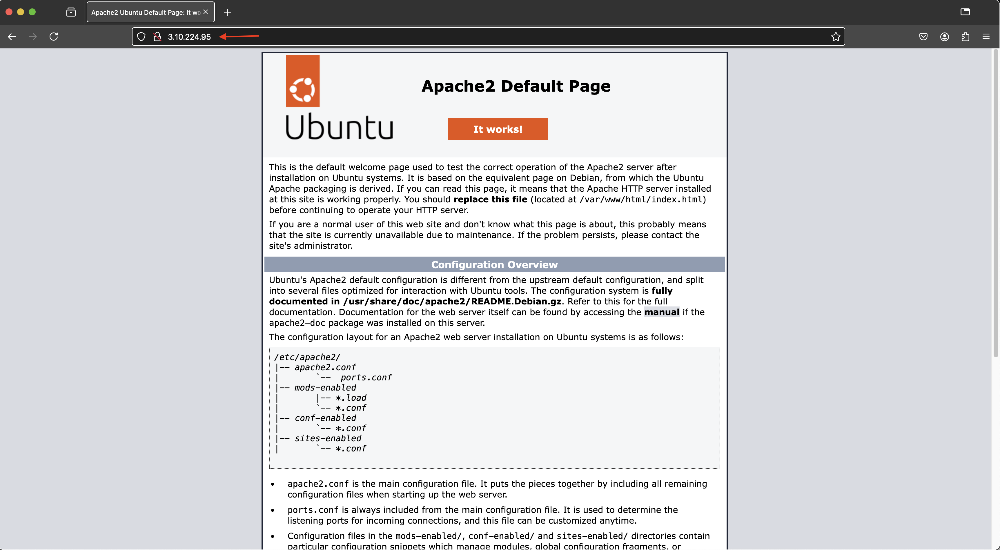
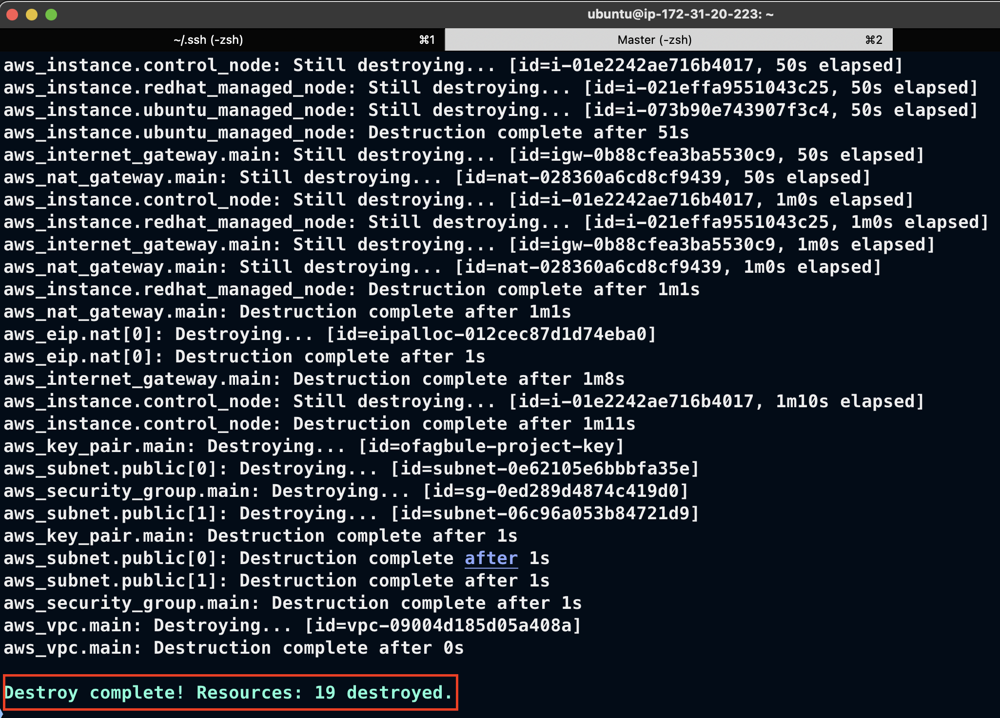

# Install Ansible and Use Ansible Playbooks on AWS EC2 Instances

This guide walks you through installing Ansible and using an Ansible playbook to install packages on remote AWS EC2 instances.

## Prerequisites

Ensure you have the following before starting:

- An active AWS account
- Terraform and AWS CLI installed and configured
- Access to the Terraform Registry

## Step-by-Step Guide

### Step 1: Prepare AWS Resources

Familiarize yourself with the following AWS resources on the [Terraform Registry](https://registry.terraform.io/):

- `aws_vpc`, `aws_subnet`, `aws_internet_gateway`, `aws_nat_gateway`, `aws_eip`, `aws_route_table`, `aws_route_table_association`, `aws_security_group`, `aws_key_pair`, `aws_instance` (3 instances for Ansible control node and managed nodes)

### Step 2: Terraform Configuration

Create the following Terraform files in your project directory:

1. **`main.tf`** – Contains AWS resource definitions.

   ```hcl
   # Your main.tf contents here
   ```

2. **`variables.tf`** – Defines input variables for Terraform.

   ```hcl
   # Your variables.tf contents here
   ```

3. **`outputs.tf`** – Specifies output values post-configuration.

   ```hcl
   # Your outputs.tf contents here
   ```

Update `variables.tf` as per your requirements.

### Step 3: Terraform Execution

```bash
terraform init
terraform validate
terraform fmt
terraform plan
terraform apply
```



### Step 4: Verify the Setup

1. Verify resources via the AWS Management Console or check the Terraform outputs for details like VPC, subnet, and EC2 instance information.
   
   

2. SSH into the Ansible control node:
   ```bash
   ssh -i <path_to_private_key> ubuntu@<instance_public_ip>
   ```
   Replace `<path_to_private_key>` and `<instance_public_ip>` with your actual values.

   

### Step 5: Ansible Setup

1. Verify Ansible installation:
   ```bash
   ansible --version
   ```



2. Configure managed node IPs in `/etc/ansible/hosts`:

   ```ini
   <instance_public_ip> ansible_user=ec2-user
   <instance_public_ip> ansible_user=ubuntu
   ```

3. Generate SSH keys on the Ansible control node:
   ```bash
   ssh-keygen -t rsa
   ```

4. Copy the public key to managed nodes:

   For Red Hat instance:
   ```bash
   ssh -i ~/.ssh/id_rsa ec2-user@<instance_public_ip>
   sudo vi ~/.ssh/authorized_keys  # Paste the public key
   ```

   For Ubuntu instance:
   ```bash
   ssh -i ~/.ssh/id_rsa ubuntu@<instance_public_ip>
   sudo vi ~/.ssh/authorized_keys  # Paste the public key
   ```

### Step 6: Running Ansible Commands

Test connectivity and run basic commands:

1. Ping all managed nodes:
   ```bash
   ansible -m ping all
   ```



2. Run shell commands on all nodes:
   ```bash
   ansible -m shell -a "uptime" all
   ```



### Step 7: Using Ansible Playbook

1. Create a playbook (`playbook.yml`):

sudo vi playbook.yml

   ```yaml
   # Your playbook.yml contents here
   ```

2. Check the playbook syntax:
   ```bash
   ansible-playbook playbook.yml --syntax-check
   ```

3. Run the playbook:
   ```bash
   ansible-playbook playbook.yml
   ```


4. Verify installations by accessing managed node IPs in a web browser





### Step 8: Cleanup

Destroy the infrastructure:
```bash
terraform destroy -auto-approve
```


## Summary

- Set up an Ansible control node on Ubuntu and managed nodes on Red Hat and Ubuntu.
- Configured SSH key-based authentication.
- Used Ansible to install packages on managed nodes via a playbook.

## Challenges

When running `ansible -m ping all`, the command worked for the first instance (<instance_public_ip>), but failed for the second (<instance_public_ip>). Manually running the command for the second instance resolved the issue:
```bash
ansible -m ping <instance_public_ip>
```

Or accept the SSH key fingerprints by responding 'yes' when prompted.

After this, both instances responded successfully when running `ansible -m ping all`.
