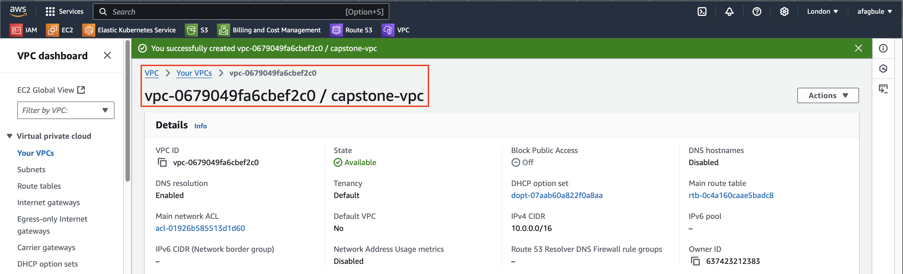
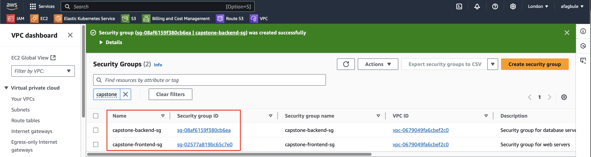

# Stage 1: Application's Infrastructure Provisioning

List of resource created in this stage include:
VPC
Subnets (2 public & private in 2 AZ)
Internet Gateway
NAT Gateway
Route Tables
Security Groups.

## Step-by-Step Guide

### 1. VPC Creation

1. Navigate to VPC Dashboard in AWS Console
2. Select your desired Region (e.g., London - eu-west-2)
3. Click "Create VPC"
4. Configure the following settings:
   - Name tag: `capstone-vpc` (or your preferred name)
   - IPv4 CIDR block: `10.0.0.0/16`
   - Tenancy: Default
5. Click "Create VPC"

### 2. Subnet Configuration

1. In the left navigation panel, click "Subnets"
2. Click "Create subnet"
3. Select your VPC from the dropdown menu
4. Create public subnets:
   - Subnet name: `capstone-pub-01`
   - Availability Zone: eu-west-2a
   - IPv4 CIDR block: `10.0.1.0/24`
   - Subnet name: `capstone-pub-02`
   - Availability Zone: eu-west-2b
   - IPv4 CIDR block: `10.0.2.0/24`
5. Click "Add new subnet"
6. Create private subnet:
   - Subnet name: `capstone-prv-01`
   - Availability Zone: eu-west-2a
   - IPv4 CIDR block: `10.0.3.0/24`
   - Subnet name: `capstone-prv-02`
   - Availability Zone: eu-west-2b
   - IPv4 CIDR block: `10.0.4.0/24`
7. Click "Create subnet"

### 3. Networking Configuration

#### 3.1 Internet Gateway Setup
1. Navigate to Internet Gateways in the left panel
2. Click "Create Internet Gateway"
3. Configure settings:
   - Name tag: `capstone-igw`
4. Click "Create Internet Gateway"
5. Attach to VPC:
   - Click "Actions"
   - Click "Attach to VPC"
   - Select your VPC from dropdown
   - Click "Attach Internet Gateway"

#### 3.2 NAT Gateway Setup
1. Navigate to NAT Gateways in left panel
2. Click "Create NAT Gateway"
3. Configure settings:
   - Name tag: `capstone-nat`
   - Subnet: Select your public subnet
   - Connectivity: Select "Public"
   - Click "Allocate Elastic IP"
4. Click "Create NAT Gateway"

#### 3.3 Route Table Configuration

##### Public Route Table
1. Select "Route Tables" from left panel
2. Click "Create Route Table"
3. Configure settings:
   - Name tag: `capstone-public-rt`
   - Select your VPC
4. Click "Create Route Table"
5. Configure routes:
   - Select Routes tab
   - Click "Edit Routes"
   - Click "Add Route"
   - Destination: `0.0.0.0/0`
   - Target: Select your Internet Gateway
   - Click "Save Changes"
6. Associate subnet:
   - Select Subnet Associations tab
   - Click "Edit Subnet Associations"
   - Select your public subnets
   - Click "Save Associations"

##### Private Route Table
1. Click "Create Route Table"
2. Configure settings:
   - Name tag: `capstone-private-rt`
   - Select your VPC
3. Click "Create Route Table"
4. Configure routes:
   - Select Routes tab
   - Click "Edit Routes"
   - Click "Add Route"
   - Destination: `0.0.0.0/0`
   - Target: Select your NAT Gateway
   - Click "Save Changes"
5. Associate subnet:
   - Select Subnet Associations tab
   - Click "Edit Subnet Associations"
   - Select your private subnet
   - Click "Save Associations"

#### 3.4 Security Group Configuration

##### Frontend Security Group (Web Server)
1. Navigate to Security Groups in left panel
2. Click "Create Security Group"
3. Configure basic settings:
   - Name: `capstone-frontend-sg`
   - Description: "Security group for web servers"
   - VPC: Select your VPC
4. Configure Inbound Rules:
   | Type  | Protocol | Port Range | Source    | Description        |
   |-------|----------|------------|-----------|-------------------|
   | SSH   | TCP      | 22         | 0.0.0.0/0 | SSH access        |
   | HTTP  | TCP      | 80         | 0.0.0.0/0 | HTTP web traffic  |
5. Add tags:
   - Name: `capstone-frontend-sg`
6. Click "Create Security Group"

##### Backend Security Group (Database)
1. Click "Create Security Group"
2. Configure basic settings:
   - Name: `capstone-backend-sg`
   - Description: "Security group for database servers"
   - VPC: Select your VPC
3. Configure Inbound Rules:
   | Type          | Protocol | Port Range | Source              | Description        |
   |---------------|----------|------------|---------------------|-------------------|
   | SSH           | TCP      | 22         | frontend-sg         | SSH access        |
   | MYSQL/AURORA  | TCP      | 3306       | frontend-sg         | Database access   |
4. Add tags:
   - Name: `capstone-backend-sg`
5. Click "Create Security Group"

