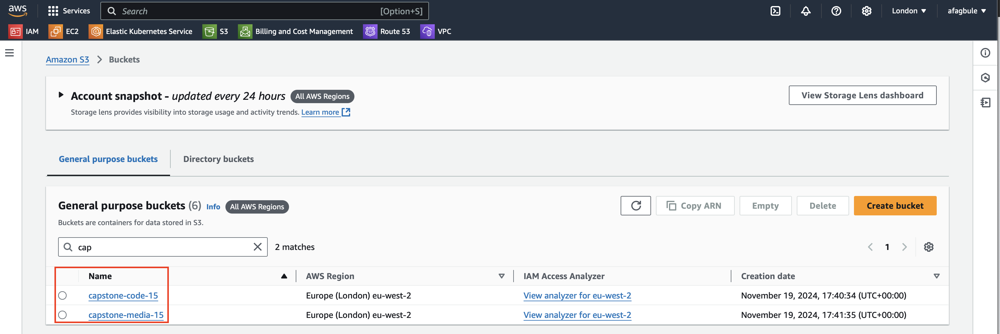
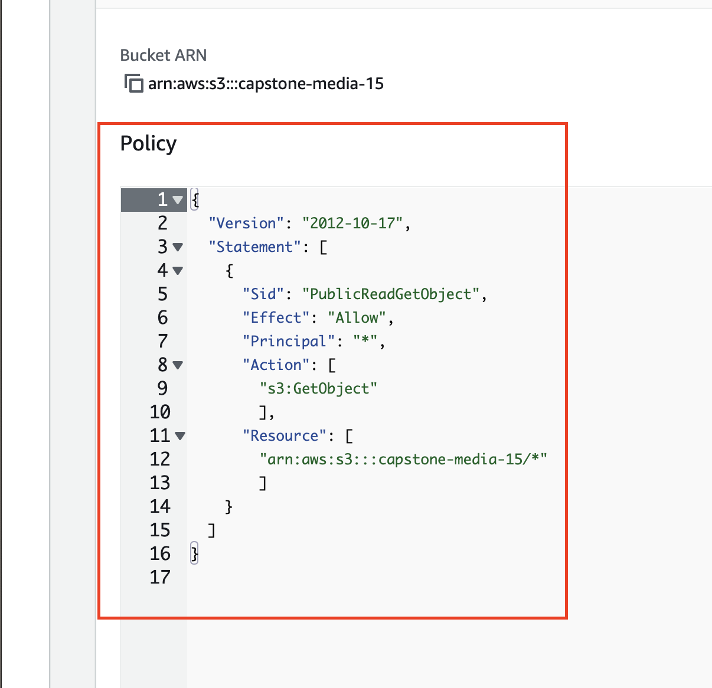

# Stage 2: Create S3 Buckets

This step involves setting up two s3 Buckets:
One for Application’s media. This bucket must be publicly accessible.
One for Application’s code. This bucket shouldn’t be publicly accessible.

## Setup Steps

### 1. Create an S3 bucket for Application code

1. Login to AWS console and click on Services, select S3 located under Storage.
2. Click on "Create bucket".
3. Give a unique name to your bucket. e.g capstone-code-15 
4. Ensure "ACLs disabled" is selected (this is the default).
5. Leave "Block all public access".
6. Select "Disable versioning".
7. Add tags if desired. e.g capstone-project
8. For encryption, keep the defaults:
   - Server-side encryption with AWS S3 managed keys (SSE-S3)
   - Enable Bucket Key
9. Click "Create bucket".

### 2. Create an S3 bucket for Application media

1. Login to AWS console and click on Services, select S3 located under Storage.
2. Click on "Create bucket".
3. Give a unique name to your bucket. e.g capstone-media-15 
4. Ensure "ACLs disabled" is selected (this is the default).
5. Uncheck "Block all public access" and then acknowledge doing this.
6. Select "Disable versioning".
7. Add tags if desired. e.g capstone-project
8. For encryption, keep the defaults:
   - Server-side encryption with AWS S3 managed keys (SSE-S3)
   - Enable Bucket Key
9. Click "Create bucket".

### 3. Set up bucket policy for public access

1. Go to the "Permissions" tab of your media bucket.
2. Scroll down to "Bucket policy" and click "Edit".
3. Add the following policy

  {
  "Version": "2012-10-17",
  "Statement": [
    {
      "Sid": "PublicReadGetObject",
      "Effect": "Allow",
      "Principal": "*",
      "Action": [
        "s3:GetObject"
        ],
      "Resource": [
        "arn:aws:s3:::your-bucket-name/*"
        ]
    }
  ]
}
     (Replace "your-bucket-name" with your actual bucket name)

9. Click "Save changes".