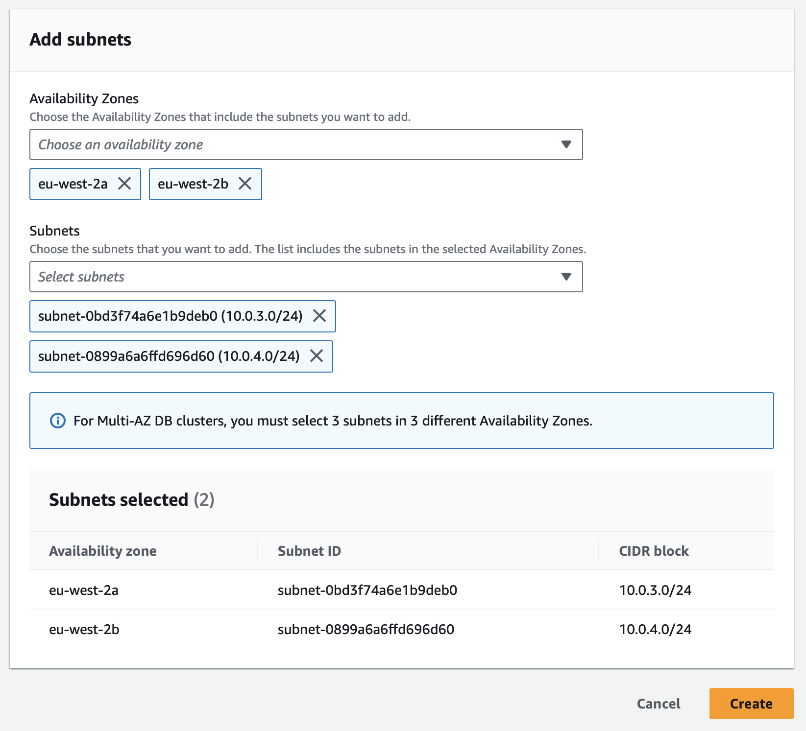
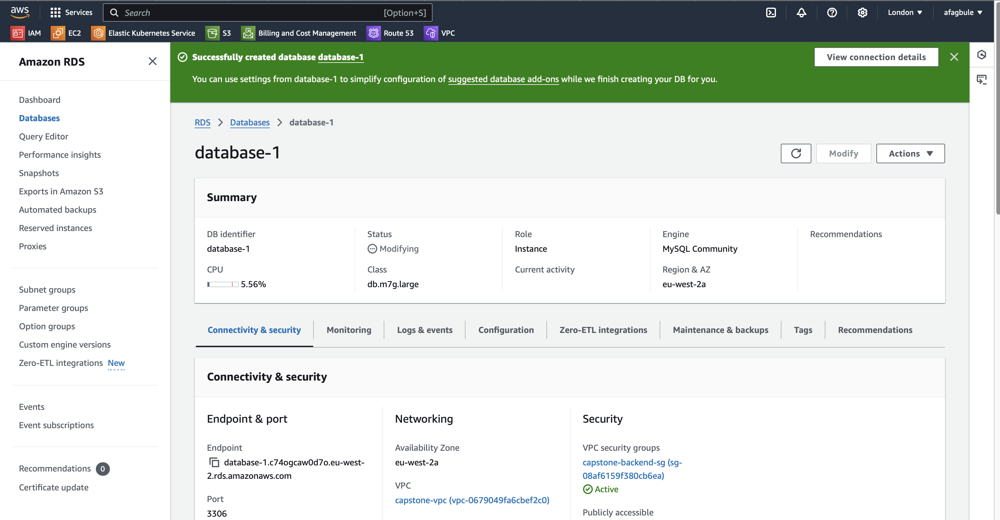

# Stage 3: Create a MySQL Relational Database

This step involves setting up a MySQL database using AWS RDS.

---

## 1. **Create a Subnet Group**
1. Navigate to the **RDS Dashboard** in AWS.
2. Click **Subnet Groups** in the left-hand panel.
3. Select **Create DB Subnet Group** and fill out the following:
   - **Name**: `capstone-db-grp`
   - **Description**: `For Capstone Database`
   - **VPC**: Choose your custom VPC.
4. Under **Add Subnets**, select:
   - Your **availability zones**.
   - Private subnets for each availability zone.
5. Click **Create**.

---

## 2. **Create the Database**
1. Go to the **Database** section in the left-hand panel and click **Create Database**.
2. Configure the database as follows:

### General Settings
- **Creation method**: Standard Create
- **Engine type**: MySQL
- **Edition**: MySQL Community
- **Version**: MySQL 8.0.39 (default)

### Template
- **Template**: Dev/Test
- **Availability & Durability**: Multi-AZ DB instance

### Instance Settings
- **DB Instance Identifier**: `database-1`
- **Credentials**:
  - **Username**: `admin`
  - **Password**: `admin123`
  - **Credentials Management**: Self-managed
- **Instance Class**: Standard classes (`db.m7g.large`)

### Storage Settings
- **Type**: General purpose SSD (`gp3`)
- **Allocated Storage**: 200 GiB

### Connectivity
- **VPC**: `capstone-vpc`
- **DB Subnet Group**: `capstone-db-grp`
- **Public Access**: No
- **VPC Security Group**: Select `capstone-backend-sg` (from existing groups)
- **Tags**: `capstone-project`

---

## 3. **Additional Configuration**
1. Expand the **Additional Configuration** section.
2. Under **Database options**:
   - **Initial Database Name**: `wordpressdb`.
3. Leave other options as default.

---

## 4. **Final Step**
1. Scroll to the bottom of the page and click **Create Database**.

