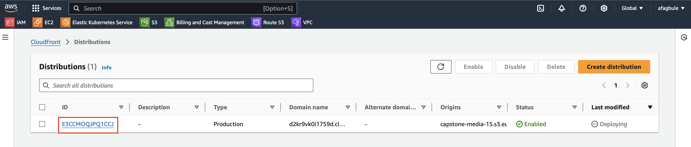

# Stage 4: Create CloudFront Distribution

This step involves setting up a CloudFront distribution and linking it to your media bucket as the origin.

## Steps to Create CloudFront Distribution

1. **Access CloudFront Dashboard**  
   Navigate to the [CloudFront dashboard](https://console.aws.amazon.com/cloudfront) in your AWS Management Console.

2. **Create a New Distribution**  
   - Click **Create Distribution** to start the setup process.

3. **Configure Origin Settings**  
   - In the **Origin Domain** field, select your **Media Bucket** from the dropdown

4. **Enable Security Protections**  
   - Under **Web Application Firewall (WAF)**, enable security protections to safeguard your distribution.

5. **Finalize and Create**  
   - Review the settings and click **Create Distribution** to complete the setup.

Your CloudFront distribution will now be linked to your media bucket, providing a secure and scalable content delivery solution.
