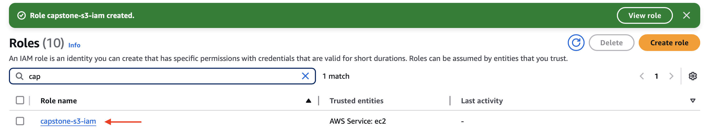

## Stage 5: Create an IAM Role with S3 Full Access

Follow these steps to create an IAM role with full S3 permissions for your project:

1. **Navigate to the IAM Dashboard**  
   - Go to the [IAM Management Console](https://console.aws.amazon.com/iam/).
   - In the left-hand panel, click **Roles**.

2. **Create a New Role**  
   - Click **Create Role**.
   - Under the **Trusted Entity Type** section, select **AWS Service**.
   - In the **Use Case** section, choose **EC2**, then click **Next**.

3. **Attach Permissions**  
   - In the search bar, type `s3`.
   - Select **AmazonS3FullAccess**, then click **Next**.

4. **Name Your Role**  
   - Enter a name for your role (e.g., `capstone-s3-iam`).
   - Scroll down and click **Create Role**.

