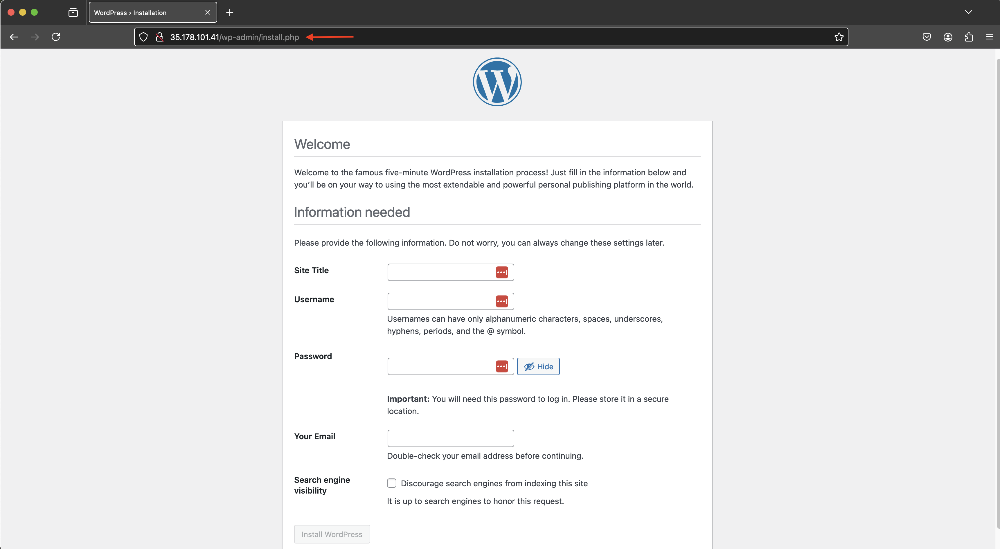

# Stage 6: Create Web Server

This step involves setting up and configuring Apache and Wordpress on a web server using an EC2 instance.

---

## EC2 Instance Configuration

### 1. Launch an Apache Web Server Instance

#### **Step 1: Set Up the Instance**
1. Navigate to the **EC2 Dashboard**.
2. Click **Launch Instance** and configure the following:
   - **Name:** `capstone-webserver`
   - **AMI:** Red Hat Enterprise Linux
   - **Instance Type:** `t2.micro`
   - **Key Pair:** Select an existing key pair or create a new one.

#### **Step 2: Configure Network Settings**
1. Click **Edit** under **Network Settings**.
2. Adjust the settings as follows:
   - **VPC:** Select the VPC you created.
   - **Subnet:** Select your **public subnet**.
   - **Auto-assign Public IP:** Enable this option.
   - **Security Group:** Select the existing frontend security group (`capstone-frontend-sg`).

#### **Step 3: Configure Advanced Details**
1. Expand the **Advanced Details** section.
2. Under **IAM Instance Profile**, select the IAM role you created (e.g., `capstone-s3-iam`).
3. Scroll to the **User Data** section and input the following script:

```bash
#!/bin/bash
# Install necessary packages
sudo yum install httpd php php-mysqlnd -y

# Set up the HTML directory
cd /var/www/html
echo "This is a test file" > indextest.html

# Download and configure WordPress
sudo yum install wget -y
wget https://wordpress.org/wordpress-6.1.1.tar.gz
tar -xzf wordpress-6.1.1.tar.gz
cp -r wordpress/* /var/www/html/
rm -rf wordpress wordpress-6.1.1.tar.gz
chmod -R 755 wp-content
chown -R apache:apache wp-content

# Configure WordPress settings
cd /var/www/html
mv wp-config-sample.php wp-config.php
sed -i "s@define( 'DB_NAME', 'database_name_here' )@define( 'DB_NAME', 'wordpressdb' )@g" wp-config.php
sed -i "s@define( 'DB_USER', 'username_here' )@define( 'DB_USER', 'admin' )@g" wp-config.php
sed -i "s@define( 'DB_PASSWORD', 'password_here' )@define( 'DB_PASSWORD', 'admin123' )@g" wp-config.php
sed -i "s@define( 'DB_HOST', 'localhost' )@define( 'DB_HOST', 'database-1.c74ogcaw0d7o.eu-west-2.rds.amazonaws.com' )@g" wp-config.php

# Enable and start Apache service
sudo chkconfig httpd on
sudo service httpd start

# Disable SELinux
sudo sed -i 's/enforcing/disabled/g' /etc/selinux/config
sudo reboot
```

4. Click **Launch Instance**.

---

### 2. Post-Launch Validation
1. Wait approximately 3 minutes for the instance to complete the user data script.
2. Copy the **public IP address** of the instance.
3. Open a browser and enter the IP address to verify the setup. You should see the default WordPress page.


