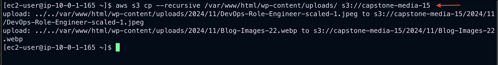
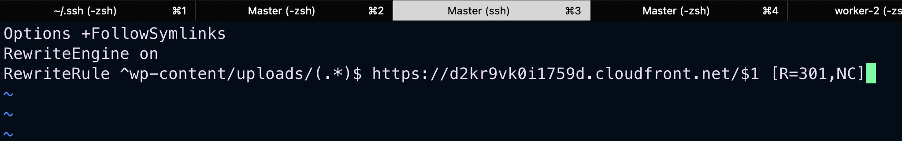
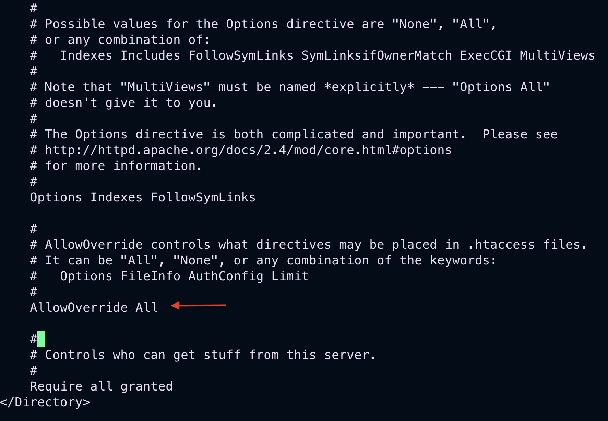

# Stage 9: Installing AWS CLI and Setting up Crontab

This step covers installing the AWS CLI, setting up synchronization between an EC2 instance and S3 buckets, configuring Apache for CloudFront, and creating a crontab for automated updates.

---

## Step 1: Install AWS CLI

1. SSH into your EC2 instance.
   ```
   ssh -i "your-keyname.pem" ec2-user@public_IP_address
   ```
2. Run the following commands to install AWS CLI:

   ```bash
   curl "https://awscli.amazonaws.com/awscli-exe-linux-x86_64.zip" -o "awscliv2.zip"
   sudo yum install unzip -y
   unzip awscliv2.zip
   sudo ./aws/install
   ```

---

## Step 2: Copy Media Files to S3

Use the AWS CLI to copy all media from the WordPress upload directory to your S3 media bucket:

```bash
aws s3 cp --recursive /var/www/html/wp-content/uploads/ s3://your-media-bucket-name
```

- Replace `your-media-bucket-name` with the actual name of your S3 media bucket.


---

## Step 3: Copy WordPress Code to S3

To back up your WordPress application code to an S3 bucket, run:

```bash
aws s3 cp --recursive /var/www/html/ s3://your-code-bucket-name
```

- Replace `your-code-bucket-name` with the actual name of your S3 code bucket.

### Synchronize Code Directory with S3

To keep your `/var/www/html` directory synchronized with the code bucket, run:

```bash
aws s3 sync /var/www/html/ s3://your-code-bucket-name
```

- Replace `your-code-bucket-name` with the actual name of your S3 code bucket.

---

## Step 4: Configure Apache to Use CloudFront for Media

1. Navigate to the `html` directory:

   ```bash
   cd /var/www/html
   ```

2. Create an `.htaccess` file:

   ```bash
   sudo vi /var/www/html/.htaccess
   ```

3. Then paste the following content directly into the editor, replacing `your-cloudfront-endpoint` with your actual CloudFront endpoint:

   ```apache
   Options +FollowSymlinks
   RewriteEngine on
   RewriteRule ^wp-content/uploads/(.*)$ https://your-cloudfront-endpoint/$1 [R=301,NC]
   ```


4. Update the Apache configuration file to enable `.htaccess` overrides:

   ```bash
   sudo vi /etc/httpd/conf/httpd.conf
   ```

   - Locate the `.htaccess` configuration section by typing `/.htaccess`.
   - Change `AllowOverride None` to `AllowOverride All`.
   - Save and exit the file.


---

## Step 5: Set Up Crontab for Automatic Synchronization

1. Edit the crontab file:

   ```bash
   sudo vi /etc/crontab
   ```

2. Add the following line to synchronize the code bucket with `/var/www/html` every minute:

   ```bash
   * * * * * ec2-user /usr/local/bin/aws s3 sync --delete s3://your-code-bucket-name /var/www/html/
   ```


   - Replace `your-code-bucket-name` with the actual name of your S3 code bucket.

3. Save and exit the file.

