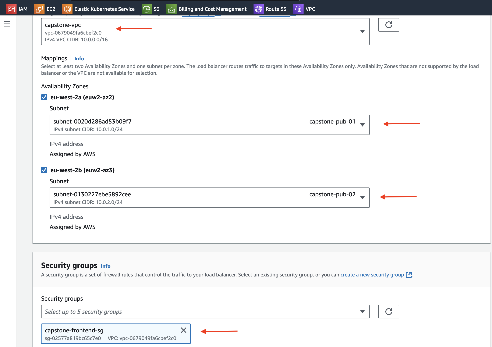
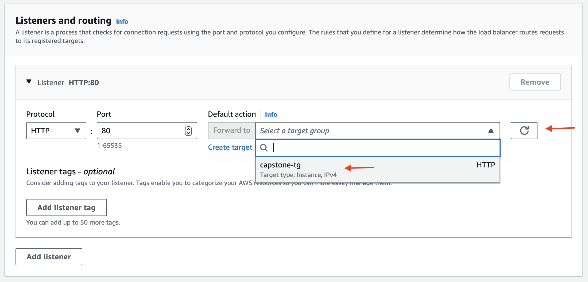
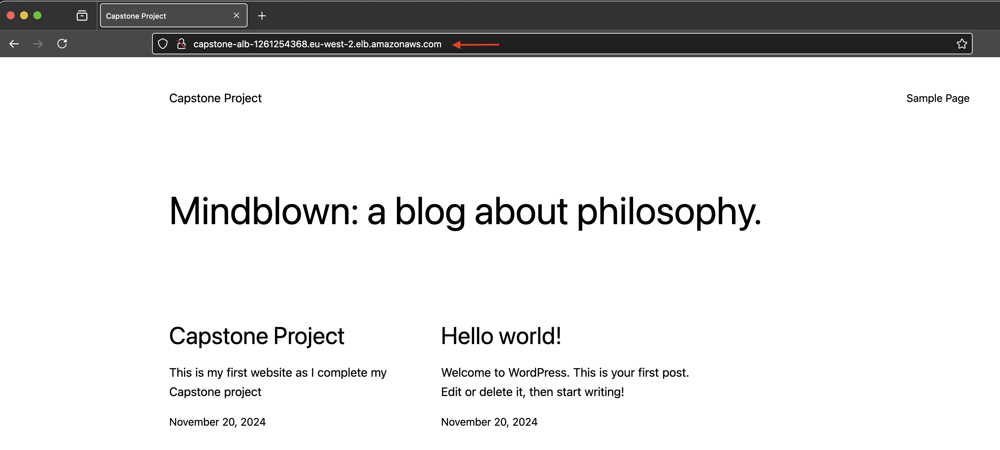
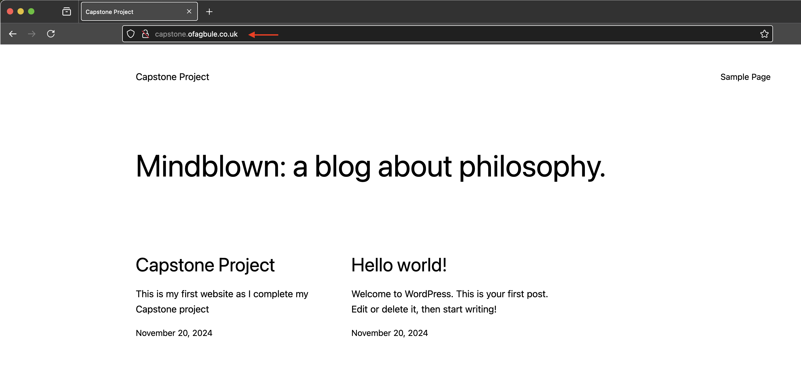

# Stage 10: Create Application Load Balancer

## Step 2: Create an Application Load Balancer (ALB)
1. **Navigate to the EC2 Dashboard**:
   - Go to **Load Balancers** and click **Create Load Balancer**.
   - Choose **Application Load Balancer**.

2. **Configure Basic Settings**:
   - **Name**: `capstone-alb`
   - **Scheme**: `internet-facing`
   - **IP Address Type**: `IPv4`

3. **Network Configuration**:
   - **VPC**: Select your custom VPC.
   - **Mappings**: Choose at least two Availability Zones.
   - **Security Groups**: Select `capstone-frontend-sg`.

   

4. **Listeners and Routing**:
   - **Protocol**: `HTTP`
   - **Port**: `80`
   - **Target Group**: 
     - Click **Create target group**.
     - **Target Type**: Choose `Instances`.
     - **Name**: `capstone-tg`.
     - Ensure your VPC is selected, then click **Next**.
     - Select your instances and click **Include as pending below**. 
     - Scroll down and click **Create target group**.
   - Refresh the page, then select your target group from the drop-down list.

   

5. **Review and Create**:
   - Verify all settings.
   - Click **Create Load Balancer**.

---

## Step 3: Verify Load Balancer Configuration
1. **Activation**: Wait for the ALB to become active (this may take a few minutes).
2. **Testing**:
   - Copy the ALB's DNS name from the details panel.
   - Paste the DNS name into a web browser.

---

## Step 4: Configure DNS with Route 53
1. Navigate to the **Route 53 Dashboard** and create a new record in your hosted zone:
   - **Record Name**: Specify a name for the record.
   - **Alias**: Enable the Alias option.
   - **Alias Target**: 
     - Select **Alias to Application Load Balancer** from the drop-down.
     - Choose your VPC region.
     - Select your ALB from the final drop-down list.
   - Click **Save**.

2. **Test the Configuration**:
   - Open a web browser and type your domain name.
   - Verify that the application is accessible and traffic is distributed correctly.

