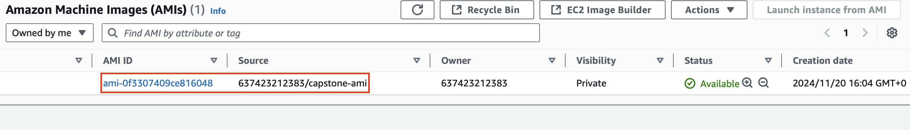
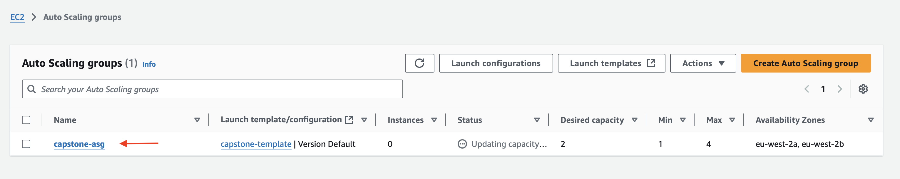
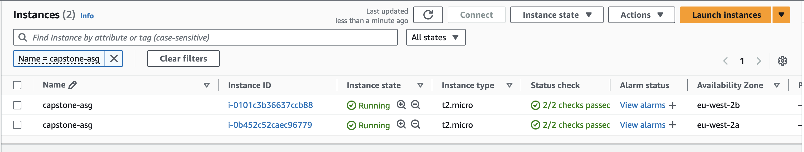

# Stage 11: Create Auto-Scaling Group

This stage involves creating an Amazon Machine Image (AMI), setting up a launch template, and configuring an Auto-Scaling Group (ASG) to ensure dynamic scaling based on demand.

---

## 1. Create an AMI

An Amazon Machine Image (AMI) is essential for launching instances within the Auto-Scaling Group.

### Steps to Create an AMI:
1. Navigate to the **EC2 Dashboard** and select your running instance.
2. Go to **Actions** → **Image and Templates** → **Create Image**.
3. Configure the image:
   - **Image Name**: e.g., `capstone-ami`
   - Leave the **Tag image and snapshots together** option as default.
4. Click **Create Image**.
5. Verify the image:
   - Go to **AMIs** in the left panel to confirm successful creation.

---

## 2. Create an Auto-Scaling Group (ASG)

An ASG automatically adjusts the number of instances to meet demand.

### Steps to Create an ASG:

1. Go to **EC2 Dashboard** → **Auto Scaling Groups** → **Create Auto Scaling Group**.
2. Configure the ASG:
   - **Name**: `capstone-asg`
   - Click → **Create a Launch Template**.

3. Set up the launch template:
   - **Template Name**: `capstone-template`
   - **AMI**: Select your created AMI under **My AMIs**.
   - **Instance Type**: `t2.micro`
   - **Key Pair**: Use an existing key pair or create a new one.
   - **Security Group**: Select `capstone-frontend-sg`.
   - **Auto-assign Public IP**: Enable in advanced network settings.
   - **IAM Role**: Choose the role created earlier.
   - Click **Create Launch Template**.

4. Attach the template to the ASG:
   - Refresh the page, then select your launch template from the drop-down list.
   - Configure **VPC and Subnets**: Select your VPC and multiple availability zones.
   - Use **Balanced Best Effort** for Availability Zone distribution.
   - Attach to an existing load balancer, selecting the one created earlier.

5. Set capacity and scaling:
   - **Desired Capacity**: 2
   - **Minimum Capacity**: 1
   - **Maximum Capacity**: 4

6. Configure scaling policies:
   - **Policy Name**: Capstone Target Tracking Policy
   - **Metric**: Average CPU Utilization
   - **Target Value**: 50%

7. Finalize settings:
   - Add tags (e.g., `Name: capstone-asg`).
   - Review all settings and click **Create Auto-Scaling Group**.

## 3. Verify Instance Provisioning
1. On the left panel, scroll up and click on Instances
2. You should see your new instances provisioned by the Auto Scaling Group
   - Verify that the number of instances matches your desired capacity

---

## 4. Test Wordpress Web Server (Optional)

1. Copy the public IP address of a provisioned instance.
2. Open a browser and navigate to the copied IP address.
3. Verify:
   - The wordpress web server is running.
   - The instances were successfully launched using the AMI.
   - Security groups allow appropriate access.
