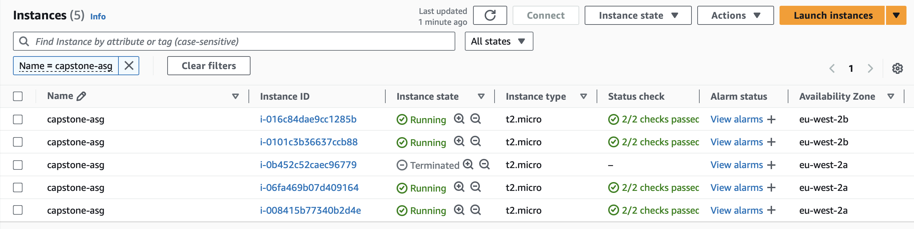

# Stage 12: Testing

## Testing Auto Scaling Functionality

### Prerequisites for Testing
- SSH access to EC2 instances
- Key pair file (`.pem`)
- Instance public IP address

### 1. SSH Connection
1. Open Git Bash (Windows) or Terminal (MacOS)
2. Navigate to your key directory
3. Connect to one of the instance created by ASG:
```bash
ssh -i ~/.ssh/devops.pem ec2-user@<PUBLIC-IP>
```
Replace `<PUBLIC-IP>` with your instance's public IP address

### 2. Monitor Initial CPU Usage
1. Run the `top` command to view all running processes
2. Note the initial CPU utilization (should be around 0.0%)

### 3. Simulate High CPU Load
1. Run the following command to spike CPU usage:
```bash
sha1sum /dev/zero &
```
2. Run `top` again to observe the effect:
   - Look for the sha1sum process (e.g., PID 1784)
   - CPU usage should increase to ~99.0%


### 4. Observe Auto Scaling Response
1. Navigate to EC2 Dashboard
2. Watch for new instances being provisioned due to high CPU



3. Check Auto Scaling Group Activity tab for scaling actions


4. Wait approximately 5 minutes for the scaling action to complete successfully

### 5. Return to Normal State
1. Kill the sha1sum process:
```bash
kill <sha1sum-PID>
```
Replace `<sha1sum-PID>` with the actual process ID

2. Verify CPU returns to normal using `top` command

### 6. Observe Scale-In Behavior
1. Wait approximately 10 minutes
2. Check Auto Scaling Group activity:
   - Group should scale in
   - Excess instances will be terminated
   - System returns to desired state (1 instance)


3. Verify final instance count in EC2 Dashboard


### 7. Cleanup Resources
To avoid unnecessary costs, clean up resources after completing your testing.