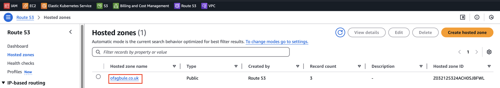

# Stage 7: Create Route 53 Hosted Zone

This step involves creating a Hosted Zone in Route 53 to manage DNS records for your domain. By doing this, AWS becomes your DNS service provider, enabling you to route traffic to your domain efficiently.

### Step 1: Create a Hosted Zone

1. Open the **AWS Management Console** and navigate to **Route 53**.
2. In the left-hand menu, select **Hosted zones** to access the Hosted Zone dashboard.
3. Click **Create hosted zone**.
4. Enter your domain name (e.g., `example.co.uk`) in the **Domain name** field.
5. Under **Type**, select **Public hosted zone**.
6. Click **Create hosted zone**.

---

### Important Notes:

1. Once the hosted zone is created, a set of **Name Servers (NS)** will be automatically generated.
2. You must update your domain's name servers with these values. To do this:
   - Access your domain registrar's dashboard.
   - Replace the existing name servers with the ones provided by Route 53.
   - Refer to this [guide](https://github.com/slimboi/mot-labs/blob/main/04-2-Hosting-a-Static-Website-on-AWS-S3-with-Route53-Domain%20Name/static-website.md) for detailed steps.
3. Name server changes may take a few minutes to propagate across the internet. Be patient during this process.