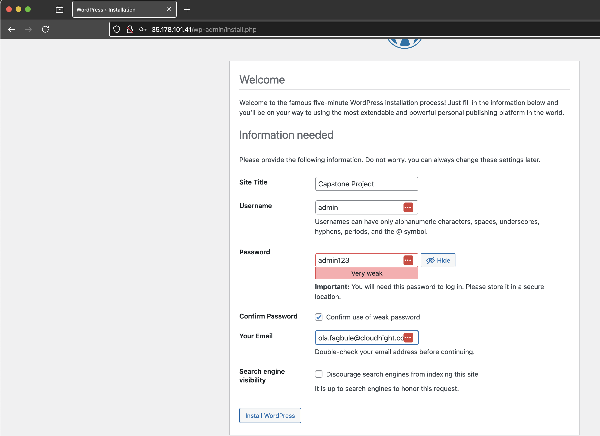
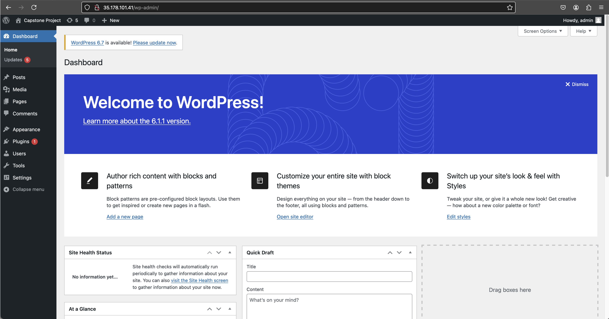
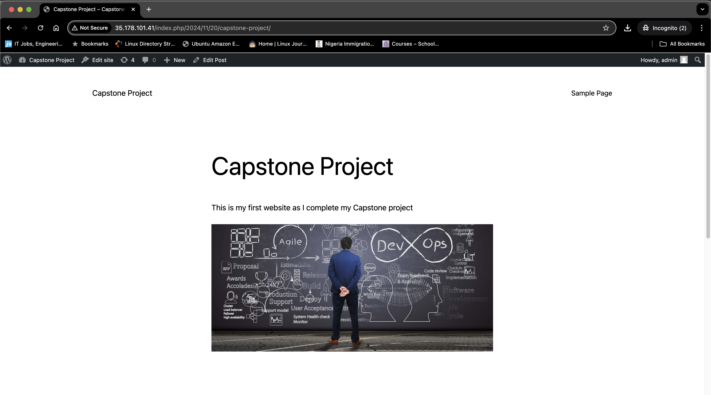

# Stage 8: Set Up Your WordPress Website

This guide walks you through setting up your WordPress website on an EC2 instance.

### Step 1: Access the WordPress Installation Page
1. Copy your EC2 instance's IP address.
2. Paste the IP address into your browser to access the WordPress installation page.

### Step 2: Install WordPress
1. Create your application credentials (username and password).
2. Click **Install WordPress**.

3. Once the installation is complete, click **Login** to access the WordPress dashboard.

### Step 3: Explore the WordPress Dashboard
1. After logging in, you'll see the WordPress dashboard.

2. Use the left-hand menu to navigate through WordPress features.

### Step 4: Add Media Files
1. In the left-hand menu, click **Media** > **Add New**.
2. Click **Select Files** and choose an image from your computer.
3. Click **Open** to upload the image.

### Step 5: Create Your First Post
1. In the left-hand menu, click **Posts** > **Add New**.
2. Close the pop-up guide if it appears.
3. Add a title for your post.
4. Click the **+** button to add content to your post.

#### Adding Images:
1. Click on the **Image** tab.
2. Select **Media Library**.
3. Choose your uploaded image and click **Select**.

#### Adding Text:
1. To add text, select the **Paragraph** block and start typing.

### Step 6: Publish Your Post
1. Once your post is ready, click **Publish**.
2. Confirm the publication by clicking **Publish** again.
3. Click **View Post** to see your live post.

### Congratulations!
You have successfully set up your WordPress website and created your first post. Explore more features in the WordPress dashboard to customize your site further.