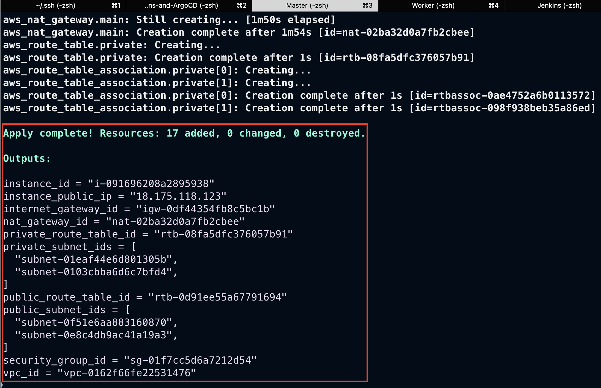
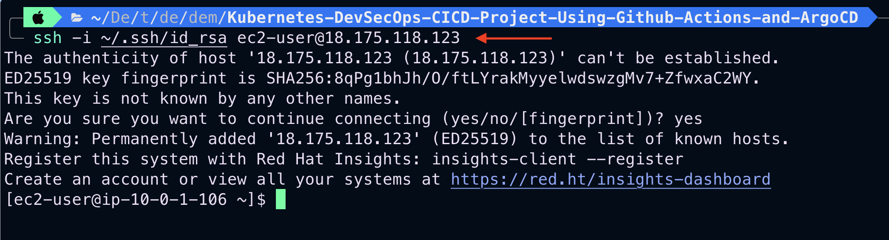
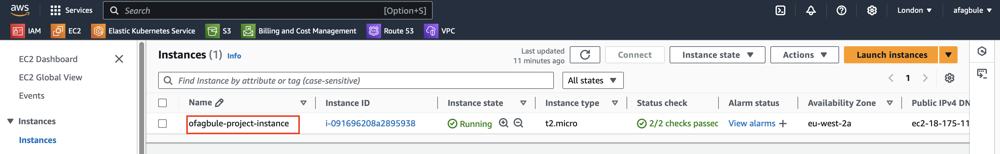

# Creating a Custom VPC and Components on AWS using Terraform

This guide demonstrates how to create a custom VPC and its associated components on AWS using Terraform.

## Prerequisites

Before you begin, ensure you have the following:

- An active AWS account
- Terraform and AWS CLI installed and configured on your local machine
- Access to the Terraform Registry to fetch the necessary code

## Step-by-Step Guide

### Step 1: Resource Preparation

Visit the [Terraform Registry](https://registry.terraform.io/) and familiarize yourself with the following AWS resources:

- `aws_vpc`
- `aws_subnet`
- `aws_internet_gateway`
- `aws_nat_gateway`
- `aws_eip`
- `aws_route_table`
- `aws_route_table_association`
- `aws_security_group`
- `aws_key_pair`
- `aws_instance`

### Step 2: Creating Terraform Configuration Files

Create three separate files in your project directory:

1. `main.tf`: This file will contain all the resource definitions for your AWS infrastructure.

   ```hcl
   # Contents of main.tf
   # (Copy the contents from the main.tf artifact provided)
   ```

2. `variables.tf`: This file defines input variables that can be used across your Terraform configuration.

   ```hcl
   # Contents of variables.tf
   # (Copy the contents from the variables.tf artifact provided)
   ```

3. `outputs.tf`: This file specifies the values that should be output after Terraform apply is complete.

   ```hcl
   # Contents of outputs.tf
   # (Copy the contents from the outputs.tf artifact provided)
   ```

Customize the variables in `variables.tf` according to your specific needs before applying the configuration.

### Step 3: Execution

1. Initialize your Terraform working directory:
   ```
   terraform init
   ```

2. Validate the configuration in the Terraform working directory:
   ```
   terraform validate
   ```

3. Format the configuration in the Terraform working directory:
   ```
   terraform fmt
   ```

4. Preview the changes Terraform will make:
   ```
   terraform plan
   ```

5. Apply the changes to create your infrastructure:
   ```
   terraform apply
   ```

### Step 4: Verification

After successful application, verify your resources in the AWS Management Console. You can also check the outputs in your terminal for important resource information like VPC ID, subnet IDs, and EC2 instance details.



To further verify:

1. SSH into the instance using the IP address provided in the output:
   ```
   ssh -i <path_to_your_private_key> ec2-user@<instance_public_ip>
   ```
   Replace `<path_to_your_private_key>` with the path to your private key file and `<instance_public_ip>` with the public IP address of your EC2 instance.



2. View the instance details in the AWS Management Console:
   - Go to the EC2 dashboard
   - Click on "Instances"
   - Find your instance in the list and click on its ID
   - Review the instance details, including its state, public IP, security group, and more



## Cleaning Up

To avoid unnecessary charges, remember to destroy your resources when they're no longer needed:

```
terraform destroy
```

## Additional Resources

- [Terraform Documentation](https://www.terraform.io/docs)
- [AWS Documentation](https://docs.aws.amazon.com/)

## Troubleshooting

If you encounter any issues, consult the error messages in your terminal or check the AWS CloudWatch logs for more detailed information. Ensure that your AWS credentials are correctly configured and that you have the necessary permissions to create these resources.