# How to Create and Use a GitHub Repository

This guide will walk you through the process of creating a GitHub account, setting up your first repository, working with Git locally, and connecting to a remote repository.

## Creating a GitHub Account

1. Go to [GitHub's website](https://github.com).
2. Click on the "Sign Up" button.
3. Provide the following details:
   - Your email address
   - A secure password
   - Your desired username

## Creating a New Repository

Once your account is set up, follow these steps to create a new repository:

1. Log in to your GitHub account.
2. On the main page, click the green "New" button or the "+" icon in the top-right corner and select "New repository".
3. Fill in the repository name and optional description.
4. Choose whether the repository should be public or private.
5. (Optional) Initialize the repository with a README file.
6. Click "Create repository".

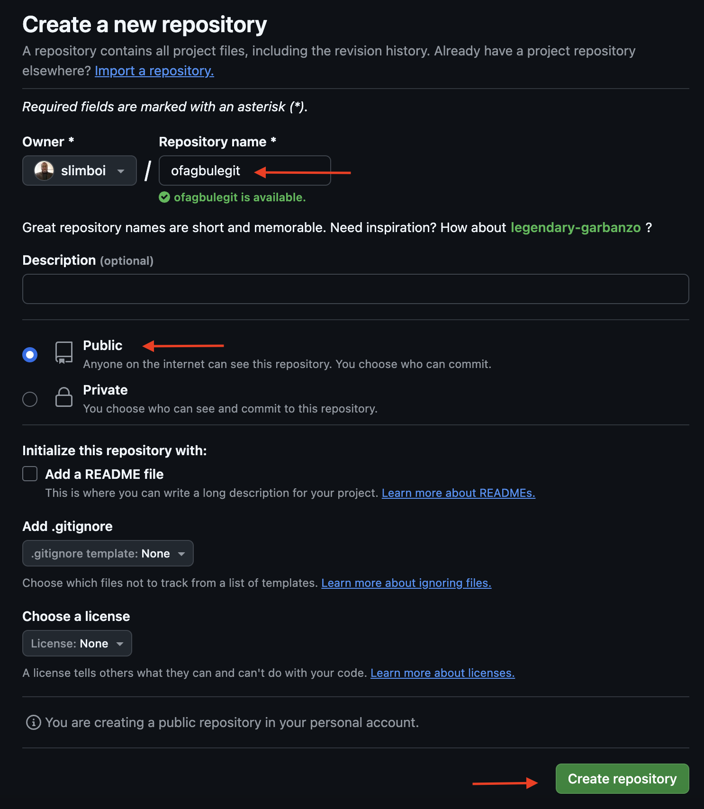

7. Congratulation you have successfully created a new repository

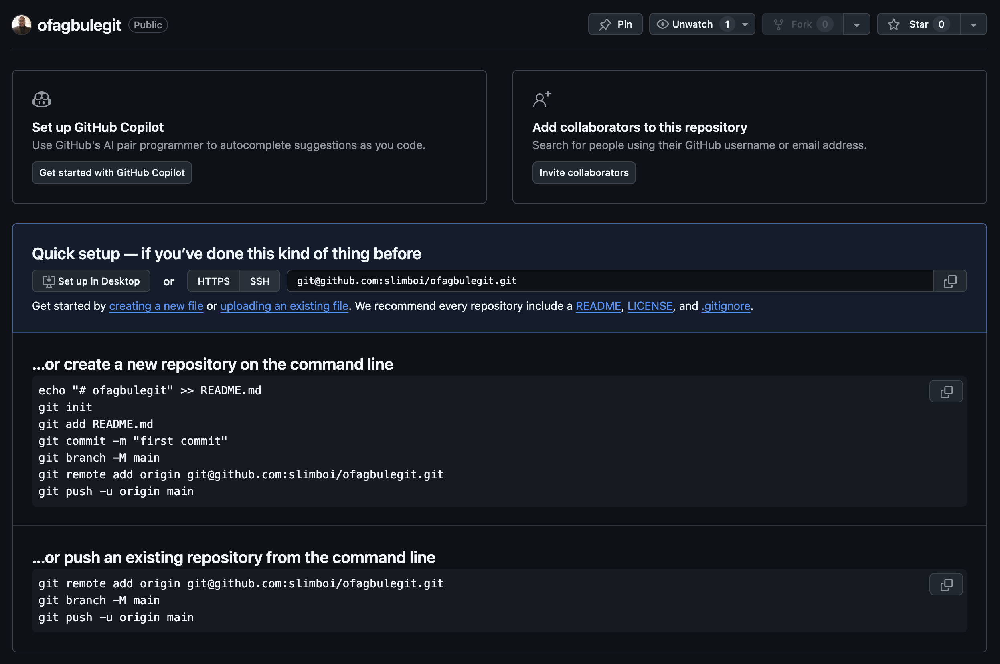

## Creating and Managing a Local Repository

### Set Up Git

1. Open GitBash or Terminal.
2. Configure Git with your username and email:
   ```
   git config --global user.name "YOUR_USERNAME"
   git config --global user.email "YOUR_EMAIL"
   ```
   Replace `YOUR_USERNAME` and `YOUR_EMAIL` with your actual credentials.

### Create Local Repository

1. Create a new directory:
   ```
   mkdir ofagbulegit
   ```
2. Navigate into the new directory:
   ```
   cd ofagbulegit
   ```

### Initialize Git and Create README

1. Create a README file:
   ```
   vi README.md
   ```
   Press `i` to switch to insert mode, type your message (e.g., "This is my ofagbulegit project"), press `Esc`, type `:wq!` and press Enter.
2. View the created file:
   ```
   ls
   cat README.md
   ```

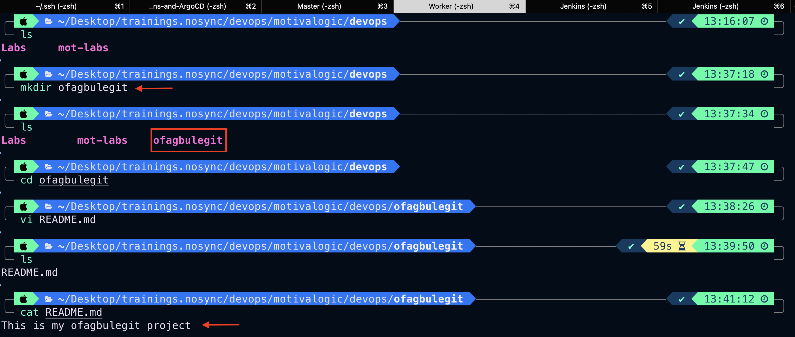

3. Initialize Git:
   ```
   git init
   ```
4. View Git directories and files:
   ```
   ls -al .git
   ```

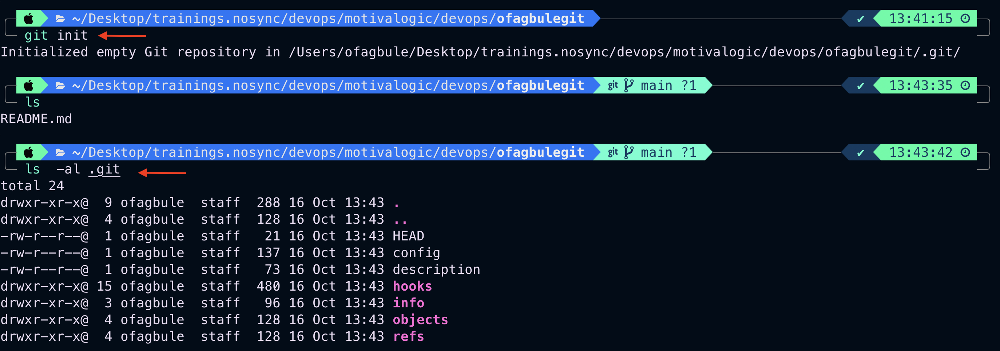

### Stage and Commit Files

1. Check the status of your files:
   ```
   git status
   ```
2. Stage your files:
   ```
   git add README.md
   ```
   Or stage all files:
   ```
   git add .
   ```
3. Check status again to see changes:
   ```
   git status
   ```

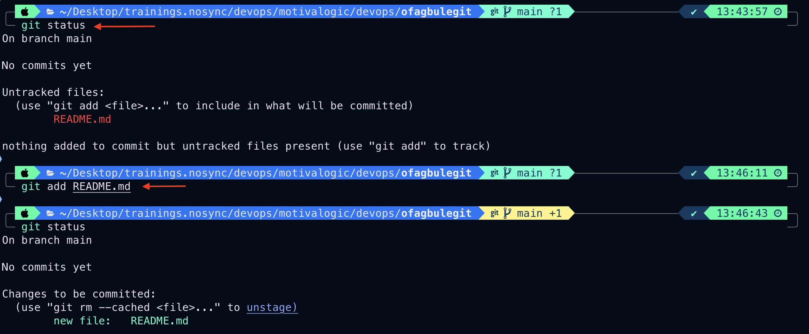

4. Commit your changes:
   ```
   git commit -m "This is my first commit to my ofagbulegit repo"
   ```
5. Check status once more:
   ```
   git status
   ```

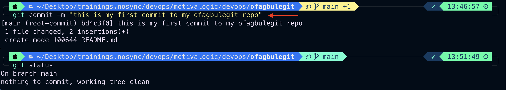

6. View commit history:
   ```
   git log
   ```

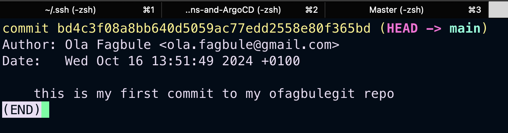

### Working with Branches

1. View all branches:
   ```
   git branch -a
   ```

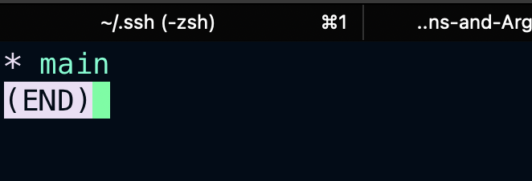

2. (Optional) Change the default branch name:
   ```
   git branch -M main
   ```

## Creating a Personal Access Token

To connect your local repository to GitHub, you'll need to create a personal access token:

1. Navigate to your profile settings on GitHub.
2. Scroll down on the left panel and select "Developer settings".
3. Click on "Personal access tokens".
4. Select "Tokens (classic)".
5. Click "Generate new token" and select "Generate new token (classic)".

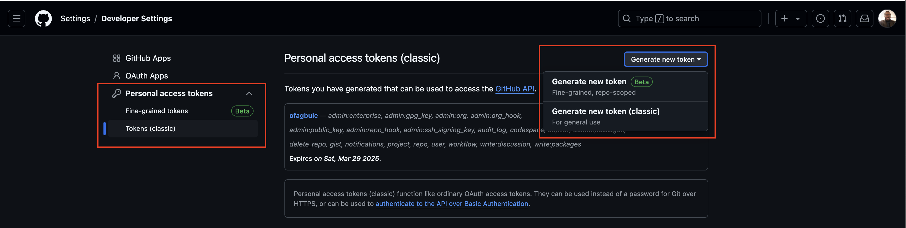

6. Enter your password to confirm.
7. Set up your token:
   - Enter a token purpose (name)
   - Choose an expiration period (preferably 30 days)
   - Select the "repo" scope
8. Scroll to the bottom of the page and click "Generate token".

**Important**: Make sure to copy your personal access token immediately. You won't be able to see it again!

## Connecting Local Repository to GitHub

Now that you have a token, you can connect your local repository to GitHub:

1. Open GitBash or Terminal.
2. Run the following command to add the remote repository:
   ```
   git remote add origin git@github.com:YOUR_USERNAME/YOUR_REPO_NAME.git
   ```
   Replace `YOUR_USERNAME` and `YOUR_REPO_NAME` with your GitHub username and repository name.

3. Push your local repository to the remote main branch:
   ```
   git push -u origin main
   ```

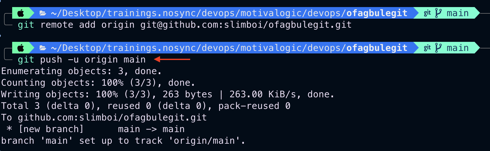

Congratulations! You've successfully pushed your first commit to GitHub.

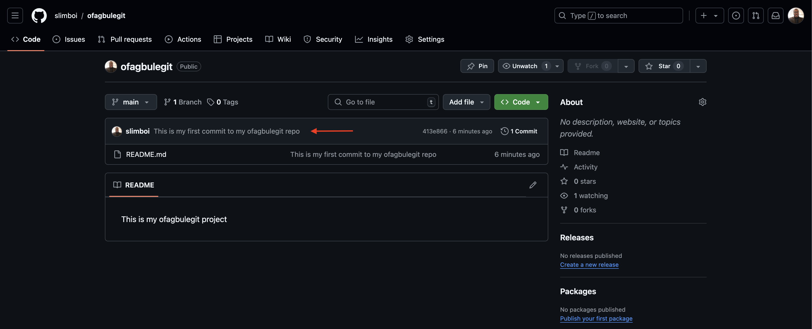

## Next Steps

Now that your local and remote repositories are connected, you can:

- Continue to make changes locally and push them to GitHub
- Create and manage different branches
- Collaborate with others through pull requests
- Explore more advanced Git and GitHub features

For more detailed information on using Git and GitHub, check out the [GitHub Docs](https://docs.github.com/en).

Happy coding!