# Deploy Apache Webserver and Configure Route53 Domain Name

This guide outlines the process of setting up an Apache HTTP Server on an EC2 instance and configuring it to use a Route53 domain name.

## Overview

The Apache HTTP Server Project is an open-source HTTP server for modern operating systems, including UNIX and Windows. It aims to provide a secure, efficient, and extensible server that delivers HTTP services in compliance with current HTTP standards.

## Steps

1. Provision a Linux EC2 instance
2. Connect to the EC2 instance
3. Install Apache Web server
4. Deploy static website
5. Configure domain name (optional)

## Detailed Instructions

### 1. Provision a Linux EC2 instance

- Launch an EC2 instance
- Name your instance
- Select Red Hat as the operating system
- Choose t2.micro as the instance type
- Create a new key pair if needed
- Configure VPC, subnet, and security groups (use the "Edit" option)
- Launch the instance

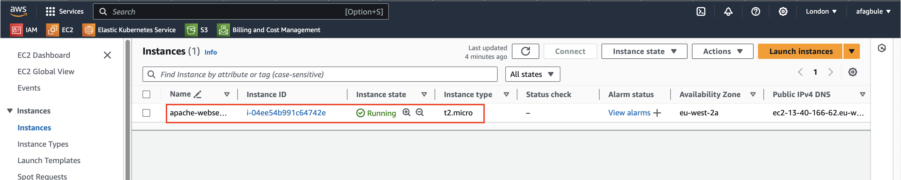

> **Note**: It's best practice to restrict access to your server. Avoid allowing access from anywhere.

### 2. Connect to the EC2 instance

After creating your EC2 instance:

1. Locate the public IP address of your instance in the EC2 dashboard.
2. Open your Git Bash or Terminal.
3. Navigate to the directory containing your key pair file.
4. Use the following command to SSH into your instance:

   ```
   ssh -i "your-keyname.pem" ec2-user@public_IP_address
   ```

   Replace `"your-keyname.pem"` with your actual key file name and `public_IP_address` with your instance's public IP.

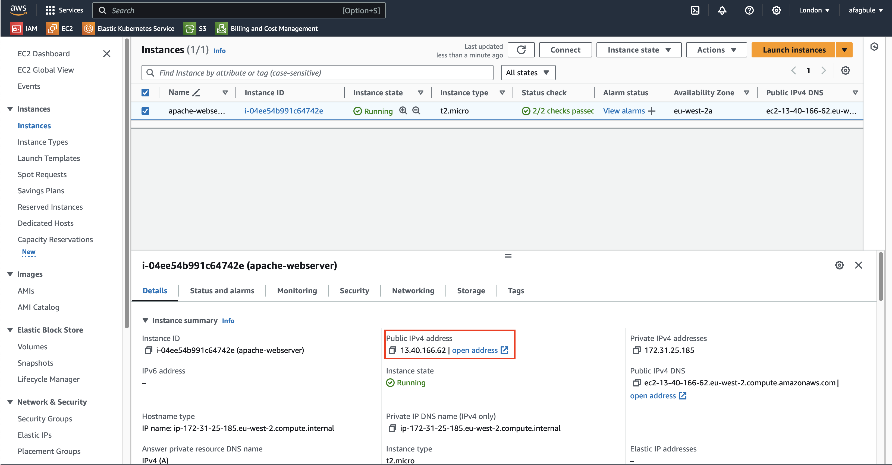

> **Important**: Ensure your key file is not publicly accessible by running:
> 
> ```
> chmod 400 "your-keyname.pem"
> ```

### 3. Install Apache Web server

Once connected to your EC2 instance:

1. Update system packages:
   ```
   sudo yum update -y
   ```

2. Install Apache:
   ```
   sudo yum install httpd -y
   ```

3. Start Apache service:
   ```
   sudo systemctl start httpd
   ```

4. Verify Apache status:
   ```
   sudo systemctl status httpd
   ```

   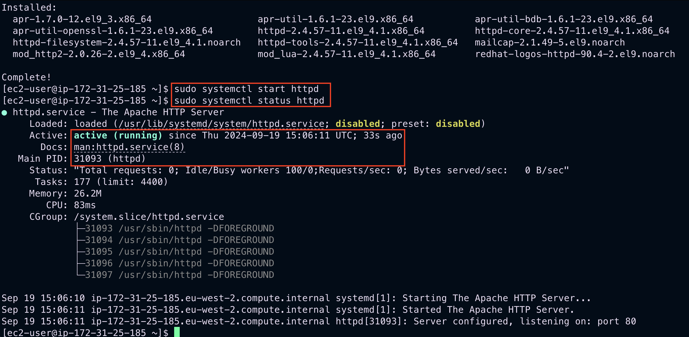

5. Test Apache installation by entering your EC2 IP address in a web browser. You should see the Apache test page:

   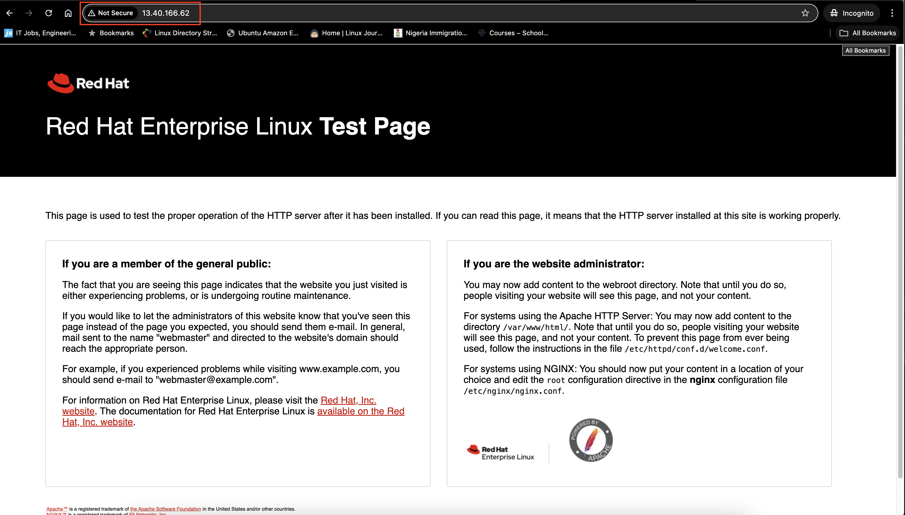

   If you can't see this page, ensure port 80 is open in your security group settings.

### 4. Deploy static website

1. Open your Terminal/Git Bash and navigate to where you have the source code.

2. Copy the source code to your EC2 instance:
   ```
   scp -i ~/.ssh/your-keyname.pem -r ~/path/to/Cloudhight_static-website-example/* ec2-user@your_ec2_ip:/home/ec2-user/
   ```
   Replace `your-keyname.pem`, `path/to`, and `your_ec2_ip` with your actual values.

3. SSH back into your instance and confirm the files are there:
   
   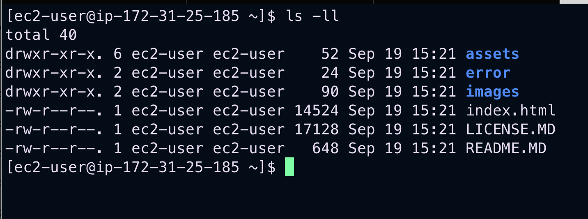

4. Copy everything to Apache's web root:
   ```
   sudo cp -r . /var/www/html/
   ```

5. Verify files have been copied:
   
   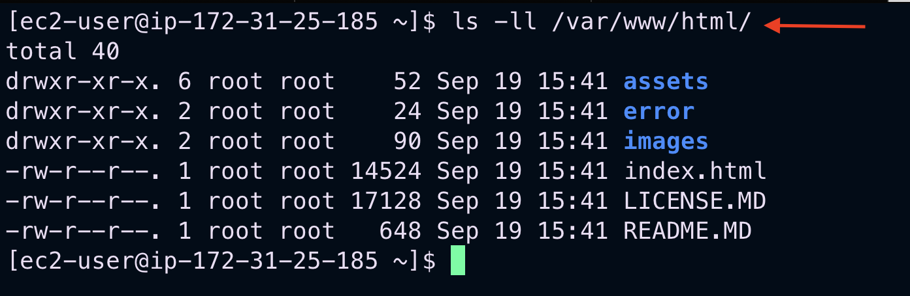

6. Restart Apache:
   ```
   sudo systemctl restart httpd
   ```

7. Access your website by entering your EC2 public IP in a web browser:

   

If you can see this page, you have successfully deployed the application.

### 5. Configure domain name (optional)

#### Create Hosted Zone

1. On the AWS Console, go to Route 53.
2. Select "Create Hosted Zone".
3. Enter your domain name (e.g., ofagbule.co.uk).
4. Select "Public hosted zone".
5. Click "Create hosted zone".

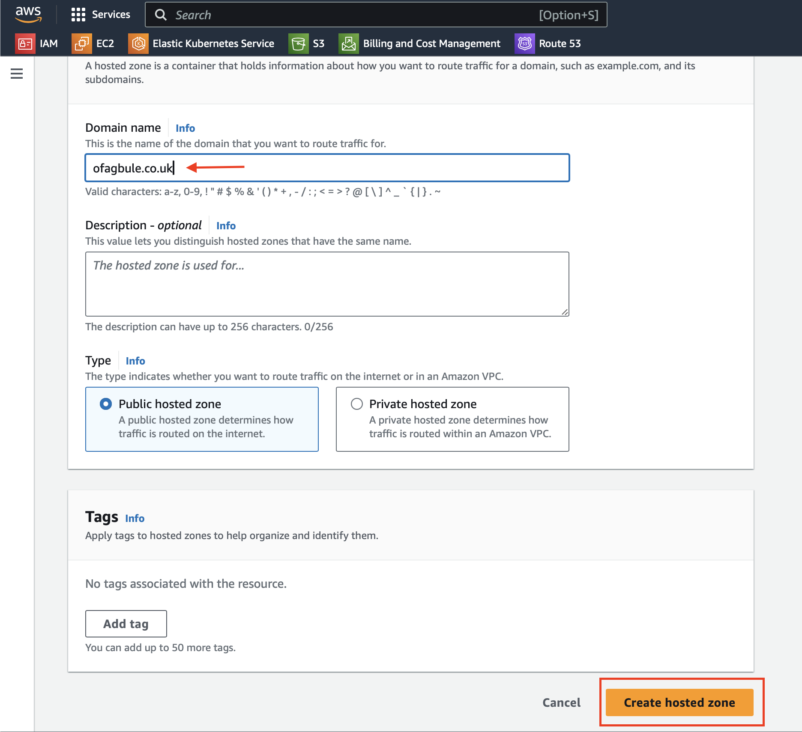

#### Create Record

1. Click on "Create record".
2. Enter your EC2 instance's public IP address in the "Value" section.
3. Click "Create records".

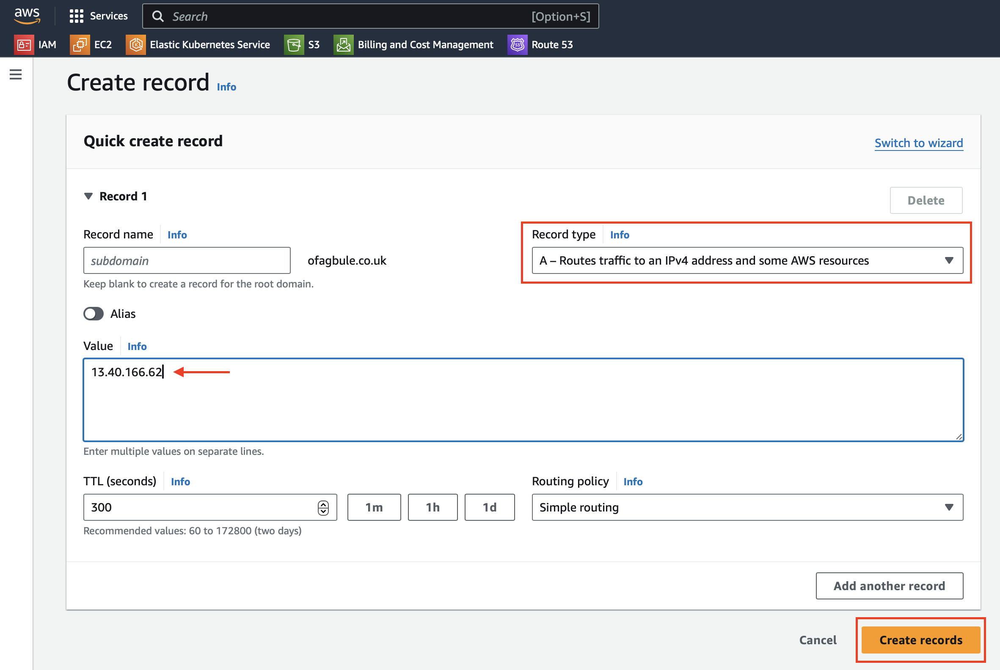

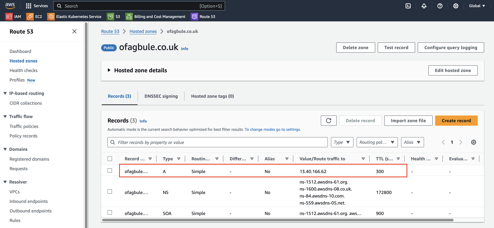

#### Test the Record

You can test the record to confirm if your IP address is correctly connected to your domain name:

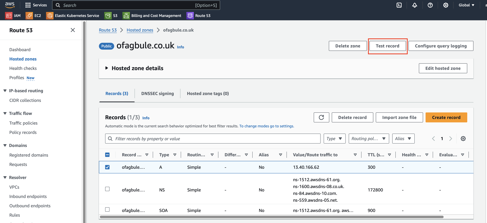

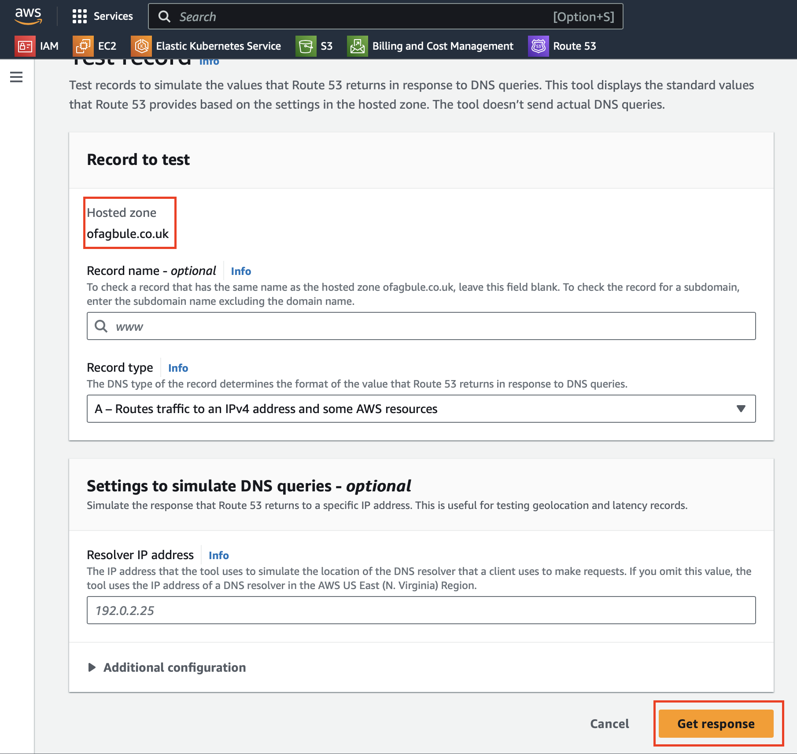

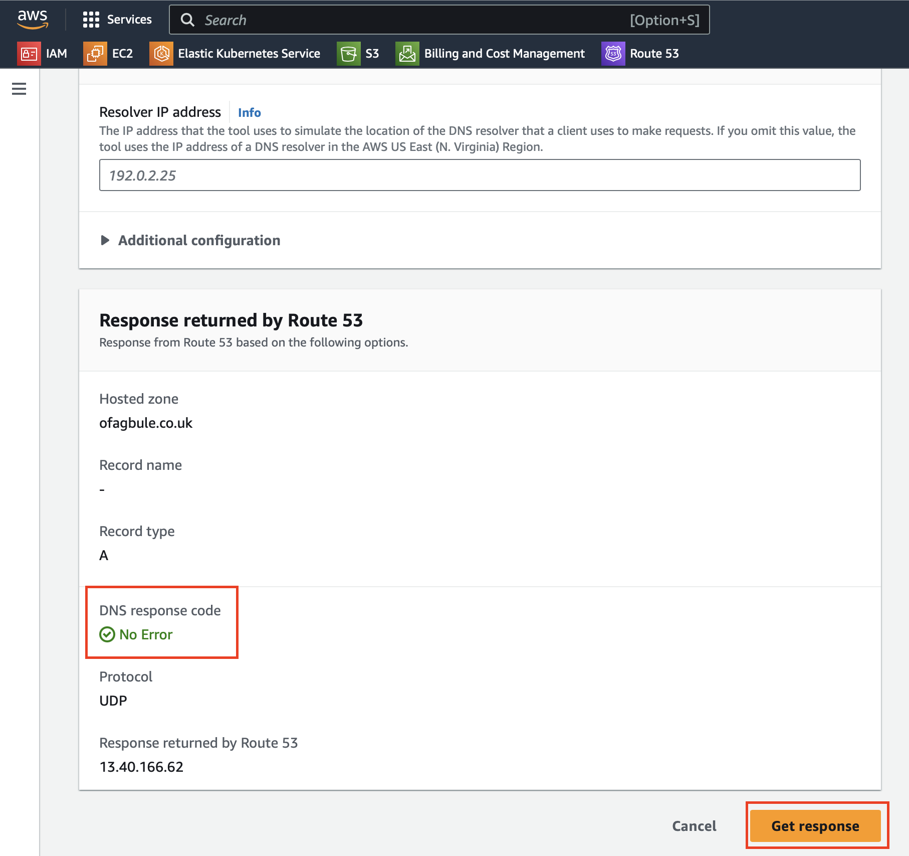

#### Access Your Website Using the Domain Name

Now, you can access your website by entering your domain name in a web browser:


Congratulations! You have now successfully configured Route 53 with your Apache server.

## Troubleshooting

- If you can't access the Apache test page or your website, check that port 80 is open in your EC2 security group.
- Ensure that the Apache service is running using `sudo systemctl status httpd`.
- Check Apache error logs at `/var/log/httpd/error_log` for any issues.
- If your domain is not resolving, double-check your Route 53 configuration and ensure that your domain's nameservers are correctly set at your domain registrar.

## Challenges Faced

During the implementation of this project, the following challenge was encountered:

- Inability to access the webpage via Google Chrome and Safari browsers, while Mozilla Firefox worked correctly.

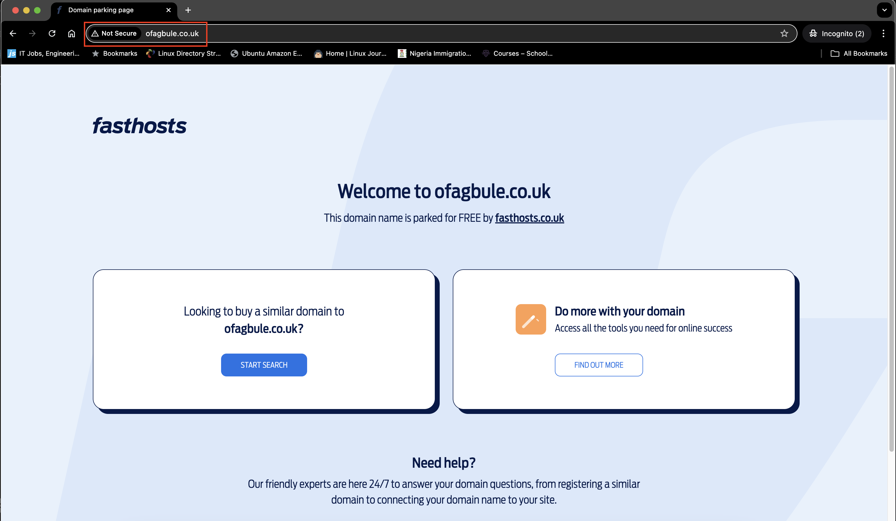

This issue manifested as a "parking page" being displayed instead of the expected website content in Chrome and Safari.

## Solution

After investigating the issue, the following solution was found:

- Updating the Name server details on the domain provider to point to the Name server details provided by Route 53 resolved the issue for Google Chrome browser.

**Current Status:**
- The website now displays correctly on Google Chrome.
- The issue persists on Safari browser.

### Key Takeaways

1. **Importance of Name Servers**: Ensure that your domain's Name servers at your domain registrar match those provided by Route 53. This is a crucial step in the DNS configuration process.

2. **Browser Differences**: Different browsers may behave differently with DNS resolution and caching. In this case, Chrome responded to the changes while Safari did not.
