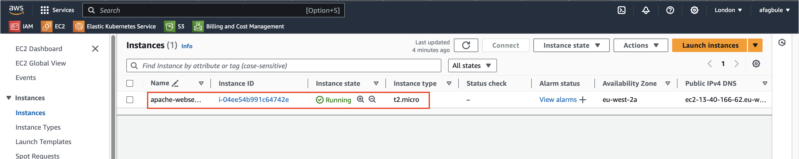

# Deploy Apache Webserver and Configure Route53 Domain Name

This guide outlines the process of setting up an Apache HTTP Server on an EC2 instance and configuring it to use a Route53 domain name.

## Overview

The Apache HTTP Server Project is an open-source HTTP server for modern operating systems, including UNIX and Windows. It aims to provide a secure, efficient, and extensible server that delivers HTTP services in compliance with current HTTP standards.

## Steps

1. Provision a Linux EC2 instance
2. Connect to the EC2 instance
3. Install Apache Web server
4. Deploy static website
5. Configure domain name (optional)

## Detailed Instructions

### 1. Provision a Linux EC2 instance

- Launch an EC2 instance
- Name your instance
- Select Red Hat as the operating system
- Choose t2.micro as the instance type
- Create a new key pair if needed
- Configure VPC, subnet, and security groups (use the "Edit" option)
- Launch the instance



> **Note**: It's best practice to restrict access to your server. Avoid allowing access from anywhere.

### 2. Connect to the EC2 instance

After creating your EC2 instance:

1. Locate the public IP address of your instance in the EC2 dashboard.
2. Open your Git Bash or Terminal.
3. Navigate to the directory containing your key pair file.
4. Use the following command to SSH into your instance:

   ```
   ssh -i "your-keyname.pem" ec2-user@public_IP_address
   ```

   Replace `"your-keyname.pem"` with your actual key file name and `public_IP_address` with your instance's public IP.

> **Important**: Ensure your key file is not publicly accessible by running:
> 
> ```
> chmod 400 "your-keyname.pem"
> ```

### 3. Install Apache Web server

- Once connected to your EC2 instance, install Apache (instructions to be added)