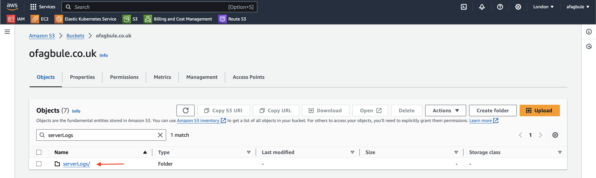
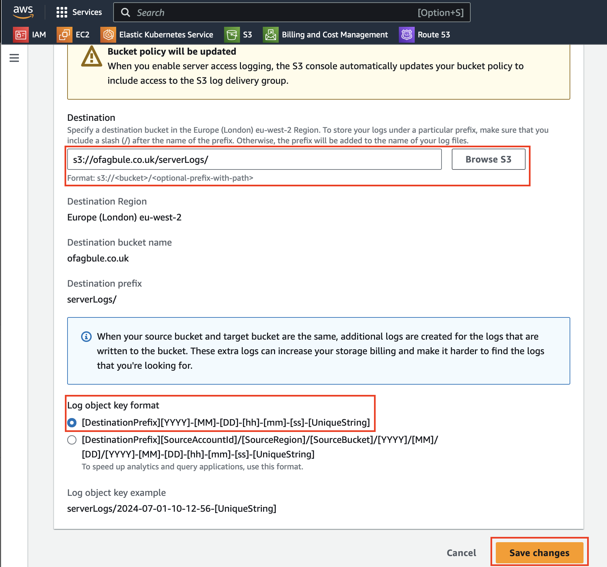
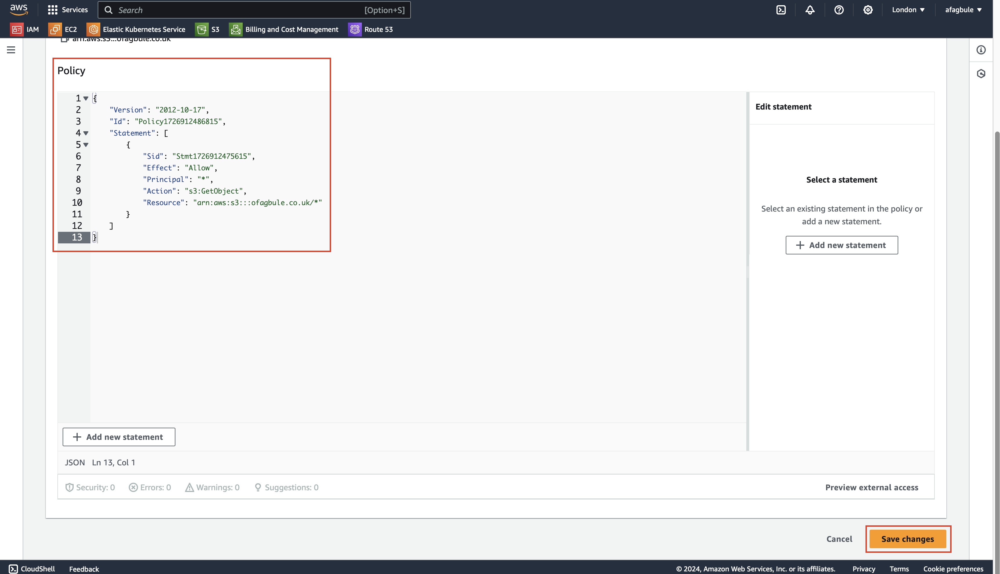
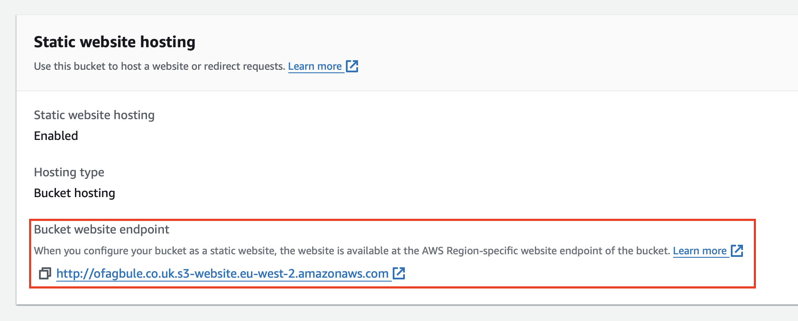

# Hosting a Static Website on AWS S3 with Route53 Domain Name

## Overview
This guide explains how to host a static website using Amazon S3 (Simple Storage Service) and set up a custom domain name with Amazon Route53.

## What is a Static Website?
A static website consists of HTML, CSS, JavaScript, images, and other files that don't require server-side processing. This is in contrast to dynamic websites that generate content on-the-fly using server-side applications.

## Why Use Amazon S3 for Static Website Hosting?

Amazon S3 offers several advantages for hosting static websites:

1. **Unlimited Storage**: No restrictions on the amount of content you can host.
2. **High Durability**: 99.999999999% durability (1 in 10,000 objects lost every 10 million years).
3. **Scalability**: Easily handles high traffic spikes without additional configuration.
4. **Cost-Effective**: Pay only for what you use, with a generous free tier for small websites.
5. **AWS Integration**: Seamlessly works with other AWS services like CloudFront (CDN) and Lambda.

## Requirements

- An AWS Account
- Static web content (HTML, CSS, JavaScript, images, etc.)
- A registered domain name (optional, for custom domain setup)

## Setup Steps

1. Create an S3 bucket
2. Upload your static website files
3. Set up bucket policy for public access
4. Configure the bucket for static website hosting
5. Set up Route53 for custom domain (optional)

## Detailed Instructions

### 1. Create an S3 bucket

1. Login to AWS console and click on Services, select S3 located under Storage.
2. Click on "Create bucket".
3. Give a unique name to your bucket. e.g ofagbule.co.uk 
4. Ensure "ACLs disabled" is selected (this is the default).
5. Uncheck "Block all public access" and then acknowledge doing this.
6. Select "Disable versioning".
7. Add tags if desired. e.g ofagbule-project
8. For encryption, keep the defaults:
   - Server-side encryption with AWS S3 managed keys (SSE-S3)
   - Enable Bucket Key
9. Click "Create bucket".

10. Create a folder to store logs of activities on your site:
    a. Click "Create folder"
    b. Name the folder "serverLogs"
    c. For Server-side encryption, keep the default "Don't specify an encryption key"
    d. Click "Create folder"

11. Configure server access logging:
    a. Click on "Properties" tab
    b. Scroll down to "Server access logging" and click "Edit"
    c. Enable Server access logging
    d. Click on "Browse S3"
    e. Select your bucket
    f. Choose the "serverLogs" folder as the destination
    g. Keep the default for Log object key format
    h. Click on "Save changes"

### 2. Upload your static website files

1. In your S3 bucket, click on "Objects" and then "Upload".
2. Click on "Add files" or "Add folder" to open your file explorer.
3. Select your static web content files and folders.
4. Drag and drop the selected files into the browser window or use the file selection dialog.
5. Click "Upload".
6. Once the files are uploaded, click "Close".

### 3. Set up bucket policy for public access

1. Go to the "Permissions" tab of your bucket.
2. Scroll down to "Bucket policy" and click "Edit".
3. Click on "Policy generator".
4. In the policy generator, provide the following information:
   - Select Type of Policy: S3 bucket policy
   - Effect: Allow
   - Principal: *
   - Actions: GetObject
   - Amazon Resource Name (ARN): arn:aws:s3:::your-bucket-name/*
     (Replace "your-bucket-name" with your actual bucket name)
5. Click "Add Statement".
6. Click "Generate Policy".

7. Copy the generated policy JSON document.
8. Go back to the "Edit bucket policy" page and paste the copied JSON.

9. Click "Save changes".

### 4. Configure the bucket for static website hosting

1. Go to the bucket's "Properties" tab.
2. Scroll down to "Static website hosting" and click "Edit".
3. Choose "Enable" for static website hosting.
4. Set "Index document" to "index.html".
5. Set "Error document" to "error.html".
6. Click "Save changes".
7. Scroll down to "Static website hosting" and copy the URL generated.

8. Put this into a web browser to view the website

### 5. Set up Route53 for custom domain (optional)

A domain name is a string of text that maps to a numeric IP address, used to access a website from client software. In plain English, a domain name is the text that a user types into a browser window to reach a particular website. For instance, the domain name for Facebook is facebook.com

The actual address of a website is a complex numerical IP address (e.g. 103.21.244.0), but thanks to DNS, users are able to enter human-friendly domain names and be routed to the websites they are looking for. This process is known as a DNS lookup.

Amazon Route 53 is a highly available and scalable cloud Domain Name System (DNS) web service. It is designed to give developers and businesses an extremely reliable and cost-effective way to route end users to Internet applications by translating names like www.example.com into the numeric IP addresses like 192.0.2.1 that computers use to connect to each other. Amazon Route 53 is fully compliant with IPv6 as well.

Amazon Route 53 effectively connects user requests to infrastructure running in AWS – such as Amazon EC2 instances, Elastic Load Balancing load balancers, or Amazon S3 buckets – and can also be used to route users to infrastructure outside of AWS.

#### Create Hosted Zone

1. On the AWS Console, go to Route 53.
2. Select "Create Hosted Zone".
3. Enter your domain name (e.g., ofagbule.co.uk).
4. Select "Public hosted zone".
5. Click "Create hosted zone".

#### Create Record

1. Click on "Create record".
2. Under Record name leave blank to create a record for the root domain, then click on the toggle button to enable Alias. Now click on the drop-down box and select Alias to s3 website endpoint.
3. A new drop-down box appears, select the Region where you provisioned the s3 bucket, then select your s3 bucket endpoint.
4. Click "Create records".

Copy the Name servers provided and go to your domain name provider dashboard to update your name server records.

Note: Don't copy the dot at the end of each name server.

Update your Name servers in your domain dashboard.

Click on Update Name Server Details.

Note: This may take a little time to propagate across the internet but eventually it should work.

Now go to your browser and type in your domain name. Congratulations! You've just configured your static website with Route 53.

## Troubleshooting

- If your website isn't accessible, check your bucket policy and ensure public access is allowed.
- For custom domain issues, verify your Route53 settings and ensure your domain's DNS is pointing to the correct name servers.
- If images or styles aren't loading, check the file permissions and ensure the paths in your HTML are correct.

## Additional Resources

- [Amazon S3 Documentation](https://docs.aws.amazon.com/AmazonS3/latest/userguide/Welcome.html)
- [Route53 Documentation](https://docs.aws.amazon.com/Route53/latest/DeveloperGuide/Welcome.html)
- [AWS Pricing Calculator](https://calculator.aws/)