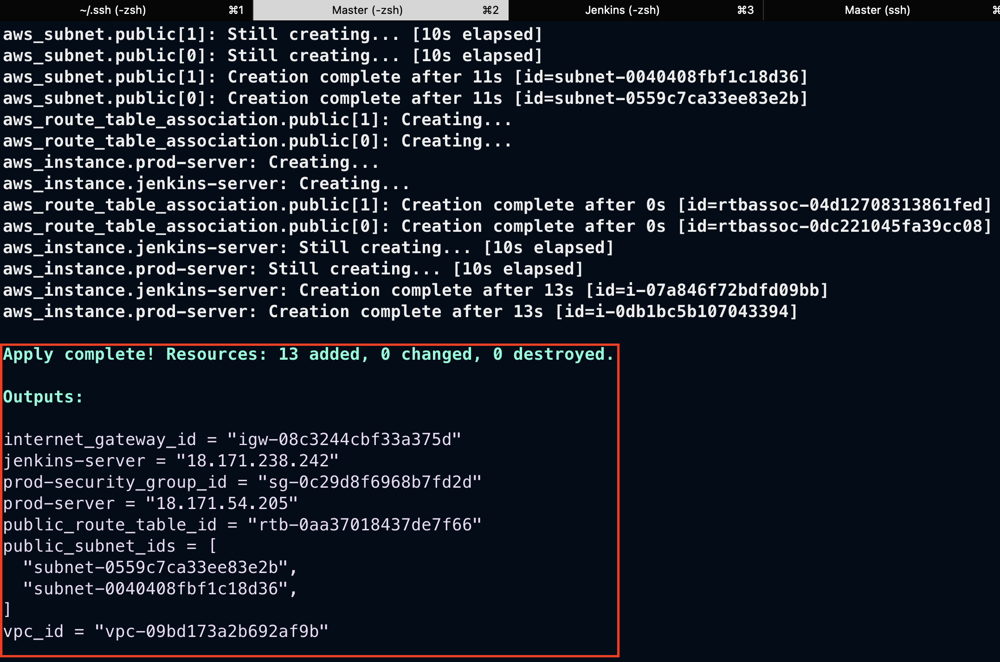
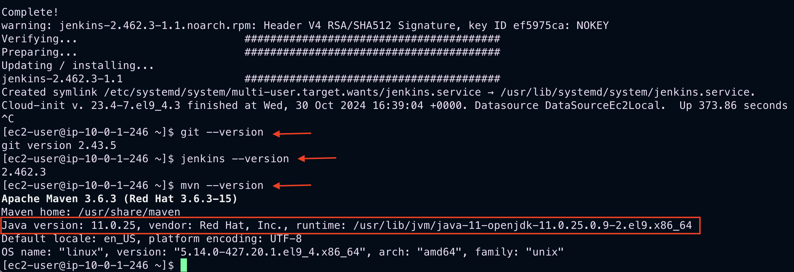
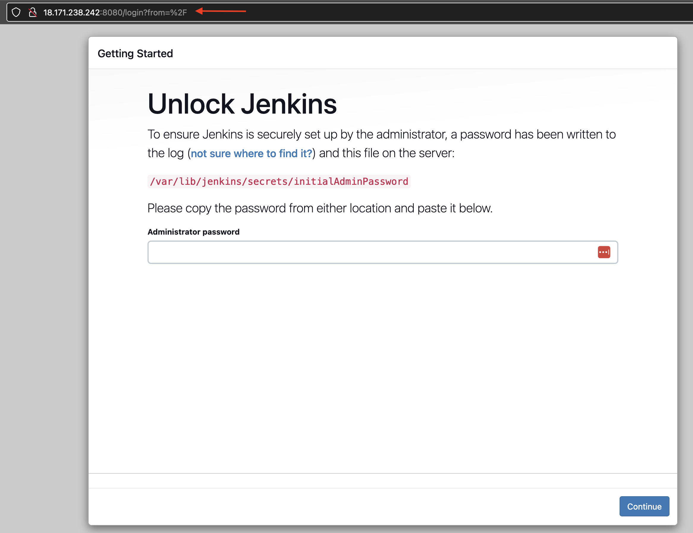
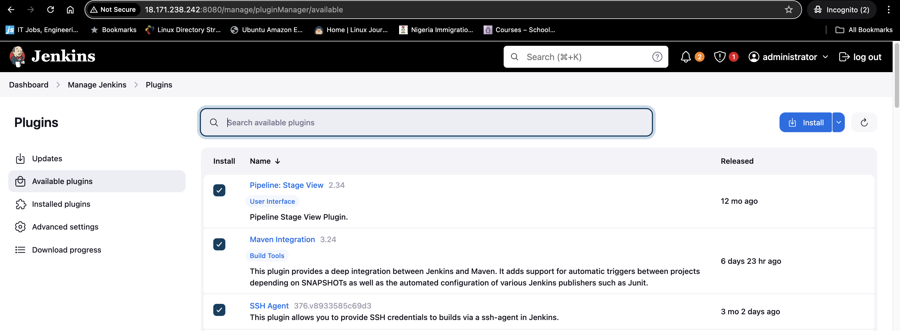
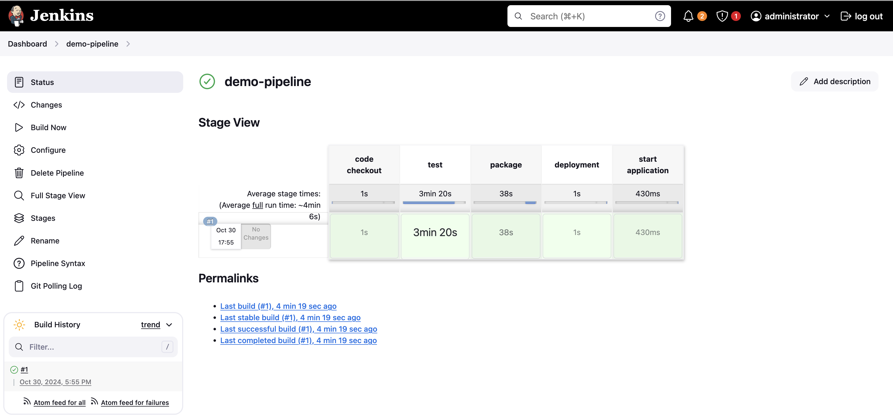
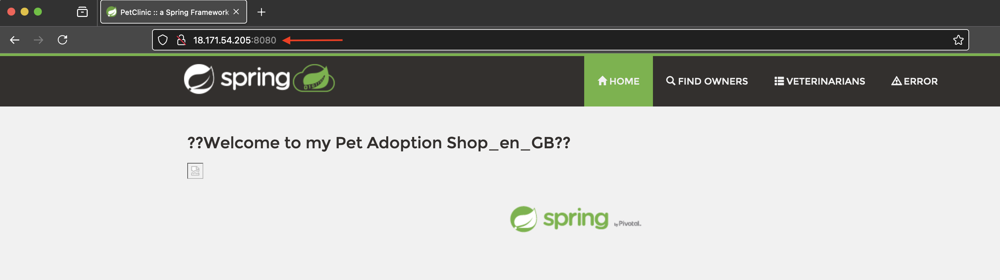

# Jenkins Pipeline for Maven Build and Deployment on AWS

This guide outlines setting up a Jenkins pipeline to build a Maven artifact and deploy it to a server hosted on AWS, using Terraform for infrastructure provisioning.

## Prerequisites

Ensure you have:

- An active AWS account
- Terraform installed and configured
- AWS CLI with appropriate credentials
- Access to Terraform Registry
- Basic knowledge of Maven, AWS, and Jenkins

## Setup Instructions

### Step 1: Configure AWS Resources with Terraform

1. Review AWS resources on the [Terraform Registry](https://registry.terraform.io/), focusing on:
   - `aws_vpc`, `aws_subnet`, `aws_security_group`, `aws_key_pair`, `aws_instance` (two EC2 instances: one for Jenkins, one for production).

2. Create Terraform files in your project directory:
   - `main.tf` – Defines AWS resources.
   - `variables.tf` – Specifies input variables.
   - `outputs.tf` – Configures outputs post-deployment.

3. Update `variables.tf` with your required configurations.

### Step 2: Deploy AWS Resources with Terraform

```bash
terraform init
terraform validate
terraform fmt
terraform plan
terraform apply
```


> *Successful creation of AWS infrastructure using Terraform*

### Step 3: Set Up Jenkins Server

1. **SSH into the Jenkins server**:
   ```bash
   ssh -i my_key_pair.pem ec2-user@<jenkins-server-ip>
   ```

2. **Monitor installation**:
   ```bash
   tail -f /var/log/cloud-init-output.log
   ```

3. **Verify key installations**:
   ```bash
   git --version
   jenkins --version
   mvn --version
   java --version
   ```


> *Verification of Git, Jenkins, Java, and Maven installations on the server*

4. **Complete Jenkins setup**:
   - Open Jenkins in a browser at `<jenkins-server-ip>:8080`.
   - Retrieve initial admin password:
     ```bash
     sudo cat /var/lib/jenkins/secrets/initialAdminPassword
     ```
   - Follow the Jenkins setup wizard to install suggested plugins and set up admin credentials.



5. **Install Jenkins plugins**:
   - Navigate to `Manage Jenkins > Plugins`, search and install *Pipeline: Stage View*, *Maven Integration*, and *SSH Agent*.



### Step 4: Configure Jenkins Tool Paths

1. Define Java and Maven paths in Jenkins:
   - **Java**: Set `JAVA_HOME` (e.g., `/usr/lib/jvm/java-11-openjdk-11.0.23.0.9-3.eI9.x86_64`)
   - **Maven**: Set `MAVEN_HOME` (e.g., `/usr/share/maven`)

2. **Add SSH Credentials**:
   - Go to `Manage Jenkins > Credentials > Global > Add Credentials`.
   - Choose `SSH Username with private key`, name it "prodkey", and paste your private key.

### Step 5: Create Jenkins Pipeline

1. From the Jenkins dashboard, create a new item:
   - Name it (e.g., `demo-pipeline`), select *Pipeline*.

2. In the pipeline configuration:
   - Scroll to *Build Triggers*, check *Poll SCM*, and set to `* * * * *` (every minute).
   - Paste the contents of your `Jenkinsfile` into the *Pipeline Script* section.
   - Save the configuration.

3. The pipeline should trigger automatically, building and deploying if configured correctly.



### Step 6: Verify Deployment

- Access the application by visiting `<production-server-ip>:<port>` in your browser.



## 🛠️ Troubleshooting

Common issues and solutions:

1. **Jenkins Connection Issues**
   - Verify security group inbound rules
   - Check Jenkins service status: `sudo systemctl status jenkins`

2. **Deployment Failures**
   - Validate SSH key permissions
   - Check network connectivity between servers
   - Verify Maven build output

## 📚 Additional Resources

- [Jenkins Documentation](https://www.jenkins.io/doc/)
- [Terraform AWS Provider](https://registry.terraform.io/providers/hashicorp/aws/latest/docs)
- [Maven Build Lifecycle](https://maven.apache.org/guides/introduction/introduction-to-the-lifecycle.html)