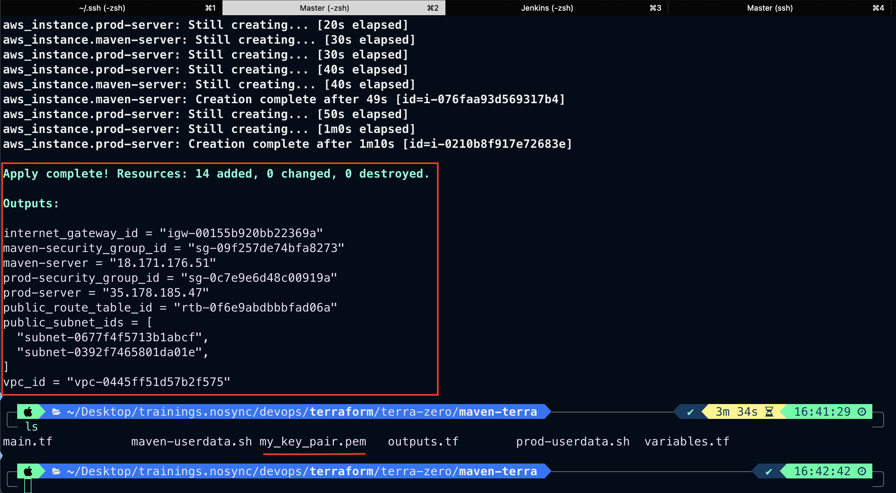
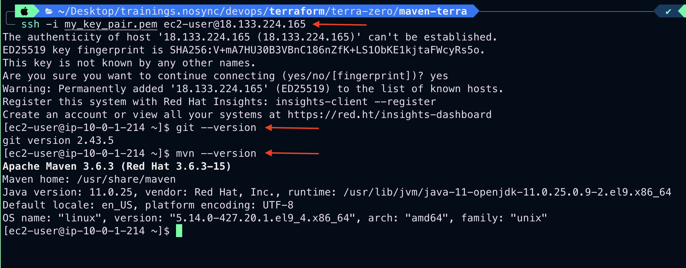
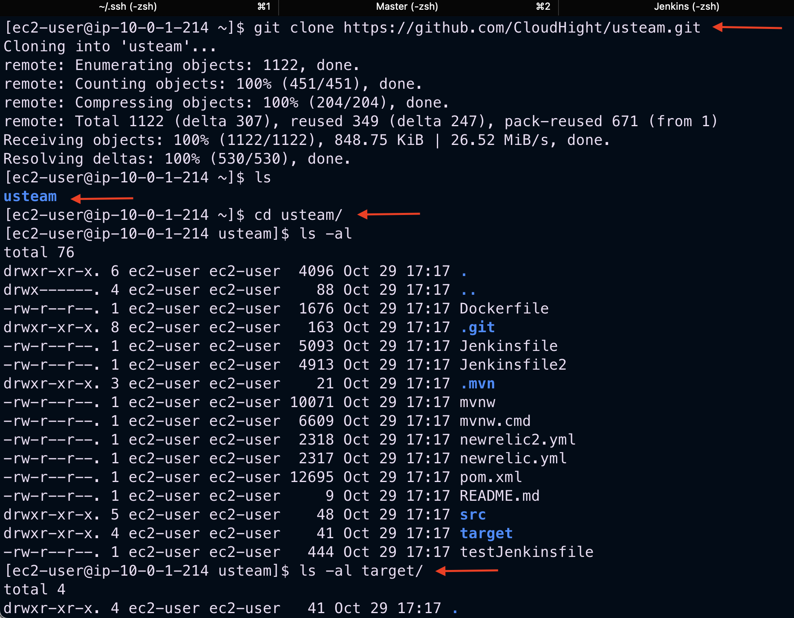
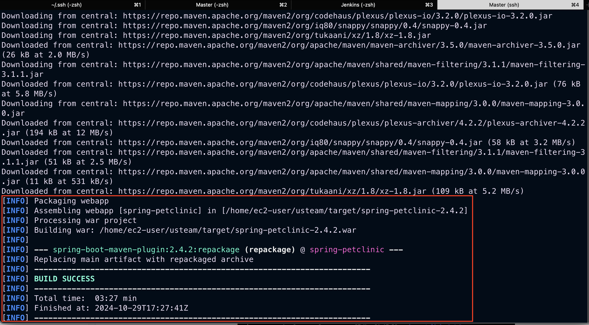
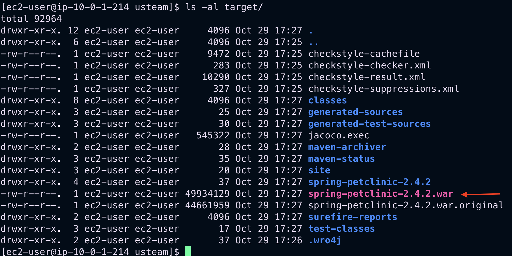
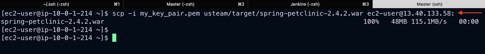
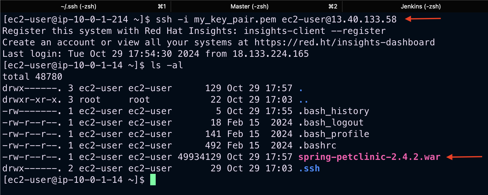
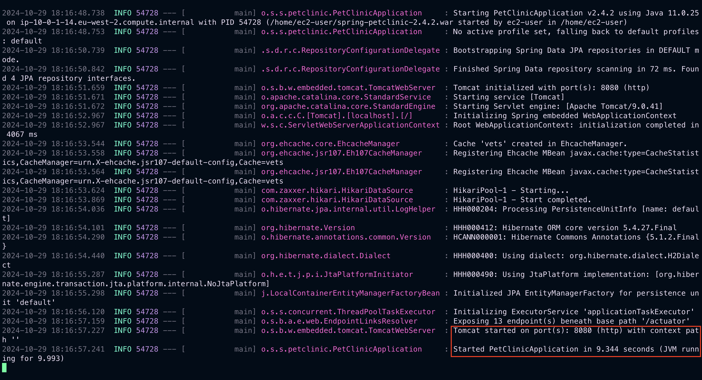
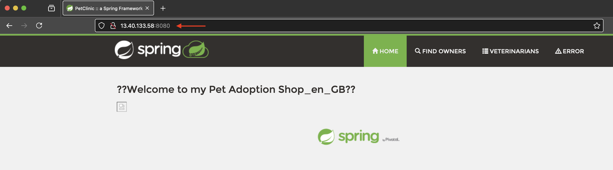
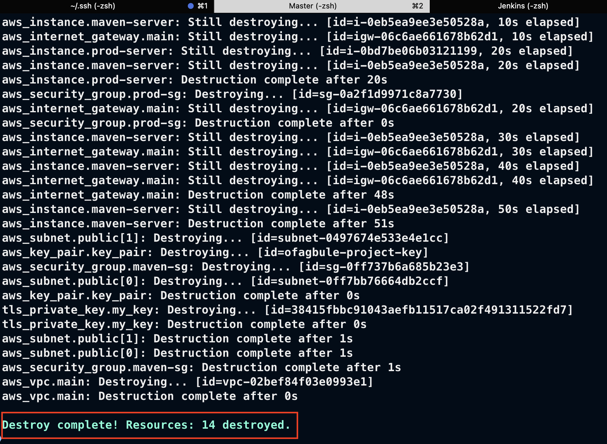

# Maven Artifact Deployment to AWS Infrastructure

This guide demonstrates how to create a Maven artifact and deploy it to a host server using AWS infrastructure provisioned through Terraform.

## Prerequisites

Before you begin, ensure you have:

- [ ] An active AWS account
- [ ] Terraform installed and configured locally
- [ ] AWS CLI installed and configured with appropriate credentials
- [ ] Access to the Terraform Registry
- [ ] Maven installed on your local machine
- [ ] Basic understanding of Maven and AWS concepts

### Step 1: Prepare AWS Resources

Familiarize yourself with the following AWS resources on the [Terraform Registry](https://registry.terraform.io/):

- `aws_vpc`, `aws_subnet`, `aws_internet_gateway`, `aws_nat_gateway`, `aws_eip`, `aws_route_table`, `aws_route_table_association`, `aws_security_group`, `aws_key_pair`, `aws_instance` (2 instances for Maven Server and Production Server)

### Step 2: Terraform Configuration

Create the following Terraform files in your project directory:

1. **`main.tf`** – Contains AWS resource definitions.

   ```hcl
   # Your main.tf contents here
   ```

2. **`variables.tf`** – Defines input variables for Terraform.

   ```hcl
   # Your variables.tf contents here
   ```

3. **`outputs.tf`** – Specifies output values post-configuration.

   ```hcl
   # Your outputs.tf contents here
   ```

Update `variables.tf` as per your requirements.

### Step 3: Terraform Execution

```bash
terraform init
terraform validate
terraform fmt
terraform plan
terraform apply
```


*Successful creation of AWS infrastructure using Terraform*

### Step 4: Maven Server Setup

1. SSH into the maven server:
```bash
ssh -i my_key_pair.pem ec2-user@<maven-server-ip>
```

2. Verify installations:
```bash
# Check Git installation
git --version

# Check Maven installation
mvn --version
```


*Verification of Git and Maven installations on the server*

3. Monitor installation progress:
```bash
tail -f /var/log/cloud-init-output.log
```

4. Clone and prepare repository:
```bash
# Clone repository
git clone https://github.com/CloudHight/usteam.git

# Change directory
cd usteam/

# List contents
ls -al

# Check target directory
ls -al target
```


*Successfully cloned repository and directory structure*

5. Build artifact:
```bash
mvn clean package
```


*Maven build process execution*


*Successfully generated WAR file artifact*

### Step 5: Production Server Deployment

1. Set up SSH key on Maven server:
```bash
# Create and edit key file
vi my_key_pair.pem
# Paste private key contents

# Set correct permissions
chmod 400 my_key_pair.pem

# Test connection to production server
ssh -i my_key_pair.pem ec2-user@<production-server-ip>
```

2. Deploy artifact:
```bash
# Copy artifact to production server
# Copy artifact to production server
scp -i my_key_pair.pem usteam/target/spring-petclinic-2.4.2.war ec2-user@<production-server-ip>:
```


*Successful artifact transfer to production server*

3. Verify deployment:
```bash
ls -al
```


*Verification of artifact presence on production server*

4. Start the application:
```bash
# Start in foreground
java -jar spring-petclinic-2.4.2.war

# Or start in background
nohup java -jar spring-petclinic-2.4.2.war &
```


*Application startup confirmation*

### Step 6: Access Application

Access the deployed application through your web browser:
```
http://<production-server-ip>:8080
```


*Successfully deployed application running in browser*

### Step 7: Cleanup

When you're done, destroy the infrastructure:
```bash
terraform destroy -auto-approve
```


*Successful destruction of AWS infrastructure using Terraform*

## Troubleshooting

1. **SSH Connection Issues**
   - Verify security group rules
   - Confirm key pair permissions (chmod 400)
   - Check instance public IP

2. **Maven Build Failures**
   - Verify Maven installation
   - Check project dependencies
   - Review build logs

3. **Application Launch Issues**
   - Verify Java installation
   - Check port availability
   - Review application logs

## Security Notes

- Keep private keys secure and never commit them to version control
- Use proper IAM roles and permissions
- Regularly update security groups and access controls
- Monitor AWS CloudWatch logs for security events
- Implement proper backup strategies

## Best Practices

1. **Infrastructure Management**
   - Use workspaces in Terraform for multiple environments
   - Version control your Terraform configurations
   - Use variables for reusable configurations

2. **Deployment**
   - Follow proper release management procedures
   - Implement continuous integration/deployment where possible
   - Maintain proper documentation of deployment procedures

3. **Monitoring**
   - Set up alerts for critical metrics
   - Monitor application and server logs
   - Regular health checks of deployed applications