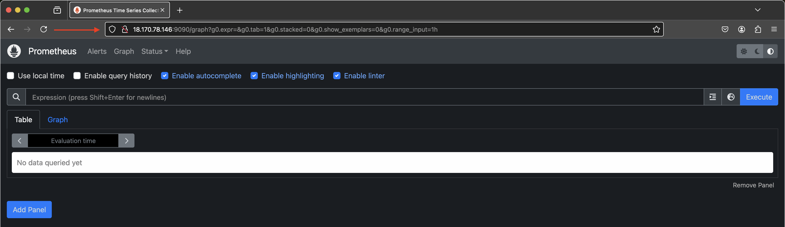
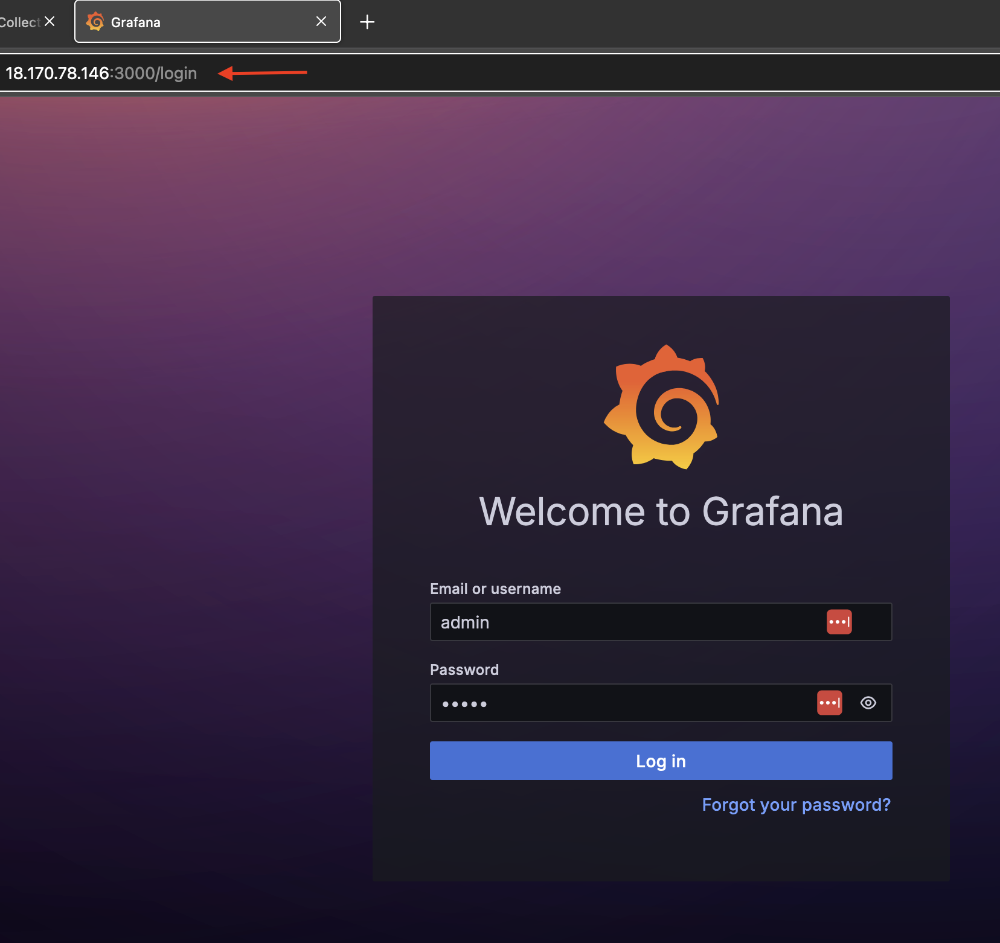
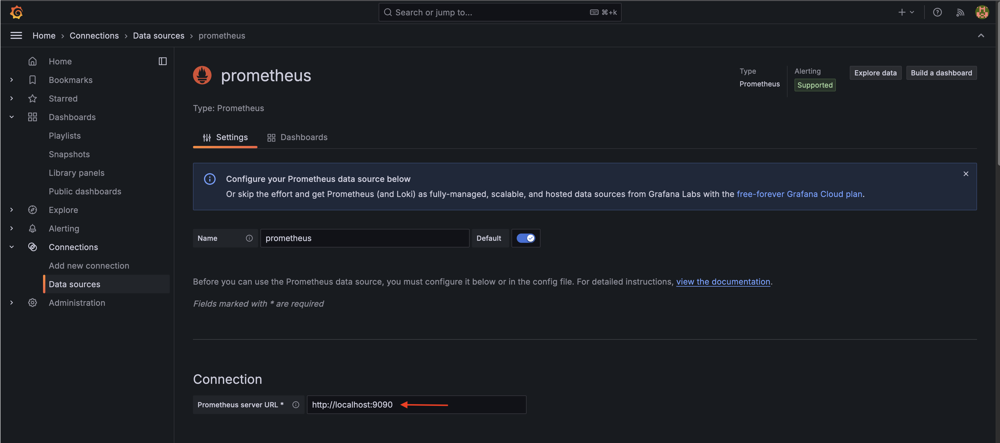
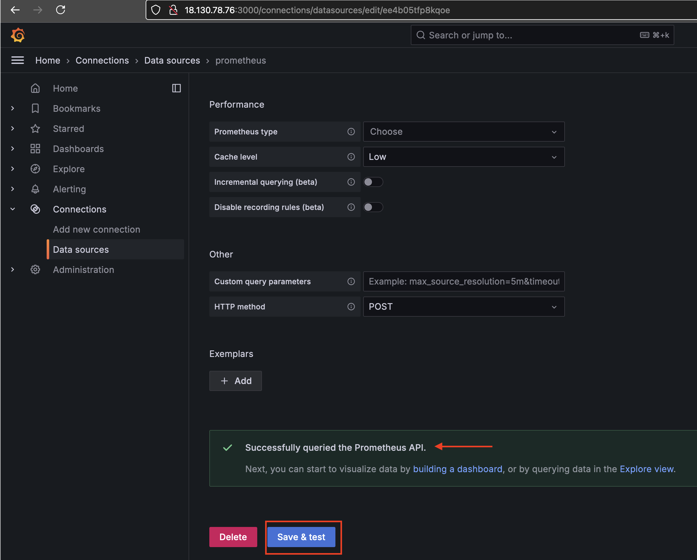
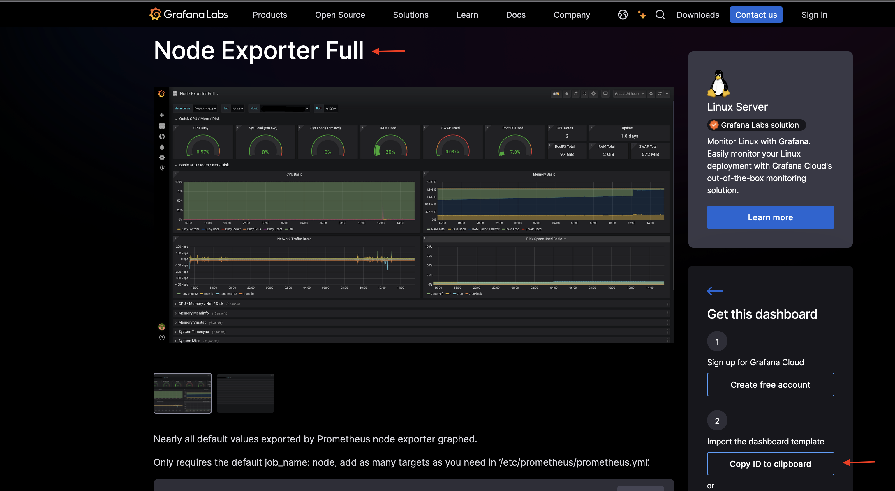
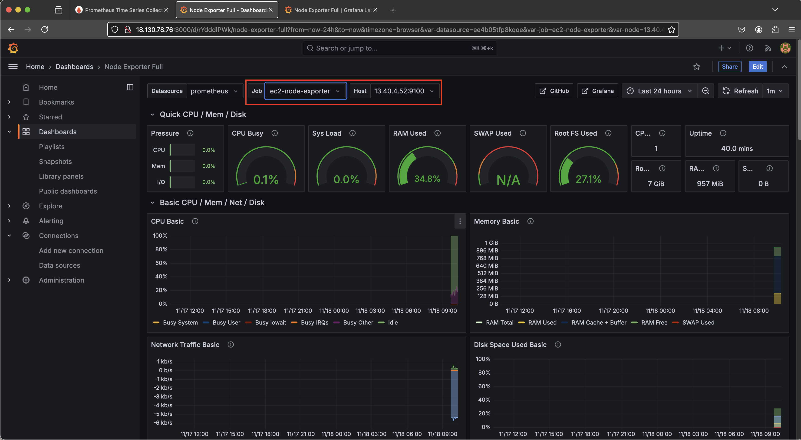
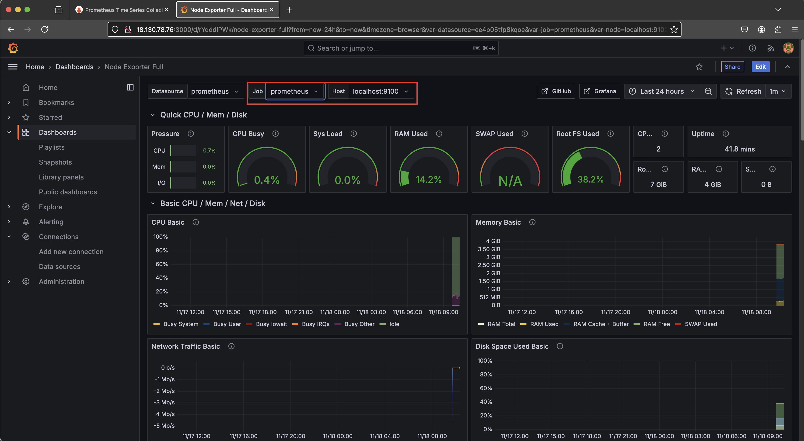

# **Install Prometheus and Grafana on a Single Server to Monitor EC2 Instances**

This guide explains how to use **Terraform** to create an AWS custom VPC and provision two EC2 instances. One instance will host **Prometheus**, **Grafana**, and **node_exporter** (the monitoring server), while the second instance will host **nginx** and **node_exporter**.

---

## 🔧 **Prerequisites**

Before getting started, ensure you have:

1. **AWS Account**: With IAM permissions to manage VPCs, EC2 instances, and related resources.
2. **Terraform**: Installed and configured on your machine. [Download Terraform](https://www.terraform.io/downloads.html)
3. **AWS CLI**: Installed and authenticated with access to your AWS account. [Install AWS CLI](https://docs.aws.amazon.com/cli/latest/userguide/getting-started-install.html)
4. **Basic Knowledge**: Understanding of AWS services and Terraform basics.

---

## 🚀 **Setup Instructions**

### **Step 1: Provision AWS Resources with Terraform**

1. **Review Key Resources**:
   Leverage Terraform resources from the [Terraform Registry](https://registry.terraform.io/), including:
   - `aws_vpc` (for creating the VPC)
   - `aws_subnet` (for subnet allocation)
   - `aws_security_group` (to allow necessary traffic)
   - `aws_key_pair` (for SSH access)
   - `aws_instance` (for EC2 provisioning)

2. **Organize Terraform Files**:
   - `main.tf`: Defines all AWS resources to be created.
   - `variables.tf`: Stores variables like instance types, regions, and key pair names.
   - `outputs.tf`: Displays key information, such as instance IP addresses.

3. **Customize Variables**:
   Modify `variables.tf` to suit your environment:
   - Instance types:
     - Prometheus/Grafana: `t2.medium` (suitable for heavy workloads)
     - Nginx server: `t2.micro`
   - AWS key pair name and region.

4. **Pass User Data**:
   - Prometheus and Grafana server: Use the `templatefile()` function to pass dynamic user data.
   - Nginx instance: Use the `file()` function to load user data.

---

### **Step 2: Deploy the Infrastructure**

Run the following commands in your project directory:

```bash
terraform init       # Initialize the project
terraform validate   # Validate the configuration
terraform fmt        # Format code for readability
terraform plan       # Preview changes
terraform apply      # Apply the configuration
```

---

## 🔍 **Access Prometheus and Grafana**

1. **Wait for EC2 Instances**:
   After provisioning, allow 2 minutes for the servers to complete their setup.

2. **Access Prometheus**:
   - Copy the public IP of the Prometheus/Grafana server.
   - Open your browser and navigate to:  
     `YOUR_IP_ADDRESS:9090`.

   

3. **Access Grafana**:
   - Navigate to:  
     `YOUR_IP_ADDRESS:3000`.
   - Log in with the default credentials:
     - Username: `admin`
     - Password: `admin` (you’ll be prompted to change this on first login).

   

4. **Configure Grafana Data Source**:
   - On Grafana’s home page, click the drop-down menu next to **Connections** and select **Data Sources**.
   - Click **Add data source**, select **Prometheus**, and configure it:
     - **URL**: `http://localhost:9090`

    

   - Click **Save & Test**.

   

   You should see a success message:  
   `"Successfully queried the Prometheus API"`.

---

### **Step 3: Import Grafana Dashboard**

1. **Import a Dashboard**:
   - Go to **Dashboards** from the left panel.
   - Click **New Dashboard**, then select **Import**.

2. **Find a Prebuilt Dashboard**:
   - Visit [Grafana Dashboards](https://grafana.com/dashboards) to find common templates.
   - Search for **Node Exporter Full**, then copy its **Dashboard ID**.

   

3. **Load the Dashboard**:
   - Paste the copied ID into Grafana's **Import Dashboard** field and click **Load**.
   - Select your Prometheus data source and click **Import**.

4. **View Metrics**:
   - The dashboard will display metrics from both the Prometheus/Grafana server and the Nginx server.

     

   

---

### **Step 4: Cleanup Resources**

To avoid unnecessary costs, clean up resources after completing your testing or deployment. Run the following command to destroy all resources:
```bash
# Remove infrastructure
terraform destroy -auto-approve
```
This will remove all provisioned infrastructure, including EC2 instances, security groups, and the VPC.

## 📄 **Notes**

- **Security Groups**: Ensure the following ports are open:
  - **9090**: Prometheus
  - **3000**: Grafana
  - **9100**: Node Exporter
- **Restrict Access**: Use CIDR blocks to allow access only from trusted IPs for enhanced security.
- **Browser Compatibility**: Ensure your browser allows access to custom ports.

---

Feel free to suggest improvements or raise issues as you work through this guide. Happy monitoring!
